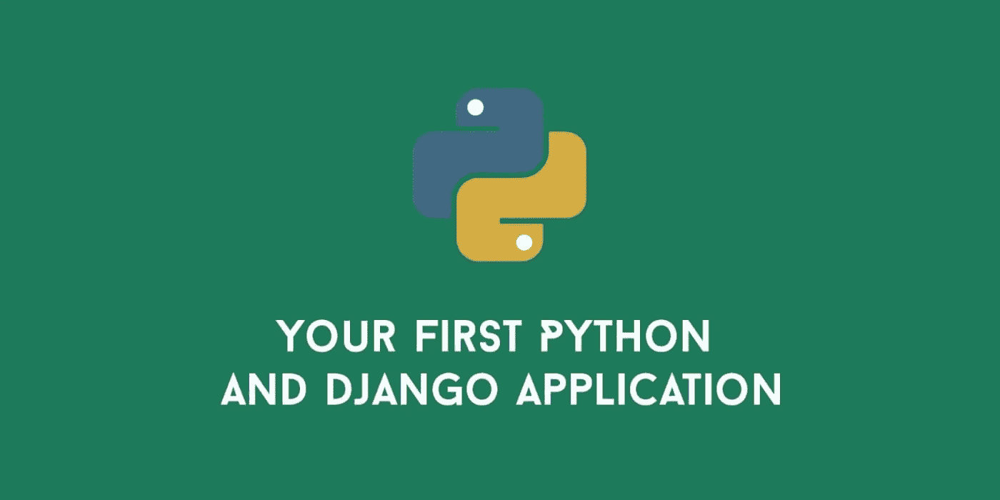

# 第一个 Django 应用步骤 y 步骤

> 原文：<https://medium.com/geekculture/writing-first-django-app-for-beginners-bf2f7cd2cbfa?source=collection_archive---------3----------------------->



Your first Python and Django Application

在本文中，我们将一步一步地创建 Django 应用程序。这篇文章是写给 Django begginers 的。

# 姜戈

*   Django 是一个高级 Python Web 框架，它鼓励快速开发和干净、实用的设计。由经验丰富的开发人员构建，它解决了 Web 开发的许多麻烦，因此您可以专注于编写应用程序，而无需重新发明轮子。它是免费和开源的。
*   Django 使得用更少的代码更快地构建更好的 Web 应用变得更加容易。

# 为什么是姜戈

使用 Django，您可以在几个小时内将 Web 应用程序从概念设计到发布。Django 处理了 Web 开发的许多麻烦，因此您可以专注于编写应用程序，而无需重新发明轮子。它是免费和开源的。

*   **快得不可思议:** Django 旨在帮助开发人员尽可能快地将应用程序从概念设计到完成。
*   **完全加载:** Django 包括几十个额外的组件，您可以使用它们来处理常见的 Web 开发任务。Django 负责用户认证、内容管理、站点地图、RSS 提要和许多其他任务——开箱即用。
*   **令人放心的安全:** Django 认真对待安全问题，帮助开发人员避免许多常见的安全错误，如 SQL 注入、跨站脚本、跨站请求伪造和点击劫持。其用户认证系统提供了一种安全的方式来管理用户帐户和密码。
*   **极度可扩展:**地球上一些最繁忙的站点使用 Django 的能力快速灵活地扩展，以满足最大的流量需求。
*   **难以置信的多功能:**公司、组织和政府已经使用 Django 构建了各种各样的东西——从内容管理系统到社交网络，再到科学计算平台。

# Django 入门

使用 Django 可以快速轻松地启动和运行。让我们开始制作我们的应用程序

首先，创建一个项目文件夹，我们所有的文件都放在这个文件夹中

```
$ mkdir MyContactApp
```

创建项目文件夹后，我们将创建虚拟环境

```
~/MyContactApp$ pip install virtualenv
~/MyContactApp$ virtualenv -p /usr/bin/python3 venv
```

现在我们将激活虚拟环境

```
~/MyContactApp$ source venv/bin/activate
```

现在我们的虚拟环境已经创建好了，我们将为我们的项目安装 Django。

```
(venv) ~/MyContactApp$ pip install django
Collecting django
.
.
.
Installing collected packages: pytz, django
Successfully installed django pytz
```

现在我们已经完成了 Django 的设置，并准备开始工作…

我更喜欢使用 Visual Studio 代码集成开发环境，你可以使用任何其他文本编辑器。

现在我们将开始我们的项目

```
(venv) ~/MyContactApp$ django-admin startproject mysite . #Remember there is space between mysite and .
#If we don't use . then manage.py file will be in mysite folder but we want it to be in our project folder that's why we used above command.
```

我们的项目文件夹将如下所示:

mysite 文件夹中有一个 settings.py 文件，我们必须对该文件进行更改。在 settings.py 文件中进行以下更改。

*   set ALLOWED_HOSTS = ['127.0.0.1 '，' localhost']
*   这里是时区的[列表](https://en.wikipedia.org/wiki/List_of_tz_database_time_zones)，相应地设置 TIME_ZONE。
*   我们还需要为静态文件添加一个路径。下到文件的*结尾*，在`STATIC_URL`条目下面，添加一个名为`STATIC_ROOT`的新条目:

```
ALLOWED_HOSTS = ['127.0.0.1', 'localhost']
TIME_ZONE = 'Asia/Kolkata'
STATIC_ROOT = os.path.join(BASE_DIR, 'static')
```

我们需要为我们的应用程序创建一个数据库，因此转到控制台并键入以下命令:

```
(venv) ~/MyContactApp$ python manage.py migrate
```

如果一切顺利，我们会看到这个-

```
(venv) ~/MyContactApp$ python manage.py migrate
Operations to perform:
 Apply all migrations: admin, auth, contenttypes, sessions
Running migrations:
 Applying contenttypes.0001_initial... OK
 Applying auth.0001_initial... OK
 Applying admin.0001_initial... OK
 Applying admin.0002_logentry_remove_auto_add... OK
 Applying contenttypes.0002_remove_content_type_name... OK
 Applying auth.0002_alter_permission_name_max_length... OK
 Applying auth.0003_alter_user_email_max_length... OK
 Applying auth.0004_alter_user_username_opts... OK
 Applying auth.0005_alter_user_last_login_null... OK
 Applying auth.0006_require_contenttypes_0002... OK
 Applying auth.0007_alter_validators_add_error_messages... OK
 Applying auth.0008_alter_user_username_max_length... OK
 Applying auth.0009_alter_user_last_name_max_length... OK
 Applying sessions.0001_initial... OK
```

一切都在按计划进行，现在我们需要启动 web 服务器。为此，请转到控制台并键入以下命令:

```
(venv) ~/MyContactApp$ python manage.py runserver
```

启动 web 服务器后，我们会看到 Django 默认的祝贺页面。

现在，我们将为联系人应用程序创建一个应用程序，我们的项目中可以有多个应用程序，但这里我们将创建一个应用程序。

要创建应用程序，请在控制台中运行以下命令:

```
(venv) ~/MyContactApp$ python manage.py startapp app-name ##you can choose any name for you app, just type the name of your ##app on the place of app-name.
##I will write 'contact', you can write yours or go with my name.
```

这个命令将添加一个名为“联系人”的文件夹到我们的项目文件夹中，这个文件夹将包含一些文件。

转到 settings.py 文件，将联系人添加到已安装的应用程序-

```
INSTALLED_APPS = [
 'django.contrib.admin',
 'django.contrib.auth',
 'django.contrib.contenttypes',
 'django.contrib.sessions',
 'django.contrib.messages',
 'django.contrib.staticfiles',
 'contact',
]
```

model.py 文件是一个存储联系人信息的地方，如姓名、电子邮件电话等。Django 将模型保存在数据库中。默认的 Django 数据库适配器是 SQLite。

让我们建立我们的 models.py 文件

```
from django.db import modelsclass Person(models.Model): def publish(self): def full_name(self): def __str__(self):
from phonenumber_field.modelfields import PhoneNumberField
 first_name = models.CharField(max_length=20)
 self.published_date = timezone.now()
 return '{} {}'.format(self.first_name, self.last_name) 
 return self.full_name() 
 self.save() 
 last_name = models.CharField(max_length=20)
 email = models.EmailField(max_length=250)
 phone = PhoneNumberField() from django.utils import timezone
```

*   首先，我们导入 Django 模型，然后导入时区和 PhoneNumberField，这将帮助我们存储电话号码。
*   之后，我们制作了类人和添加模型。Model 通知 Django 这是一个 Django 模型。
*   接下来，我们想要收集一个人的信息，这就是 Django 字段类型进入游戏的地方。将使用什么字段类型取决于您要填写什么信息。您可以在[文档](https://docs.djangoproject.com/en/2.0/ref/models/fields/#field-types)中了解更多关于 Django 字段类型的信息。
*   在本例中，我们需要名字、姓氏、电子邮件和电话。first_name 和 last_name 是字符串，因此对于字符串数据，我们使用 charfield，并且我们可以根据字符串大小设置 max_length 参数，对于名称 20 就足够了。
*   对于电子邮件，我们使用 Emailfield，因为 Django 中没有 PhoneNumberField，所以我们使用第三方包来存储电话号码，并将其导入上面。[添加 phonenumber_field](https://github.com/stefanfoulis/django-phonenumber-field) 指南。
*   接下来，我们定义了三个函数:publish、full_name 和 __str__。Publish 函数将根据时区保存人的信息，full_name 将给出名和姓的连接字符串，__str__ 将给出对象的字符串表示。

现在回到控制台，我们必须告诉 Django 一些变化。在控制台中编写以下命令

```
(venv) ~/MyContactApp$ python manage.py makemigrations contact
```

Django 为我们准备了迁移文件，我们必须将其应用到我们的数据库中。为此，请键入以下命令:

```
(venv) ~/MyContactApp$ python manage.py migrate contact
```

我们已经做了我们的模型人。要添加、编辑和删除它，我们将使用 Django admin。

转到 admin.py 文件并添加以下内容:

```
from .models import Person
admin.site.register(Person)
```

# 注意:不要忘记在编辑文件后保存它们，否则它会显示以前的输出或错误。

要查看我们的人员模型，请在控制台键入 *python manage.py runserver* ，然后在浏览器中键入地址[http://127 . 0 . 0 . 1:8000/admin/](http://127.0.0.1:8000/admin/)。您将看到一个登录页面。

要登录，您需要用户名和密码。为此，我们必须创建一个超级用户。转到控制台，键入以下命令:

```
#Use ctrl+c to stop the web server
(venv) ~/MyContactApp$ python manage.py createsuperuser
```

创建您的用户名和密码，并使用它登录到管理页面。现在，您可以编辑、删除和向数据库添加新的联系人。现在，请向您的应用程序添加一些联系人。

首先，我们将为联系人应用程序编写 URL。当用户在浏览器中键入特定的 URL 时，会发生以下情况:

*   Django 使用 URLconf 并寻找变量 **urlpatterns** ，它是 urlpath 实例的列表。
*   Django 遍历每个 URL 模式，直到找到被请求的正确 URL。
*   一旦 URL 匹配，Django 调用**视图**是简单的 python 函数。如果没有匹配的 URL，Django 会显示一个错误视图。

让我们为我们的主页写第一个 URL。在主页上，用户将看到联系人列表。

我们将在我们的联系人应用程序中创建一个单独的 URL 文件，以保持我们的工作整洁。转到 contact 文件夹，添加一个新文件名 urls.py。在 contact/url.py 文件中添加以下行:

```
#contact/urls.py from django.urls import pathurlpatterns = [
from . import views app_name = 'contact' 
 path('', views.contact_list, name='contact_list'),
]
```

我将解释这段代码，但在此之前，我们需要将这些 URL 包含到我们的 mysite/urls.py 文件中，以使它真正工作。为此，我们必须在 mysite/urls.py 文件中添加一些行。我们的 mysite/urls.py 文件如下所示:

```
#mysite/urls.py from django.contrib import adminurlpatterns = [
from django.urls import path
from django.conf.urls import include 
 path('admin/', admin.site.urls),
 path('', include('contact.urls', namespace='contact'))
]
```

让我们理解这里发生了什么，首先，我们从 django.urls 导入路径视图，和视图。在路径中，我们给了一个空字符串作为参数，所以如果它得到一个空字符串，Django 将调用视图函数名 contact_list。

让我们编写视图函数:

```
from django.shortcuts import render, get_object_or_404, redirectdef contact_list(request):
from .models import Person 
 persons = Person.objects.all().order_by('first_name')
 return render(request, 'contact/contact_list.html', {'persons': persons})
```

首先，我们导入 render、get_object_or_404 和 redirect 函数，然后从模型文件中导入我们的类。

在这里，contact_list 是一个函数，它将 request 作为一个参数，然后我们定义 person 的变量，这个变量是对象的列表，它们按 first_name 排序。因此，如果用户向主页发送请求，那么名为“contact_list”的视图函数将被调用，它将返回呈现模板 contact_list.html 的呈现函数

模板是 HTML 文件，将保存在 contact/templates/contact 目录中。因此，首先在联系人目录中创建模板文件夹，然后在模板文件夹中创建联系人文件夹。这只是一个有用的命名约定，当您在一个项目中处理多个应用程序时，它会让您的生活变得简单。保持你的东西有条理是很好的。

现在创建 contact_list.html 文件并添加以下行:

这将在主页上显示我们联系人列表中的所有人的列表。现在，如果你想在用户点击这个人时显示这个人的详细信息，你必须遵循同样的过程。转到 urls.py 文件，编写 URL，编写视图函数，然后是模板。

如果你想接受用户的输入，你必须使用表单。对于添加新的联系人或编辑他们，将有来自用户方的输入，所以我们将在这里使用表单。

使用表单时，有两种类型的请求。一个是 **GET** 请求，另一个是 **POST** 请求。这两个请求用于不同的目的，例如，如果你想改变系统的状态，比如你想在数据库中做一些改变，那么它将是一个 POST 请求，但是如果它不改变系统的状态，那么它将是一个 GET 请求。

当您在数据库中添加或编辑联系人时，这将是一个 post 请求，如果您想要某个人的信息，那么这将是一个 GET 请求。

我建议你阅读文档中的表格，这里是[链接](https://docs.djangoproject.com/en/2.0/topics/forms/)。

我们的 Html 表单结构将如下所示:

在此之前，我们必须在联系人文件夹中创建一个名为 forms.py 的新文件，并添加以下行:

```
from django import formsclass Meta:
from .models import Person class PersonForm(forms.ModelForm): 
 model = Person
 fields = ('first_name', 'last_name', 'email', 'phone')
```

现在我们想为我们的添加和编辑联系人编写视图函数，但是我们将为这两个函数使用相同的模板，因为它将使用相同的表单。添加和编辑联系人的视图功能如下所示:

```
def contact_new(request):def contact_edit(request, pk):
 if request.method == 'POST':
 person = get_object_or_404(Person, pk=pk)
 if request.method == 'POST':
 form = PersonForm(request.POST, instance=person)
 if form.is_valid():
 form.save()
 return redirect('/person/' + str(person.pk))
 else:
 form = PersonForm(instance=person)
 return render(request, 'contact/contact_edit.html', {'form': form}) 
 form = PersonForm(request.POST)
 if form.is_valid():
 form.save()
 return redirect('/')
 else:
 form = PersonForm()
 return render(request, 'contact/contact_edit.html', {'form': form})
```

接下来，我们将编写删除联系人的视图函数。这里，视图功能是获取要删除的对象，然后从数据库中删除联系人，最后将用户重定向到主页。

```
def contact_delete(request, pk):
 person = get_object_or_404(Person, pk=pk)
 person.delete()
 return redirect('/')
```

我在下面分享了我的 [Github 库](https://github.com/hiteshmishra708/django-contact-app)的链接。它有这个项目的全部代码。我已经使用 bootstrap 使应用程序看起来很好。如果在这个项目中你不得不面对任何问题，你可以看到代码并继续前进。这里是[环节](https://github.com/hiteshmishra708/django-contact-app)。

感谢阅读。如果你发现这篇文章有用，别忘了**鼓掌**和**与你的朋友和同事分享。:)如果你有任何问题，请随时联系我。
**与我接通👉**[**LinkedIn**](https://linkedin.com/in/hiteshmishra708)**，**[**Github**](https://github.com/hiteshmishra708)**:)****