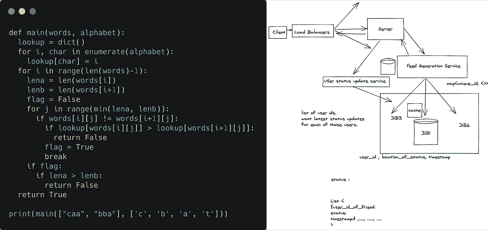
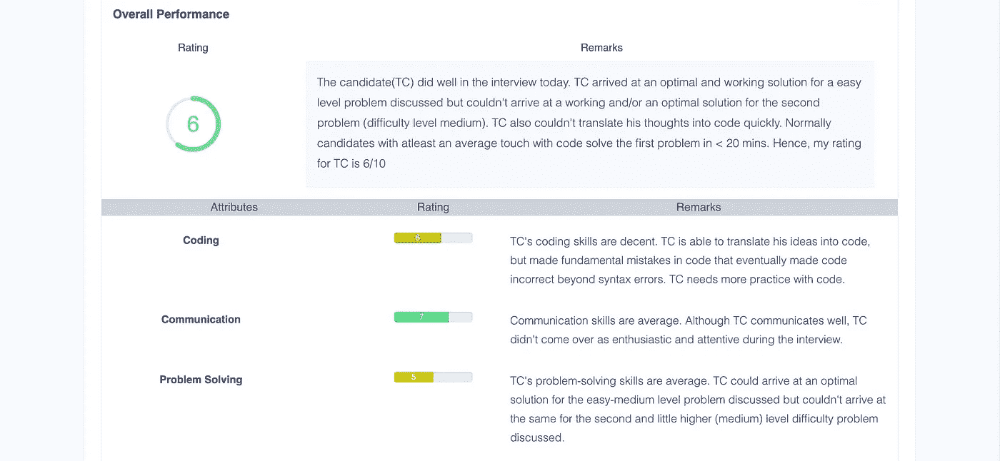

# 撰写出色的面试反馈

> 原文：<https://medium.com/geekculture/writing-great-interview-feedback-4ac36ac5e2e?source=collection_archive---------16----------------------->

面试很难——这包括指导和评估。我在之前的文章中概述了一些有效面试的要点。在这篇文章中，我想回顾一下如何写面试反馈，并确保我们作为面试官正在做出正确的决定。

# **为什么面试反馈很重要？**

## **做出正确的决定**

作为人类面试官，我们有很多固有的偏见。

为了纠正这些偏见，我们首先需要承认它们，而不是否认它们:

> **“真正的知识是知道自己无知的程度”**

撰写详细的面试反馈有助于我们组织思路，根据事实而不是印象进行推理，并避免常见的面试官偏见。

**建立和改进校准**

书面面试反馈有助于面试官了解对方的评价方式，随着时间的推移作为面试官进行校准和改进。阅读其他面试官写的反馈经常教会我如何提取我之前错过的信号或我本可以问的有趣问题。这对于在一家公司建立一个经过校准的面试官库至关重要。

**增强领导力洞察力**

招聘经理和高管的主要职责之一是建立一个伟大的团队，为此，他们需要了解公司内部随着时间的推移做出的招聘决定。写得好的面试反馈为建立一个伟大的团队打下了基础。

# 好的面试反馈是由什么组成的？

## 访谈记录时间表

我们应该在面试中尽可能多地做笔记，以克服我们的第一/最后印象偏差。我想出了一个写面试反馈的好方法，那就是写下简短的笔记，记录面试中收集的信号和时间。这有助于我在最后评估候选人每个问题花了多少时间，积极和消极的信号等。

**Interview Notes Timeline**

## 面试时问的问题

写下采访中提出的问题，因为它有助于理解围绕评级和注释的推理。最好从结构化的问题库中提问，这也有助于我们跟踪哪个问题提供了什么样的信号。

## **代码/设计片段/截图**

附上候选人编写的代码或设计作为反馈的一部分。

**Code / Design Screenshots**

## **记分卡**

这是反馈中最重要的部分，我们在其中提供对候选人的最终评估。

*   请在填写完笔记时间线后再填写此部分
*   **综合评分**:提供综合评价分数及理由。这应该清楚地说明为什么给出评级以及评级背后的校准见解。
*   **属性等级**:为该面试预先指定的属性提供一个等级。这些是评估候选人的不同轴。当我们希望找到在比如说编码方面非常强，但在解决问题的技能方面一般的候选人时，这最终变得非常有用。
*   尽量避免使用笼统的陈述，如“*候选人不好”、“候选人资历很浅”或“候选人没有正确的态度”。*

> 我觉得这位候选人非常谦虚，并且有强烈的学习热情。她能够来问我相关的问题，并根据我提供的提示，最终想出正确的解决方案。感觉更像是和一个同事在面试。

*   **言简意赅，用自己的声音写**。可以提及你无法提取相关信号的地方，或者你这边是否可以做得更好。

> 面试时，候选人需要的时间比我预期的要多。尽管他听起来很有道理，并且能够根据暗示进行推理。我觉得我本可以在提供暗示方面做得稍微好一点，因为我的一个暗示最终让候选人有点困惑。我们应该在下一次面试中更具体地检查解决问题的技巧。

**Scorecard with an overall and attribute-wise rating**

所有面试官写的结构化反馈确实有助于在公司内部建立强大的面试和招聘文化。它帮助我成为一名更好的面试官，并向我的同龄人学习。我希望有一天所有的公司都投资建立一个强大的面试团队，并提供出色的候选人体验。