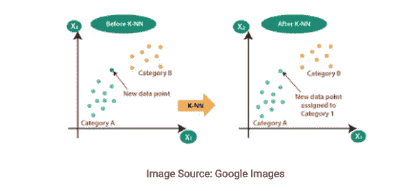
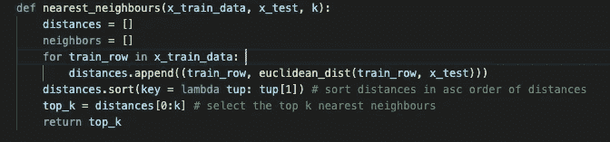
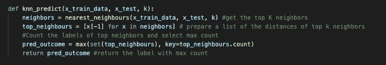

# 从头开始用 Python 写 KNN

> 原文：<https://medium.com/geekculture/writing-knn-in-python-from-scratch-67123907165?source=collection_archive---------6----------------------->

只用了大约 20 行代码！

KNN 分类算法大致分为三种方法:

*   计算数据集两行(向量)之间的欧几里德距离
*   获得新数据的 K 个最近邻居
*   预测新数据的标签(对新数据点进行分类)

1.  计算欧几里德距离

> 欧几里德距离= sqrt(sum I to N(x1 _ I-x2 _ I))

2.通过对欧几里德距离排序获得 K 个最近邻

3.预测或分类新的数据点

关于 KNN 的一些基本要点:

*   KNN 是监督学习(训练数据提供标签(Y))和非参数算法(没有假设或定义的函数，它只从数据模式中学习)。
*   K 的值理想地应该是奇数。如果数据点数量的 sqrt 是偶数，则加 1 或减 1。
*   KNN 需要进行要素缩放，并且对异常值非常敏感，因为它会计算行之间的欧氏距离，最终会对较大的值赋予较大的权重。
*   KNN 可用于连续输出变量，但是，它将是 KNN 回归，输出值将通过取最近邻的平均值来计算
*   KNN 被称为懒惰学习算法，因为它具有基于实例的学习，这意味着它不会立即学习模型，而是存储训练数据，只在进行预测时使用它
*   选择 K 值:这可以通过两种方式实现:( a)采用数据点数量的 sqrt ;( b)使用交叉验证进行超参数调整 K 值是一个范围，例如(1，21 ),并选择产生最小误差的 K 值。
*   在 KNN 也可以注意到偏差-方差权衡。理想情况下，K 值越大，预测就越好，但是，这也可能导致过度拟合，从而导致高方差。

希望这是有帮助的！