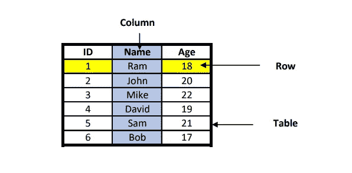
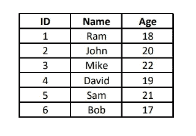
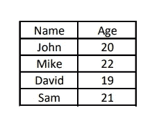
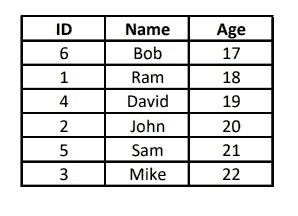
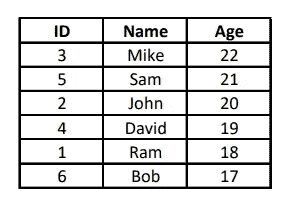
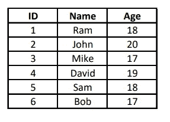
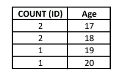

# 5 分钟学会写 SQL 查询！

> 原文：<https://medium.com/geekculture/writing-your-first-sql-query-610da7a5afea?source=collection_archive---------18----------------------->


Photo by [Glenn Carstens-Peters](https://unsplash.com/@glenncarstenspeters?utm_source=medium&utm_medium=referral) on [Unsplash](https://unsplash.com?utm_source=medium&utm_medium=referral)

SQL 代表结构化查询语言，这是数据科学最需要的技能之一。它广泛用于存储、操作和检索 RDBMS(关系数据库管理系统)中的数据。用于从数据库中检索所需数据或信息的 SQL 命令称为 SQL 查询。

在这篇文章中，我将解释 SQL 的用法，一些重要的定义和用例子创建查询的步骤。

# 我们为什么需要 SQL？

以下是 SQL 的一些用法，它使使用数据库变得更加容易:

1.  **创建数据库:**数据库是以表格形式存储的有组织数据的集合。
2.  **创建表:**SQL 中的表是用来存储数据库数据的数据库对象。在表中，数据以行和列的形式组织，其中每一列代表一个唯一的字段，每一行代表一个唯一的记录。
3.  **创建视图:**视图也被称为虚拟表。它们类似于数据库中的真实表。可以通过从数据库的各种表中选择所有或所需的列/字段来创建视图。
4.  **插入和更新数据:** SQL 可以用来插入和更新数据库中的数据。
5.  **检索数据:**我们可以借助 SQL 查询从数据库中检索所需的数据/信息。

# **基本定义:**



Table: Student_Details

1.  **表格:**表格是数据的集合，其中的数据以行和列的形式组织。例如，上面名为 Student_Details 的表具有 ID、Name 和 Age 字段。
2.  **行:**也称为元组/记录。单行包含构成单个实体的所有属性。例如，1、Ram、18 一起表示单个学生的详细信息，也称为单个记录。
3.  **列:**每一列代表一个唯一的字段。例如，上表由 ID、姓名和年龄字段组成。
4.  **查询:**查询基本上是一个命令，用于从数据库的一个或多个表中检索所需的信息。

# **编写第一个 SQL 查询:**

以下查询可用于从表中提取所有信息:

```
SELECT * FROM [TABLE_NAME];
```

以下是 SQL 查询的组成部分:

*   **SELECT** 语句用于从数据库中选择要显示的信息，并且是检索数据所必需的。
*   ( ***** )星号用于选择表格的所有列。
*   **FROM** 用于表示要从中检索信息的表的名称。

我们可以使用上面的查询来显示 Student_Details 表中的全部信息，如下所示:

```
SELECT * FROM Student_Details;
```



Table: Student_Details

***注意:*** *表名和列名区分大小写。*

# 使用一些附加条件过滤信息:

我们可以使用上述查询的附加条件来根据我们的需要过滤出信息。这些是可选条件，在查询中可能存在，也可能不存在。它们如下:

1.  **WHERE:**WHERE 子句用于仅显示满足所提供条件的记录。我们可以使用各种运算符，如>、<和=，等等。在 WHERE 子句中。

```
SELECT [Column_Name] FROM [Table_Name]
WHERE [Condition];
```

例如，如果我们想要年龄大于 18 岁的学生的姓名，那么我们可以编写如下查询:

```
SELECT Name, Age FROM Student_Details
WHERE Age > 18;
```



Selecting the records where the Age is greater than 18

我们可以使用 AND 和 OR 根据 WHERE 子句中的多个条件来筛选记录，而 NOT 可以用于筛选和显示不满足条件的结果。

**2。ORDER BY:**ORDER BY 是一个关键字，用于按升序或降序对记录进行排序。我们可以使用 ASC 将记录按升序排序，使用 DESC 将记录按降序排序。

***注意:*** *默认情况下，ORDER BY 关键字按升序对结果进行排序，所以如果我们希望结果按升序排序，就没有必要提到 ASC。*

我们可以使用 ORDER BY 子句，如下所示:

```
SELECT * FROM [Table_Name]
ORDER BY [Column_Name] ASC | DESC;
```

例如，如果我们希望从 Student_Details 表中选择所有记录，并根据年龄对它们进行升序和降序排序，那么我们可以编写如下查询:

*   **升序:**

```
SELECT * FROM Student_Details
ORDER BY Age ASC;
```



ORDER BY Age in ascending order

*   **降序:**

```
SELECT * FROM Student_Details
ORDER BY Age DESC;
```



ORDER BY Age in descending order

**3。GROUP BY:**GROUP BY 语句用于将具有相同值的行分组到汇总行中。通常，它与 MIN()、MAX()、COUNT()、SUM()和 AVG()等聚合函数一起使用。我们可以使用 GROUP BY 语句，如下所示:

```
SELECT [Column_Name] FROM [Table_Name]
GROUP BY [Column_Name];
```

例如，让我们考虑这个表:



Table: Student_Data

这里，在上表中，有两条年龄为 17 岁的记录和两条年龄为 18 岁的记录。因此，我们可以使用 GROUP BY 语句列出每个年龄的学生人数，如下所示:

```
SELECT COUNT(ID), Age FROM Student_Data
GROUP BY Age;
```



Number of students of each Age using GROUP BY

# **结论:**

这些是创建 SQL 查询的基本步骤。现在您已经准备好使用 SQL 从数据库中提取信息了。最后提供了一些最好的 SQL 在线资源的链接。更多关于 Python、机器学习、数据科学和前端开发的内容请关注 [Chirag Rathi](https://medium.com/u/7a0563da8b9d?source=post_page-----610da7a5afea--------------------------------) ！

快乐学习！😊

## 找到我🤙：

*   [**领英**](https://www.linkedin.com/in/chiragrathi12/)
*   [**碎碎念**](https://twitter.com/ChiragRathi8)
*   访问我的作品集网站[**chiragathi . me**](http://www.chiragrathi.me/)

[](https://www.w3schools.com/sql/) [## SQL 教程

### SQL 是一种在数据库中存储、操作和检索数据的标准语言。我们的 SQL 教程将教你…

www.w3schools.com](https://www.w3schools.com/sql/) [](https://www.hackerrank.com/domains/sql) [## 解决 SQL 代码挑战

### 加入 700 多万开发人员在 HackerRank 上解决代码挑战的行列，这是为…

www.hackerrank.com](https://www.hackerrank.com/domains/sql) [](https://leetcode.com/problemset/database/) [## 问题- LeetCode

### 提高你的编码技能，迅速找到工作。这是扩展你的知识和做好准备的最好地方…

leetcode.com](https://leetcode.com/problemset/database/)