# 用 Angular 编写您的第一个测试

> 原文：<https://medium.com/geekculture/writing-your-first-test-in-angular-a79e49a3a2dc?source=collection_archive---------26----------------------->


# 介绍

这是 Angular 系列中 [**单元测试的第二篇教程，目标是让 Angular 中的单元测试简单易懂。在上一个教程中，**](https://simpleweblearning.com/tag/unit-test-in-angular)**[**Angular**](https://simpleweblearning.com/introduction-to-unit-test-in-angular)中的单元测试介绍，我们涵盖了单元测试中的基本概念和术语。在本教程中，我们将介绍编写测试用例时遵循的常见模式，然后介绍一些我们可以在单元测试中使用的常见 Jasmine 函数。**

# 三 A 模式

当编写一个测试用例时，不管它是单元测试还是功能测试，通常遵循的模式是**安排—行动—断言**模式，或者也称为三 A 模式。

arrange-Act-Assert 代表:

**安排** —准备测试环境，如测试数据或测试开始前各变量的初始状态。在后端测试中，这可能是指数据库中的数据，但在前端测试中，这可能是来自 API 的数据，或者只是将变量放入类中。

**动作** —我们将在这个测试用例中执行的动作。在前端测试中，动作可以包括与 DOM 元素的交互、调用函数或进行 API 调用。

**断言** —采取行动后的预期结果或结局。这是测试真正发生的地方，也是我们可以测试我们的程序是否满足我们期望的地方。

这种模式非常流行，因为当你按照这种模式准备测试用例时，它迫使你提前思考并问自己以下问题:

1.  这个测试用例的目的是什么？
2.  这个测试用例中测试的主要目标是什么？
3.  为了测试这个目标，需要准备哪些初始状态，这个测试会涉及到哪些变量或函数？
4.  预期的结果是什么，如何定义测试用例是通过还是失败？

如果您的测试用例能够回答这些问题，那么恭喜您，您的思路是正确的。此外，重要的是要记住，一个测试用例应该只为测试一件事而构建。换句话说，如果你想要测试多个东西，考虑将它们分成不同的测试用例。这将有助于您调试和识别代码中的错误，如果将来由于程序中添加了新特性而导致测试失败的话。

# 火柴人

Matchers 是 Jasmine 框架提供的函数，用于测试某些东西是否符合我们的预期。在前端测试中，这些匹配器函数以关键字 **expect** 开始。

例如:

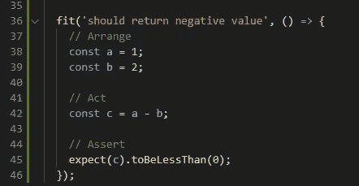

Matcher Example

在上面的测试用例中，我们准备了一些初始变量(a 和 b)，对它们执行一些操作，并将结果保存到变量 c，然后最后将第 45 行的结果与 **toBeLessThan** 匹配器进行比较。当然，第 42 行通常会在您想要测试的函数的 ts 文件中，所以第 42 行通常可以通过从组件调用一个函数来替换。

这是测试结果:

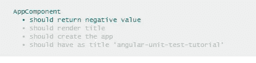

Matcher Example Test Result

有许多有用的匹配器

```
expect().toBeTruthy()expect().toBeFalsy()expect().toBeNull()expect().toEqual()expect().toContain()expect().toHaveBeenCalled()
```

这里有一个 Jasmine cheatsheet，当我开始写角度测试时，我经常参考它:【https://devhints.io/jasmine
T3

# 我们的第一个测试案例

让我们试着用我们在本教程中学到的知识编写一些测试。

假设我们想要测试一个简单的函数——sum。该函数应该接受两个变量，并返回它们的和。我们想针对这个功能编写一些测试，如果在编写测试时发现问题，我们会逐步改进这个功能。

我们函数的起点:

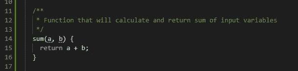

Initial Sum Function

对于我们的第一个测试用例，要测试的最直观的东西当然是函数的输出，所以让我们试着为此写一个测试用例。

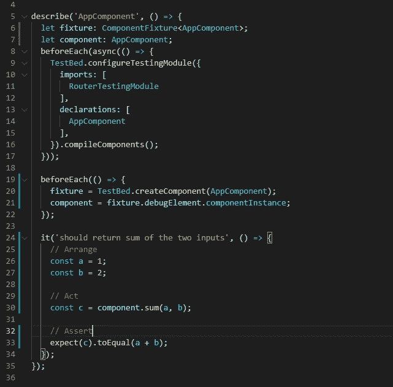

First test case

对于排列状态，我们准备了两个变量，我们将在这个测试中使用。(第 26、27 行)。然后我们从测试环境中调用 sum 函数，方法是在 Act 状态下通过组件实例访问它(第 30 行)。

注意。所有变量或函数都可以通过组件实例来访问。

最后，我们在断言状态下进行断言，以检查结果。

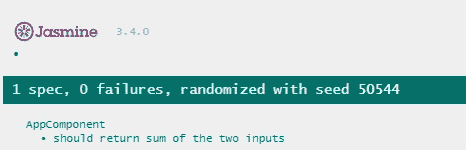

First test case result

虽然您可以在这里结束您的测试用例，但是在各种情况下测试您的函数总是一个好的实践。例如，如果其中一个参数没有提供给函数，该怎么办？我们希望抛出一个错误，让用户知道他们需要为函数提供额外的参数，而不是让程序崩溃。

为此，我们开发了以下测试用例:

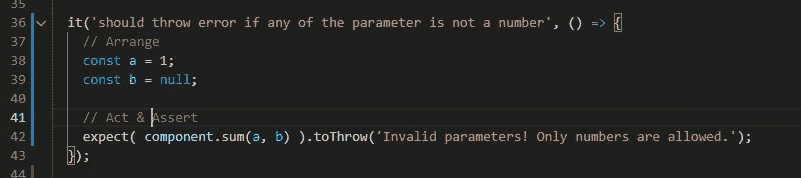

Verify Input

因为我们是用 TypeScript 编写程序，所以它会检查是否所有的参数都被传递到函数中，如果缺少，它会为我们标记错误。因此，我们没有检查缺失的参数，而是在 Arrange 状态下将一个参数更改为 null(第 38、39 行)。如果任何参数不是数字，我们希望我们的函数抛出一个错误。

请注意，这一次 Act 和 Assert 被组合在一行代码中。这是因为我们希望函数在调用时抛出一个错误，所以如果我们像在第一个测试用例中那样将输出保存到一个变量中，程序将永远不会到达 Assert 语句。

如果不更新函数，我们会从 Jasmine 得到以下错误。

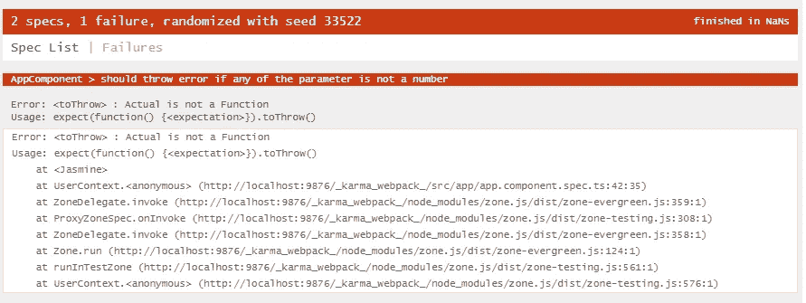

Initial attempt of verifying function inputs

这是意料之中的，因为我们还没有更新我们的功能。让我们更新函数，这样测试用例就通过了。

在继续之前，我们使用 JavaScript 中的本机 **typeof** 函数来验证两个参数是否都是数字。

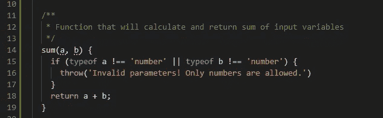

Updated Function

更新函数后，我们从 Jasmine 获得了以下输出:

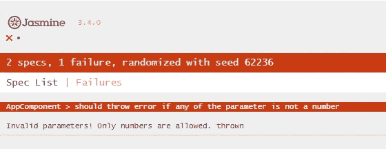

Verify Input test case failed again

我们从函数中抛出了一个错误，但是测试仍然失败。为什么？每当我们需要测试一个函数是否抛出错误时，我们必须总是将我们的函数调用包装在一个匿名函数中。

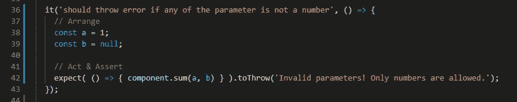

Updated Verify Input Test

在我们对测试用例进行了修改之后，我们可以看到测试已经通过了。

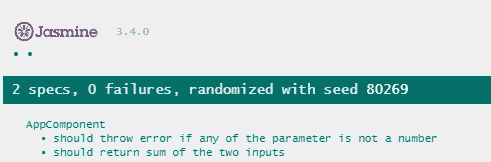

Final Result

# 结论

在本教程中，我们学习了如何使用 Jasmine 的三 A 模式和匹配器函数编写测试用例。虽然这将使我们能够编写大多数测试用例，但有时一个函数可能涉及许多其他函数调用。为了使我们的测试用例统一和简单，我们需要确保从与这个测试用例不相关的其他函数返回某些值。这就是我们介绍《茉莉花开》中间谍故事的地方。在 Angular 的 [**单元测试的下一个教程中，我们将介绍 Jasmine 的 Spy，并教你如何使用 Spy 来使你的测试更容易实现。**](https://simpleweblearning.com/tag/unit-test-in-angular)

原帖:
[https://simple web learning . com/writing-your-first-test-in-angular](https://simpleweblearning.com/writing-your-first-test-in-angular)