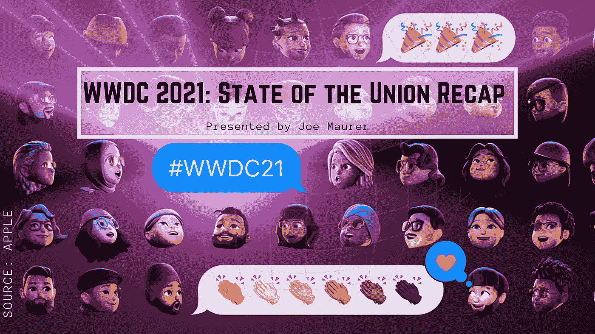
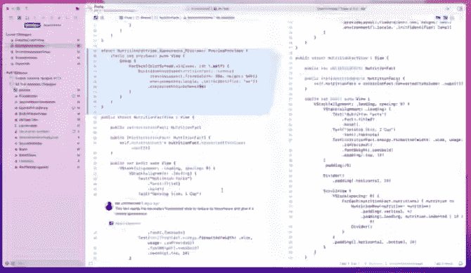
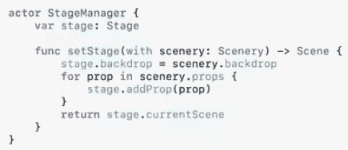
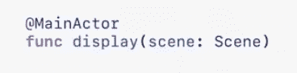
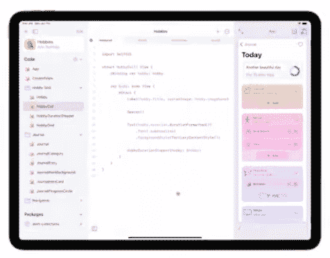
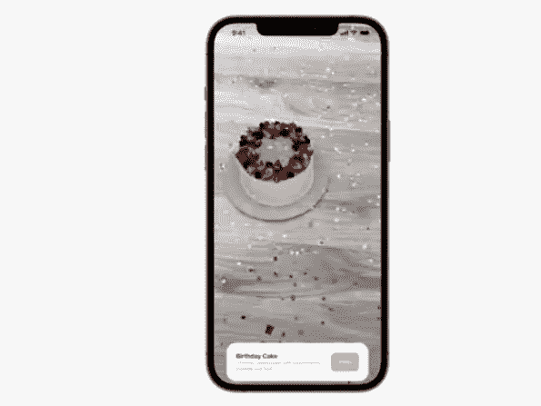
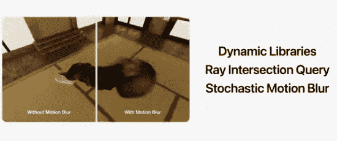
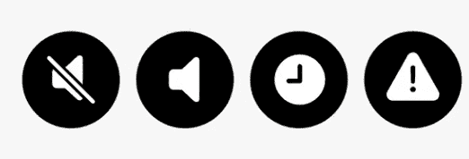

# WWDC 2021:国情咨文

> 原文：<https://medium.com/geekculture/wwdc-2021-state-of-the-union-recap-8c3c22b4c146?source=collection_archive---------31----------------------->

下面是苹果在 WWDC(2021 年全球开发者大会)的国情咨文。你可以在这里找到完整的视频。

# **XCode Build**

Xcode Build 是一种新的持续集成和交付服务，内置在 Xcode 中，托管在云中，是苹果简化构建应用程序的过程，同时帮助您专注于重要的事情。它帮助您卸载您的构建、测试和代码签名以供分发。它会将您的结果直接发布到 Xcode 的报告导航器中，这样您就不必在构建应用程序的地方切换上下文了。

一个很酷的特性是，你可以让构建在完成时通知你，并把它发布到你的 Slack 或任何其他服务上。还有一个公共 API，您可以深入其中获取关于您的构建的信息。我可以看到用这种方式构建应用程序是多么的集成和方便。这实际上似乎是为你的应用程序编写测试的一种有趣的方式！

代码审查也希望在注释和审查代码方面做出巨大的改进。新的视图允许您在多种方式之间进行选择，以查看哪些代码发生了更改，甚至在您修复任何潜在的错误时查看注释。任何编写代码的人都会回顾，当有多个修订和文件被删除或添加到一个拉取请求中时，会变得多么混乱。

# **Swift 并发支持**

大多数开发人员和工程师都习惯于编写并发代码，因为这是快速响应代码的重要组成部分。

> [“并发使您的应用程序](https://developer.apple.com/videos/play/wwdc2021-102/?time=1209) [能够同时执行多项任务，](https://developer.apple.com/videos/play/wwdc2021-102/?time=1211) [帮助您的应用程序在后台工作时保持对用户输入的响应](https://developer.apple.com/videos/play/wwdc2021-102/?time=1214) [，](https://developer.apple.com/videos/play/wwdc2021-102/?time=1217) [就像天气应用程序在用户选择城市时获取预测数据](https://developer.apple.com/videos/play/wwdc2021-102/?time=1218) [。](https://developer.apple.com/videos/play/wwdc2021-102/?time=1221)

问题？Swift 从来没有对并发代码的本地支持，所以编写好的并发代码是不必要的困难。苹果对此的新方法是**结构化并发**。参与者是一种行业标准，对于安全的并发编程至关重要。

> "[从概念上讲，一个 actor 是一个对象，它只通过提供互斥的访问来保护自己的状态](https://developer.apple.com/videos/play/wwdc2021-102/?time=1483) [。](https://developer.apple.com/videos/play/wwdc2021-102/?time=1487) [这完全消除了并发访问](https://developer.apple.com/videos/play/wwdc2021-102/?time=1492) [以及随之而来的低级数据竞争。](https://developer.apple.com/videos/play/wwdc2021-102/?time=1495)”

“演员”现在是 Swift 的一等公民，并且有一个更简单的声明:

另一个好处是 MainActor，它允许您将函数修饰为总是在主线程上运行。这对于 UI 所需的 API 调用至关重要。

# **雨燕游乐场**

今年，Swift playgrounds 4 允许您无论走到哪里都可以实现自己的想法。它允许你在游乐场和 Xcode 之间切换。一旦你创建了一个应用程序，你甚至可以直接从 Playgrounds 应用程序发布你的应用程序到 TestFlight。

# **虚拟现实和增强现实套件**

现在，您可以使用自定义金属着色器和动态纹理为 AR 对象添加酷炫的效果。你可以在生日蛋糕演示中看到这些效果，五彩纸屑散落在物体周围。

# **金属改进**

作为一名游戏工程师，有一点让我印象深刻，那就是你现在可以更好地控制显示器的刷新率。特别是如果你开发的游戏要在 IPad Pro 上运行，或者在连接到高端显示器的 MAC 上运行，控制刷新率对让你的游戏看起来运行流畅非常有用！

游戏控制器支持现在也更容易添加，有触觉支持。您只需几行代码就可以添加一个新的屏幕控制器。

# **通知**

iOS 现在正在改变通知的工作方式和交付级别。焦点允许用户选择发送什么类型的通知。现在有 4 个级别的通知:低，积极，时间敏感，和紧急(见上文)。通知摘要允许用户简要了解交付了哪些内容，并带有一些相关标记。

还有更多的内容，但这些是我印象最深的亮点。请在下面的评论中告诉我你对什么感兴趣！