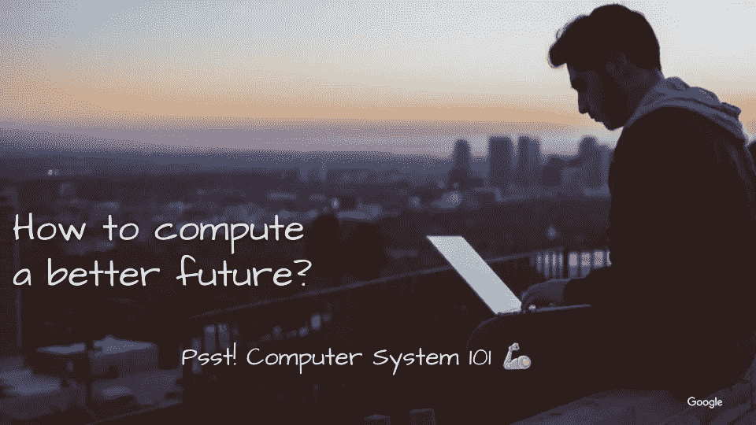
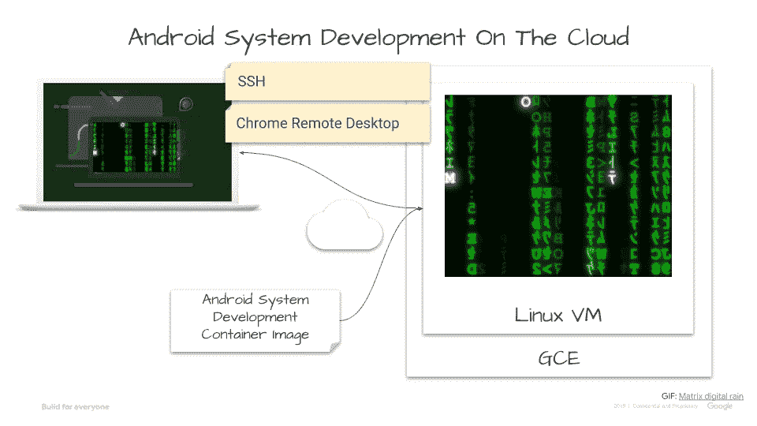

# WWDC21 —少数派报告

> 原文：<https://medium.com/geekculture/wwdc21-minority-report-ac4b531a0035?source=collection_archive---------27----------------------->

本周在苹果 WWDC21， [**Xcode Cloud**](https://www.apple.com/newsroom/2021/06/apple-introduces-new-developer-tools-and-technologies-to-create-even-better-apps/) **比你想象的**还要大一件事。请允许我想象一下长远来看能是什么样子，以及我为什么要麻烦一个小小的实验课程:[云上的 Android 系统开发(ASD)。](https://github.com/samlin001/asd-codelabs)

[Apple WWDC21 — Introducing Xcode Cloud](https://www.youtube.com/watch?v=0TD96VTf0Xs&t=6095s)

# 众神和世界的毁灭

航空母舰的崛起是一个颠覆性创新的故事。1942 年[中途岛](https://www.youtube.com/watch?v=PssySnK4Kys)战役，诸神的黄昏早已开始。在这个故事中，超级战舰是古老的注定要毁灭的神。例如，日本战舰“大和号”是有史以来建造的最大战舰。这样一艘标志性的船承载了许多雄心壮志，但不可避免地驶入了注定失败的诸神之战。1945 年，大和进行了一次自杀性任务，10-Go 行动。大和号从第一次攻击到[爆炸](https://en.wikipedia.org/wiki/Japanese_battleship_Yamato#/media/File:Explosion_of_the_Japanese_battleship_Yamato,_on_7_April_1945_%28NH_62582%29.jpg)的 2 小时内被飞机击沉，标志着战舰时代的悲惨终结。**不是因为大和不是同级最好的。相反，航母玩的新游戏超出了战舰的范畴。当然，我不排除有一天这艘战舰可能是我们对抗外星人的最后希望😉。**

[Yorktown and Saratoga Night Attack on Yamato](https://navy-matters.blogspot.com/2019/04/japanese-invasion-of-pearl-harbor.html)

# Xcode 云

TL；dr [Xcode Cloud](https://www.apple.com/newsroom/2021/06/apple-introduces-new-developer-tools-and-technologies-to-create-even-better-apps/) 让应用开发者能够通过 Xcode 在云上构建、测试&分发。即使本地 IDE 仍然需要它，它仍然会显著减少当前开发工作流的开销。更重要的是，**它的网络效应将把团队集体生产力推向一个新的高度。**这可能是应用程序开发人员云之旅的一个新开端，以便在任何地方都能更好地扩展工作。

像往常一样，苹果不是第一个。比如 Arm 的 [mbed 编译器](https://os.mbed.com/handbook/mbed-Compiler)，一个可以让开发者进行物联网构建的在线 IDE 等等。多年来一直通过浏览器使用设备。尽管如此，**苹果还是像往常一样非常善于“把握时机”**。即使 Xcode Cloud 是一个早期的测试版本，它对于已建立的团队来说也不是一个足够好的选择。但是，我敢打赌，这是开发人员更好地合作方式转变的开始。当然，**它更适合新的开发者、创新者&甚至早期采用者，就目前而言**。

那又怎样，GitHub 也已经为持续集成(CI)和持续部署(CD)工作流提供了[GitHub Action](https://docs.github.com/en/actions/guides/about-continuous-integration)一段时间了。TL；一站式服务。Xcode Cloud 作为一种软件即服务(SaaS)模式，针对苹果开发者进行了优化。基本上，一个新的&更好的版本“[微软开发者网络(MSDN)订阅](https://en.wikipedia.org/wiki/Microsoft_Developer_Network#Software_subscriptions)”。这不仅有助于维持其应用生态系统，还能增加一点服务收入。但更重要的是，**它巩固了设备-用户-开发者的良性循环&应用商店的护城河**。

哦，这种服务收入甚至不应该成为衡量其成功的直接标准。相反，苹果可能更关心它如何成为苹果的其他消费的“Prime”，例如 iCloud 等。在小众意义上，这是一项“云业务”。

[https://developer.apple.com/xcode-cloud/](https://developer.apple.com/xcode-cloud/)

# 为什么在云上开发 Android 系统

感谢 [Code Next](https://codenext.withgoogle.com/) ，去年我们和高中生在 Raspberry Pi 上玩 Python 玩得很开心。这更加坚定了我的信念:CS 天赋是后天培养的，而不是天生的。因为我们一直在问自己为什么不是安卓。我们了解到进入门槛很高。例如，即使设置 Android 应用程序开发环境，也不仅需要太多的精力，而且需要更强大的计算机。然而，许多 Code Next 目标学生只能访问 Chromebooks。因此，问题是我们如何才能创造公平的竞争环境，让更多的高中生有机会学习。

即使我是一个糟糕的开发人员，我也看到了人们如何从 SoC 供应商到手机、手表、VR 耳机和智能汽车的设备制造商进行 Android 设备开发。因此，我一直在思考更高层次的挑战:**一个高中生如何学习&甚至只通过浏览器**开发消费计算设备。所以，也许更多的人可能会在野外发现一些有趣的东西。此外，还需要探索更好的方法，以便在任何地方都能更灵活地工作。这至少是我们在 COVID 19 幸存时可以尝试的一件小事。

# 新开始的开始

目前， [ASD-codelabs](https://github.com/samlin001/asd-codelabs) 非常原始，有 4 个代码实验室。但这应该会让学生们体验一下工作的样子，获得一点动手的满足感。我建议以高水平的 CS 101 理论入门开始这样的课程或工作坊。我喜欢用书中的一些好的插图，[虚拟机:系统和流程的通用平台](https://books.google.com/books?id=LCtNaLNOa4gC&printsec=frontcover#v=onepage&q&f=false)。这不仅提供了总体情况下的整体视图，而且与软件定义的新时代[的背景非常相关。](https://samlin001.medium.com/the-new-age-of-software-defined-2ae97c6d3281)

1.  [在云上搭建系统开发环境](https://github.com/samlin001/asd-codelabs/blob/main/codelab1/README.md)。
2.  [在云上构建一个 Android 虚拟设备](https://github.com/samlin001/asd-codelabs/blob/main/codelab2/README.md)。
3.  [在云上创建自己的 AVD](https://github.com/samlin001/asd-codelabs/blob/main/codelab3/README.md)。
4.  [定制您自己的开发环境](https://github.com/samlin001/asd-codelabs/blob/main/codelab4/README.md)，构建可扩展的定制映像。

我们将继续探索、构建和改进这一点。那么，为什么不为你所关心的🦾.社区的更多学生创造一个新的开始呢欢迎任何拉取请求🙏。

[github.com/samlin001/asd-codelabs](https://github.com/samlin001/asd-codelabs)

# 完全公开

这里陈述的观点是我自己的，而不是我公司的。它们大多是从公开信息中推断出来的。我不了解这些公司的内幕，也不是什么专家。