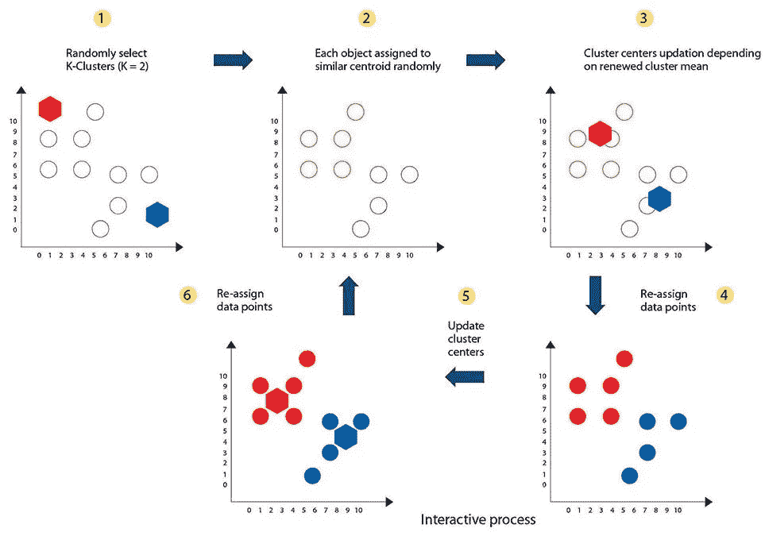

# x-Means-K-Means 聚类算法的补充

> 原文：<https://medium.com/geekculture/x-means-algorithm-a-complement-to-the-k-means-algorithm-b087ae88cf88?source=collection_archive---------9----------------------->

Image Source: [https://www.pinterest.com](https://www.pinterest.com/)

# 介绍

聚类是将数据分组到几个簇或组中的过程，因此一个簇中的数据具有最大的相似性，而簇之间的数据具有最小的相似性。k-均值(杜达&哈特，1973；Bishop，1995)一直是度量数据的主力。它的吸引力在于它的简单性，以及它的局部最小收敛性质。聚类的中心或质心是 K-Means 算法中聚类组的起点。数据是通过计算到初始聚类中心点的最近距离作为每个组或聚类形成中的中心点来完成的。

# K-均值的弱点和 X-均值的必要性

但是在这种情况下，初始聚类中心点的确定是 K-Means 算法的弱点。这是因为没有用于选择和确定聚类中心点的方法。从一组数据中任意或随机选择聚类中心点。K-Means 算法的聚类结果通常不是最优的，并且在每个进行的实验中都不是最优的。所以可以说聚类结果的好坏取决于聚类的中心点或者初始质心。

整体而言，K-means 受到以下限制:

1.  K-means 很慢，并且相对于完成每次迭代所花费的时间，它的伸缩性很差。
2.  簇的数量“K”必须由用户预先确定和提供。
3.  当局限于以固定的 K 值运行时，它会根据经验找到比动态改变 K 值时更差的局部最优解。

前两个问题的解决方案和第三个问题的部分补救方法是 X-means。这种有效估计星团数量的方法是由美国匹兹堡卡内基梅隆大学的 Dan Pelleg 和 Andrew Moore 提出的。

# X 均值的解释

> 在每次运行 K-means 后，X-means 开始起作用，对当前质心的哪个子集应该分裂以获得更好的拟合做出局部决定。分裂决策是通过计算贝叶斯信息标准(BIC)来完成的。

X-Means 通过交替应用两种操作来工作——K-Means 算法(改进参数)来针对选定的 K 值最佳地检测聚类，以及聚类分裂(改进结构)来根据信息标准优化 K 值。在这种方法中，K 的实际值是以一种不被监控并且仅基于数据集的方式来估计的。 *Kmax* 和 *Kmin* 作为 X 可能取值的上下限，在 X-means 分组的第一步，知道目前 X = *Xmin* ，X-means 找到初始结构和质心。在下一步中，估计结构中的每个聚类被视为父聚类，父聚类可以被分成两组。

# 用 Python 实现

有一个强大而令人惊叹的库可以实现 X-means 来确定最佳的集群数量—[py clustering . cluster . X means](https://pypi.org/project/pyclustering/)

PyClustering 库实现了 K-Means++初始化算法，该算法在最佳中心位置的已知范围内选择初始中心。PyClustering 的文档显示了如何在那个包中调用 K++初始化。K++初始化(及其更具可伸缩性的对应物 K||)随机选择彼此远离的初始点。他们随机均匀地选取初始对象，然后以与其距离成比例的概率从已经选择的对象中选择下一个点。

在实施时，我们需要给它一个初始的中心列表。我们可以选择以下初始中心之一:

1.  两个随机的物体。
2.  两个最远的物体。
3.  一个随机的物体和它最远的邻居。
4.  沿着 PCA 的第一特征向量的第一个和最后一个对象。

# 改进的余地

X-means 的一个主要问题是，它假设数据具有相同的球面高斯分布。因此，它倾向于过度拟合椭圆聚类中的数据，或者具有不同聚类大小的数据的输入集中的数据。G-Means 和 PG-Means 算法试图通过将数据投影到一维上，并运行统计拟合优度测试来解决这个问题。这种方法可以为非球形分布带来更好的性能，但是，投影可能无法为所有数据集提供最佳效果。投影可以将许多聚类的数据折叠在一起，忽略密度的差异。这需要多次预测以确保准确性。

我希望这篇文章能让你深入了解 X-Means 算法，它是 K-Means 算法的一个增强。

感谢阅读！注意安全！