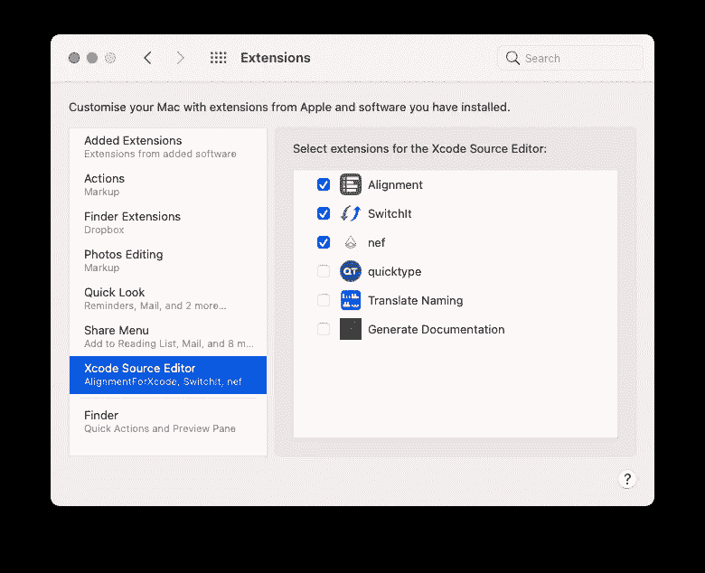
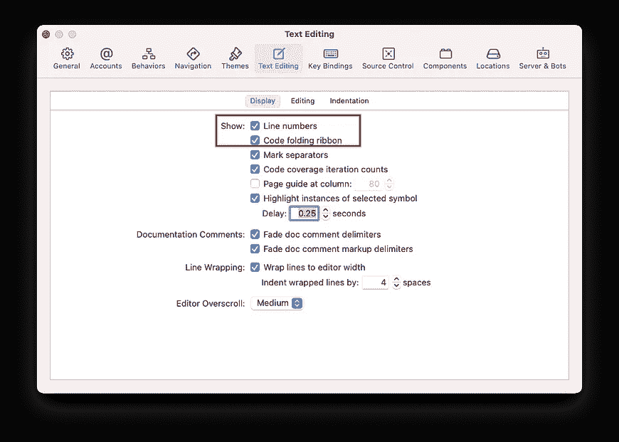
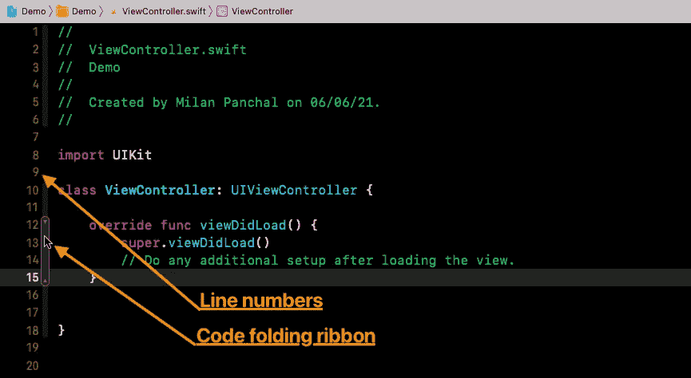
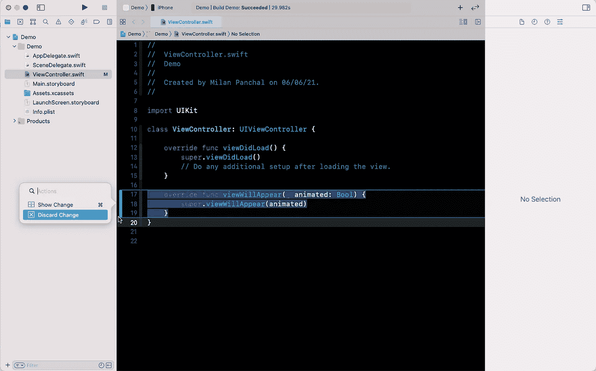
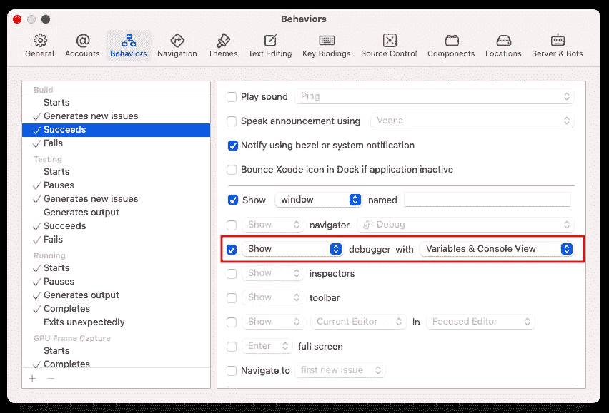

# Xcode 开发设置—安装后

> 原文：<https://medium.com/geekculture/xcode-setup-for-development-post-installation-c6edf8ca3964?source=collection_archive---------32----------------------->

# 1)安装 Xcode 扩展

## a.nef 扩展

*   extension 对于将代码片段从 Xcode 导出到图像或剪贴板非常有用。
*   安装指南将在[https://github.com/bow-swift/nef-plugin](https://github.com/bow-swift/nef-plugin)发布

## b.Xcode 对齐

*   去 App Store 搜索 Xcode 扩展的**对齐。**
*   Xcode 源代码编辑器扩展将对齐您的赋值语句并提高代码可读性。
*   **链接下载:**[https://apps . apple . com/in/app/alignment-for-xcode/id 1168397789？mt=12](https://apps.apple.com/in/app/alignment-for-xcode/id1168397789?mt=12)

一旦你安装了扩展，你必须启用它们。

*   导航到*系统偏好➞扩展➞ Xcode 源代码编辑器*
*   选择所有你想使用的分机
*   重新启动 Xcode



Xcode Extension

# 2)显示行号和代码折叠色带

*   前往 Xcode ➞偏好设置➞文本编辑➞显示
*   点击 ***显示:行号*** 和**代码折叠色带**复选框



Show Line numbers and code folding ribbon

# 3)设置主题

*   前往 Xcode ➞偏好设置➞主题
*   选择你喜欢的主题。*我一般比较喜欢* ***子夜*** *主题:)*
*   您可以选择自定义字体、间距和光标样式

你也可以从编辑器➞主题➞午夜导航

> 有趣的事实: **黑暗主题**越来越受欢迎，他们甚至可以在一些设备上**节省**电池**电量**。

# 4)删除不支持的模拟器

如果你已经使用 Xcode 好几年了，那么你的系统中可能会有旧的模拟器，占据大约 20GB 的空间。

您可以在终端中用一个命令轻松删除所有不可用的模拟器:

```
**$ xcrun simctl delete unavailable**
```

# 5)启用构建时间


Build time in activity viewer

*   如果您想知道 Xcode 构建项目需要多长时间，您可以使用一个终端命令来找到答案:

```
**$ defaults write com.apple.dt.Xcode ShowBuildOperationDuration YES**
```

*   构建完成后，持续时间将出现在活动查看器*(Xcode 工具栏区域中上方的窗口)*中，旁边是“**成功**”消息。
*   如果您正在运行应用程序，在您可以看到持续时间之前，状态将被正在运行状态所取代。

# 6)启用“显示源代码管理更改”

*   前往 Xcode ➞偏好设置➞源代码管理
*   点击通用菜单下的 ***显示源代码控制修改*** 复选框



Show/Hide or Discard Source Control Changes

# 7)删除打印和页面设置的按键绑定

我们经常使用键盘快捷键来提高工作效率。其中，我最常用的命令是— `**⇧⌘O**` **(** 快速打开……)。但是有时候我不小心按了`**⇧⌘P**` 打开页面设置。

为了解决这个问题，我移除了**打印**和**页面设置的键绑定。**为此，

*   前往 Xcode ➞偏好设置➞按键绑定
*   搜索**打印**并按下删除按钮移除快捷键
*   搜索**页面设置**并按下删除按钮移除快捷键

# 8)定制行为

在大多数情况下，当我们构建和运行我们的应用程序时，我们确实需要打开**调试区域**。使用`**⇧⌘Y**` 或`**⇧⌘C**` 快捷键我们可以切换/激活调试区。

要在每次构建或运行应用程序时打开**调试区域**，我们必须定制 Xcode 行为:

*   跳到 Xcode ➞偏好设置➞行为
*   在构建选项下选择成功，用选项启用**显示调试器，然后从下拉菜单中选择**变量&控制台视图****
*   在**运行**菜单下，按照同样的程序**启动**。



Behaviors

*本文中列出的定制对您有帮助吗？请评论，你最喜欢的 Xcode 设置有哪些？*

# 有问题吗？

如有疑问，欢迎在下方评论，**。**

如果你喜欢这篇文章，请分享给你的朋友，并给我留下评论。此外，点击鼓掌按钮(👏)下面来表示你有多喜欢这篇文章。

感谢阅读！👨🏼‍💻

# 您可以在以下网址找到我:

[Twitter](https://twitter.com/milan_panchal24)|[LinkedIn](https://www.linkedin.com/in/milanpanchal/)|[GitHub](https://github.com/milanpanchal)|[Medium](/@milanpanchal24)|[hacker rank](https://www.hackerrank.com/milanpanchal)|[leet code](https://leetcode.com/milanpanchal/)|[堆栈溢出](https://stackoverflow.com/users/1748956/milanpanchal)