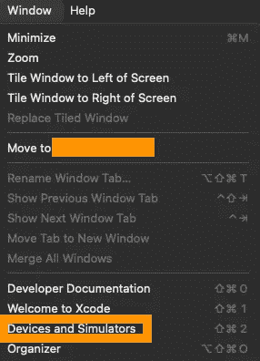

# [Xcode]无法安装 app-name

> 原文：<https://medium.com/geekculture/xcode-unable-to-install-app-name-7599f0cf6596?source=collection_archive---------3----------------------->

当使用 Xcode 构建实际设备时，构建可能会成功，但有时会出现这样的错误，设备无法启动。在本文中，我将向您展示如何解决这个问题！

**结论**:

设置文件不正确。

删除旧的预配文件

**窗口>设备和模拟器**

