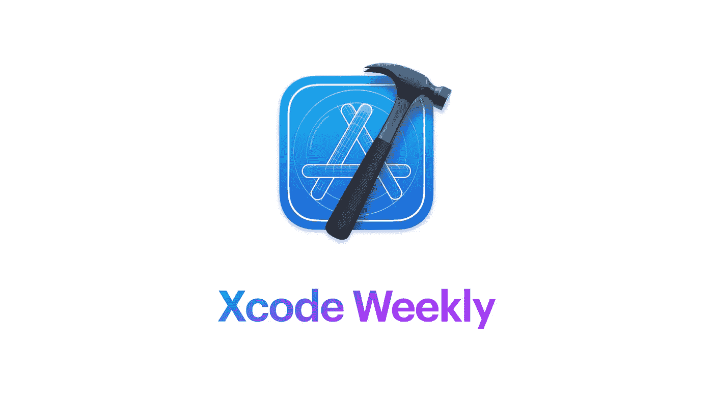
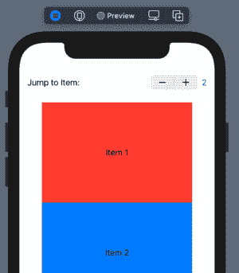

# Xcode 周刊-你一周的 iOS 开发剂量- 04

> 原文：<https://medium.com/geekculture/xcode-weekly-your-ios-dev-dose-for-the-week-04-fdabdb5e1438?source=collection_archive---------9----------------------->

## IOS 开发者周刊杂志

首先，抱歉耽搁了。我父亲上周做了手术，我在医院陪着他。这是没有计划的，所以我没有时间完成草案。

# 🤔Xcode 周刊是什么？

> 在一个 iOS 开发者的一生中，学习不是短跑，而是马拉松。但是我知道跟踪所有的博客、YouTube 频道、twitter 账户、会议、时事通讯等有多难。
> 
> *Xcode 周刊是我在一周内浏览的一系列 iOS 应用开发者的东西，我觉得这些东西很重要。我正在和这里的每个人分享。*
> 
> *有许多涵盖许多领域的每周时事通讯。但它们部分满足了我的需求。所以这是给那些可能寻找我寻找的东西的人的。*

让我们看看这个星期我都有些什么。

# 📰新闻

**1。**[***提醒:APNs 供应商 API 要求于 3 月 31 日开始***](https://developer.apple.com/news/?id=uzyxiriy)

基于 HTTP/2 的 Apple Push Notification service(APNs)provider API 让您可以利用一些强大的功能，比如使用 JSON Web 令牌进行身份验证、改进的错误消息传递和每个通知的反馈。如果您仍然使用传统的二进制协议发送推送通知，请确保尽快升级到 APNs 提供商 API。2021 年 3 月 31 日之后，APNs 将不再支持传统的二进制协议。

*功劳*-[-*developer.apple.com*-](https://developer.apple.com)

2. [***加拿大初创公司 Buddybuild 在 2018 年苹果收购后关闭***](https://www.macrumors.com/2021/03/01/buddybuild-closing-after-apple-buyout/?utm_campaign=iOS%2BDev%2BWeekly&utm_medium=web&utm_source=iOS%2BDev%2BWeekly%2BIssue%2B497)

在发给现有客户的一封电子邮件中，Buddybuild 表示，自 2021 年 3 月 31 日起，将不再支持这些服务，更新也将停止。到秋天，该公司将完全停止运营。在关闭之前，Buddybuild 建议客户“尽快”开始迁移他们的工作。

*信用*-[MAC rumors](https://www.macrumors.com)

3. [***俄亥俄州向公众扩展在线 Swift 编码和开发课程***](https://www.macrumors.com/2021/02/10/ohio-state-swift-courses-open-publicly/)

在一份新闻稿中，该大学表示，自一年多前推出该项目以来，已有 3000 多名学生、教师和校友加入了该项目，现在任何人都可以从世界任何地方在线加入该项目。

*信用* - [*Macrumors*](https://www.macrumors.com)

# 📃教程

1.  [***支持点击和长按 SwiftUI 中的按钮***](https://steipete.com/posts/supporting-both-tap-and-longpress-on-button-in-swiftui/)

我今天的任务非常简单:向 SwiftUI 中的按钮添加一个可选的长按处理程序。一个常规的点击会打开我们的网站，长按会做…别的事情。没那么难吧？

*功劳-* [*斯坦伯格*](https://steipete.com)

2. [***雨燕编译器初学者***](https://theswiftdev.com/the-swift-compiler-for-beginners/)

了解如何使用 swiftc 命令构建可执行文件，了解构建管道、编译器和连接器。

*Credit-T*[*heSwiftDev*](https://theswiftdev.com)

3. [***如何在 Swift 中使用@autoclosure 提高性能***](https://www.avanderlee.com/swift/autoclosure/)

Swift 中的@autoclosure 是一种闭包，它允许省略大括号，使其看起来像普通表达式。然而，在引擎盖下，它仍然是一个封闭。通过理解这意味着什么，我们可以提高代码的效率。

4.[***swift ui ScrollViewReader 教程***](https://www.ioscreator.com/tutorials/swiftui-scrollviewreader-tutorial)

在 SwiftUI 中，ScrollViewReader 是一个在子视图中提供编程滚动的视图。使用 scrollTo 方法执行滚动。在他的教程中，可以使用步进器选择项目编号。当选择该数字时，ScrollViewReader 将滚动到所选项目。本教程是为 iOS 14 和 Xcode 12 打造的，可以在苹果开发者门户[下载](https://developer.apple.com/download/)。

*信用-*[IOs creator](https://www.ioscreator.com)

# 📺录像

1.  [***使用 SwiftUI 堆栈创建简单的 AR 用户界面&按钮***](https://youtu.be/R1XHWyprFVk)

欢迎来到我的 RealityKit + SwiftUI 课程！在本课程中，您将学习如何为 iPhone 和 iPad 构建 AR 家具应用程序。

*信用-* [*现实学校*](https://www.youtube.com/c/realityschool)

2. [***使用 SwiftUI 登录苹果| iOS 14 | Swift 5***](https://youtu.be/O2FVDzoAB34)

Kilo Loco 向您展示如何使用 SwiftUI 和 iOS 14 实现与苹果的登录。本教程将涵盖处理 SIWA 按钮用户界面，持久化用户凭证，以及撤销苹果特权登录。

*贷-* [*斤机车*](https://www.youtube.com/channel/UCv75sKQFFIenWHrprnrR9aA)

3.[***SwiftUI 中的***](https://youtu.be/pHtNwgIhUm4)

在这个视频中，Mohammad Azam 将演示如何在 SwiftUI 中创建渐变。

*功劳-* [*阿扎尔*](https://azamsharp.com)

# 🤎独立特别🧑🏽‍💻

1.[***2020 年我作为独立 iOS 开发者赚了多少***](https://youtu.be/M6cDnvAXj2M)

我回顾了 2020 年作为一名独立开发者，我在 App Store 上赚了多少钱。在看了其他人分享类似信息的视频后，我觉得把我的数据扔进拳击场是公平的。请在评论中留下你的问题。

*信用-* [*蒂娜·刘易斯*](https://www.youtube.com/channel/UCwIILfbH8vE_996NiDTqBcA)

***就这样了伙计们，我该离开了。***

我会试着每周都这样做，但不敢保证😷。

**下一版⏭** [**Xcode 周刊——你一周的 iOS 开发剂量——05**](https://rajaikumar.medium.com/xcode-weekly-your-ios-dev-dose-for-the-week-05-47646b706ceb)

**上一版⏮** [**Xcode Weekly —你一周的 iOS 开发剂量- 03**](/nerd-for-tech/xcode-weekly-your-ios-dev-dose-for-the-week-03-7504997704ad)