# XOXO！用 Python 创建 TicTacToe 游戏

> 原文：<https://medium.com/geekculture/xoxo-creating-the-tictactoe-game-with-python-634f7f604840?source=collection_archive---------23----------------------->

Photo by [Visual Stories || Micheile](https://unsplash.com/@micheile?utm_source=unsplash&utm_medium=referral&utm_content=creditCopyText) on [Unsplash](https://unsplash.com/s/photos/tic-tac-toe?utm_source=unsplash&utm_medium=referral&utm_content=creditCopyText)

嗯，TicTacToe-是的 x 和 Os。当我们完成后，我会告诉你赢得 90%的机会的明显诀窍。让我们跳进来。

页（page 的缩写）s:我本地安装的 Python 版本是 Python 3。另外，我使用 PyCharm 作为我的集成开发环境(IDE)。不用担心，只要兼容 Python，什么 IDE 都适合。

对于这个动手项目，我们将创建 TicTacToe 的命令行版本。它将有各种类型的玩家(人机，人机，计算机-计算机)。

首先，我们分成两个项目:

> 程序 1: Player.py
> 
> 程序二:Game.py

我们所要做的就是连接这些类，并告诉游戏类“这是我的 x 玩家，这是我的 O 玩家”

## 程序 1: Player.py

我们首先要做的是创建这个文件。然后我们导入“数学”和“随机”模块。

我们导入“数学”库，因为它为我们提供了对 Python 中一些常见数学函数和常数的访问。还有随机模块，因为我们确实需要对计算机进行一些随机化，不是吗？

是的，我们有！

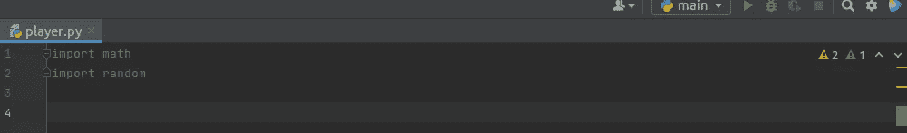

想知道为什么我们在右边有警告标志吗？这是因为我们还没有使用导入的库。我们会在跑步的时候用到它们。

## 职业选手

接下来，我们将创建一个基本的“玩家”类。然后我们将初始化玩家将要代表的字母。

“_init_”是一个方法(构造函数)，用于初始化我们的“player”类的属性。

“self”只是我们的 player 类的一个实例。它简单明了地帮助我们访问“player”类的属性和方法。在这种情况下，我们的属性是“字母”。Self 不存储值或类似的东西，但是没有它，你的方法和属性就不能工作。

大多数语言使用这个，但是在 python 中，我们使用“self”。皮顿人只是以自我为中心-我猜你会说我也是，哈哈。

只是为了让你用非技术语言理解；属性(颜色、形状、大小)回答什么问题，方法(启动、加速、移动)回答如何问题。

字母是我们的“玩家”类的属性。字母= X 和 o。

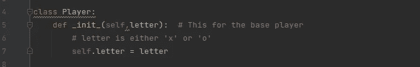

由于 TicTacToe 不是一个人的游戏，我们希望其他玩家也能玩，所以我们从“game”中定义了 get_move 函数。然而，我们还没有定义游戏类别。

我们使用 pass 关键字，因为我们还没有准备好执行代码。

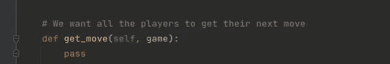

## 班级电脑玩家

这个类从基本的 Player 类继承属性。我们使用 super()函数来访问基本 player 类中的方法。超级()。调用超类(或基类或播放器)中的初始化。

## 人类职业玩家

对于人类玩家来说，我们的超类仍然是玩家。

页（page 的缩写）请注意我是如何互换使用超类、基类和父类的，因为它们的意思是一样的。

初始化的设置就像电脑播放器一样。

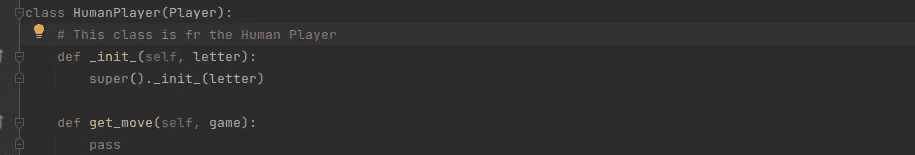

很好，让我们切换并创建游戏文件。

## 程序二:Game.py

这是游戏程序，所以我们将第一个类定义为“TicTacToe 类”

我们将初始化 TicTacToe 板。

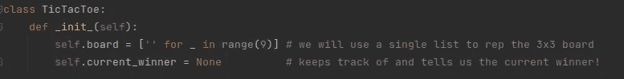

* *当值不重要时，使用“_”。范围是 9，因为它是一个 3x 3ti tacoe 板。“”表示这是板上的一个空白点。

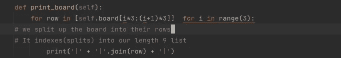

我们想看看这个板子里有什么，所以我们把 self.board 分成不同的行。我们这样做是为了选择哪一组三人组。第一、第二或第三排。

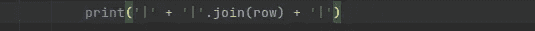

值“|”充当分隔符。join(row)连接字符串中的“I”值，其中分隔符是垂直线。本着坦诚的精神，垂直线对这个程序的逻辑没有任何贡献。

使用静态方法是因为它不涉及任何特定的板。而且我们不一定要传入一个‘自我’。静态方法不允许你继承类的属性。

所以我们只需要打印出哪个数字对应哪个点。

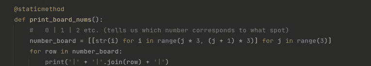

范围(3)中 j 的数字板是[ 0，1，2]。和上面的板子范围是一样的。它的作用是给出每行的索引。

所以[0，1，2]是一个子数组。

[3，4，5]是另一个子数组。

[6，7，8]是最后一个子数组。

然后我们用上面的方法连接这些字符串。

现在，我们想进入游戏的逻辑。这是 TicTacToe 而不是 Chess，所以我们用一个空格来表示空白。然后，我们需要知道玩家走一步后的可用走法。

我们将不得不为此返回一个索引列表。

i==指数

先说评论部分；它详细描述了返回函数。

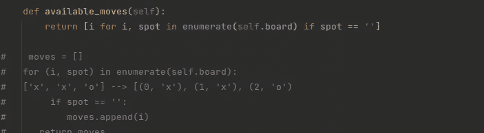

首先，我们将移动初始化为一个空列表。我们使用枚举赋值来遍历整个板值。枚举方法为板上的值添加一个计数器。这是一个反复的任务。它创建一个列表并分配两个极点；索引和值。使用 enumerate 命令，我们可以知道一个玩家刚刚在第(0，0)行玩了‘x’。

如果 spot == empty space，我们知道这是一个可用的移动，然后将该 spot 的索引附加到“moves”上。最后，我们返回移动。

然而，用一个列表理解——返回函数来写这个更简洁。

返回函数向我们传递索引，枚举函数帮助我们知道可用的空位置。

## 回到 Player.py

请记住，我们没有定义 get_move 函数，而是使用了“pass”来阻止它的执行。现在让我们定义 get_move 函数。

## RandomComputerPlayer

对于计算机，我们将在计算机上随机选择一个空的点。我们将随机选择存储在“square”中。

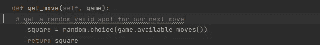

## 人类玩家

valid_square 和 val 分别为 False 和 None，因为用户尚未输入任何值。如果有一个值输入，valid_square 将为真。

该字符串被添加到“self.letter”中，因此不会混淆该轮到谁了。

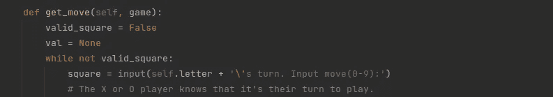

## 支票

我们需要确保该值是一个有效的数字。我们只能通过将方形字符串转换为整数来实现。因为我们不能将(a，b，c)这样的字符转换成整数，这将返回一个错误。此外，如果该值在游戏程序中不可用，它将返回一个错误。

如果它通过了那个块，那么我们可以说 valid_square 为真。

然后，我们用 except 命令捕获 ValueError，并打印输入的字符串。

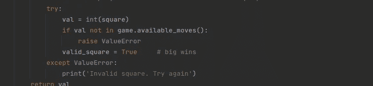

所以一旦我们有了一个有效的正方形，它就会返回那个值。

## 返回游戏. py

下一步，我们在 TicTacToe 类之外定义一个名为“play”的函数。设置 print_game 函数打印出游戏中的步骤。

我们也给“letter”分配一个起始字母。

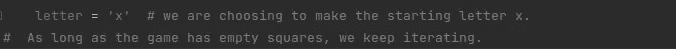

你怎么想呢?我们应该检查一下这个游戏是否还有空方块，对吗？让我们后退一步，定义空方块和空方块数函数。

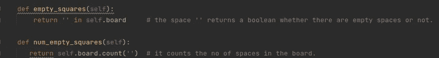

所以当有空的方块时，我们想让合适的玩家移动。

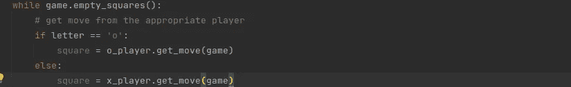

接下来，让我们再回去，定义一个函数来进行下一步。当我们移动时，我们需要用户想要移动的方格的信息以及玩家的字母。

如果 self.board 是空的，我们将该字母分配给给定的方块。

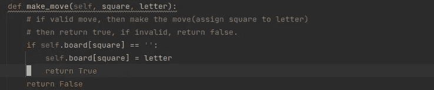

此后，让我们把它放到我们的播放循环中。

页（page 的缩写）s:括号用来索引一个数组。Square 是一个数组。

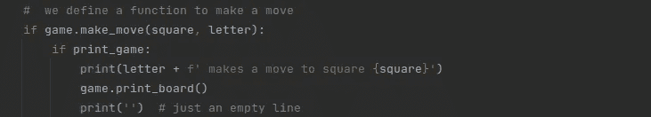

走完这步棋后，我们需要在游戏循环中交替字母。

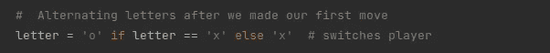

为了游戏的流畅性和易玩性，我们加入了“时间.睡眠”功能。我们在程序的顶部导入时间。

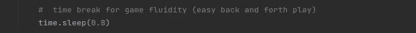

我们很清楚，这是一个让玩家成为赢家的举动。所以我们回到 make_move 函数，把字母赋给当前的获胜者。

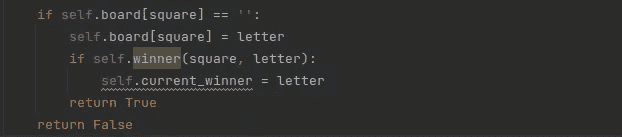

回到游戏循环，移动后，我们将检查当前的赢家，如果有一个当前的赢家，一个字母赢了，我们可以结束游戏。

或者在 while 循环结束后，如果是平局，我们输出‘这是平局’。

等等，让我们来定义函数‘赢家’

是的，我们知道如果你在任何地方连续出现 3 个，你就是赢家。我们必须检查所有的可能性。

所以 row_ind 将是给定的平方除以 3 并向下舍入。

给定行索引，我们得到行。

all 命令是可迭代的；对于行中的每个点，我们检查该点是否等于字母。

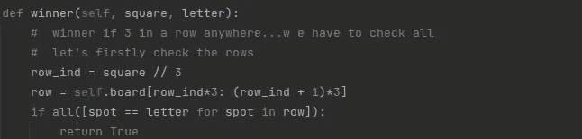

列和对角线的逻辑类似于行逻辑。

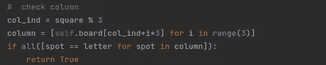

## 对角线

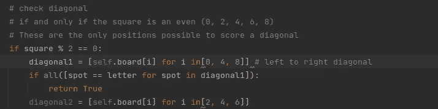

# 将 TicTacToe 推送到我的远程存储库

我进入了我的目录。请注意，有两个略有不同的 TicTacToe 目录，因此我使用 ls 命令列出了我的目录，然后选择了正确的目录。我使用“git init”命令在这个目录中初始化了一个本地 git 存储库。

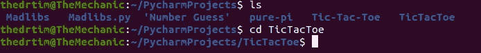

我暂存了我们的 game.py 和 player.py 文件。使用 git 状态，我确认它们实际上是上演的。

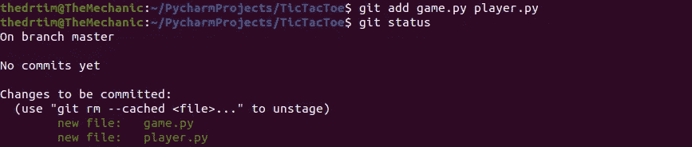

然后，我们将文件提交给本地存储库。

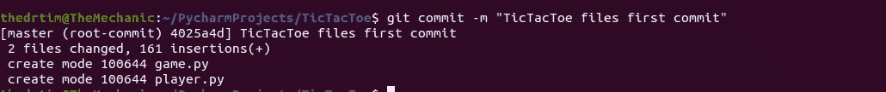

要将我们的文件从本地存储库推到远程存储库，我们必须设置上游；我们将它设置为远程存储库的主分支。

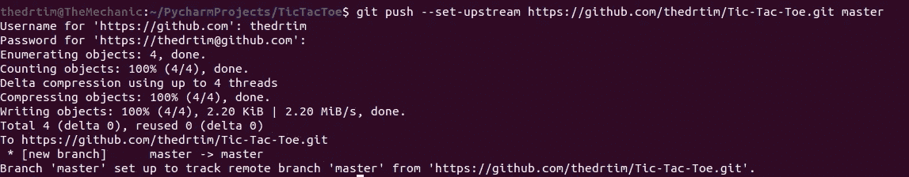

哇哦。看看这个。

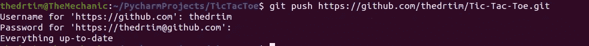

现在与我们在远程存储库中拥有的进行比较…

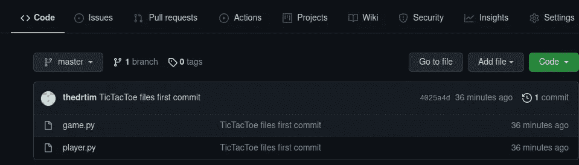

呵呵，是啊…那些是我们的文件。

我们的程序是有效的，我们致力于存储库。Booyah！

哦，顺便说一下，如果你想把这个发给你的同事、团队成员或者大部分是朋友，只要把这个库的链接发给他们，他们就可以“git 克隆”它了。

所以，是的，我告诉过你我要告诉你一个公开的把戏，对吗？这是:

> 确保你的信在中间。结束了！

我正在考虑用 Python 创建一个国际象棋游戏，如果我最终完成了，我会把它链接到这里。干杯！

所以我期待听到你对 Python、构建游戏和 DevOps 文化的观点和贡献。我不得不说，我的内容并不局限于传统的软件领域，但我也打破了商业和战略的神话和传说，以及它们与软件的集成。

我的内容总是能引起软件和软件相关领域的专业人士和新手的共鸣。因此，如果你有任何问题，请提出来，或者你也可以通过 [Twitter](https://twitter.com/TimothyBamiro?t=KiFKyGjRfP7eZLLsqqHEEg&s=08) 和 [GitHub](https://github.com/thedrtim) 联系我。

感谢阅读。

如果你对这个话题有任何想法，请留下评论——我乐于学习和探索知识。

# 我可以想象这个帖子有多有用，请留下掌声👏下面几次以示对作者的支持！