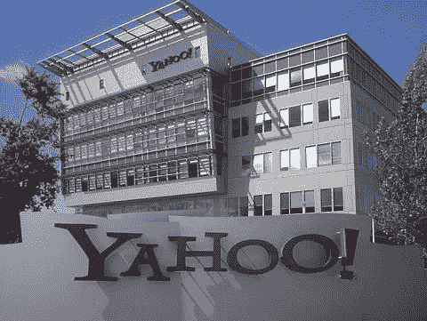

# 雅虎 IP 终于在软银 16 亿美元的交易中赚了大钱

> 原文：<https://medium.com/geekculture/yahoo-ip-finally-scores-big-money-in-1-6bn-softbank-deal-b25c960f39fd?source=collection_archive---------12----------------------->

## 日本公司获得前互联网巨头的品牌和“许可技术”的权利，给企业家上了一课

Source: [Gaku](https://commons.wikimedia.org/wiki/File:YAHOO_headquarters.jpg) ([CC BY 2.0](https://creativecommons.org/licenses/by/2.0/deed.en))

五年前，许多市场观察家预计雅虎的专利拍卖会给这家遭受重创的互联网公司带来数十亿美元的收入。