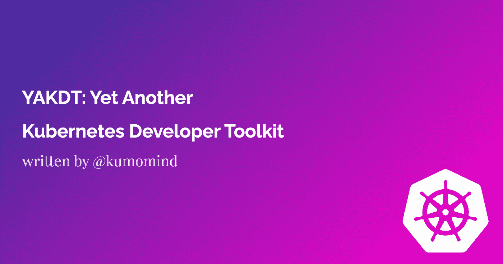

# YAKDT:另一个 Kubernetes 开发工具包

> 原文：<https://medium.com/geekculture/yakdt-yet-another-kubernetes-development-toolkit-387c93acf4ab?source=collection_archive---------8----------------------->

这篇文章与我们的最新文章 [YAKD:另一个 Kubernetes 仪表板](/geekculture/yakd-yet-another-kubernetes-dashboard-7766bd071f30)一致，其中我们列出了几个专门用于管理 Kubernetes 集群的仪表板项目。在本文中，我们主要关注开发工具，并试图强调每个人都应该记住的注意事项，以正确识别哪个工具在哪个环境中是最好的。