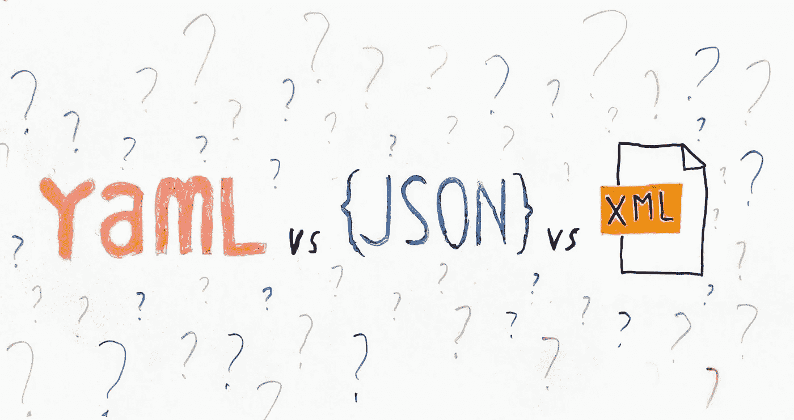

# 围棋中的 YAML vs JSON vs XML。

> 原文：<https://medium.com/geekculture/yaml-vs-json-vs-xml-in-go-bf4ebd1066f2?source=collection_archive---------15----------------------->

在最近的一个 Go 项目中， [I](https://www.linkedin.com/in/andrew-hayes-belfast) 不得不选择发送和接收数据所使用的数据格式。我通常使用 JSON，但是我决定对这些选项进行诚实的比较。我相信你已经从标题中了解到，主要的竞争者是 YAML、JSON 和 XML。我评估他们的标准是:

1.  人类可读性。能够在开发和调试过程中读取数据是很好的。