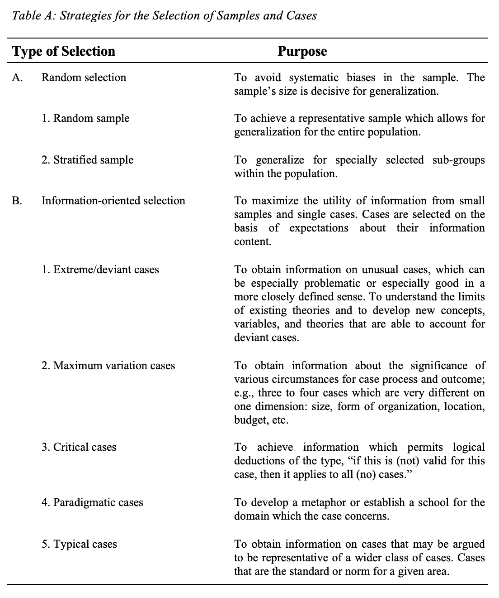

# 是的，你可以从案例研究中归纳出

> 原文：<https://medium.com/geekculture/yes-you-can-generalize-from-a-case-study-f8000bd647b9?source=collection_archive---------21----------------------->

## 不管你的主管怎么说

Source: Pixabay

> "从案例研究中归纳的秘密是案例的战略选择."

这是科学哲学和方法论中的一个普遍原则，人们不能从案例研究中概括出来。这是错误的。事实上，通过智能抽样，可以从案例研究中进行归纳——甚至从单个案例研究中进行归纳。*

从案例研究中归纳的秘密是案例的战略选择。当目标是获得关于给定问题或现象的尽可能多的信息时，典型案例或随机样本往往不是最有效的策略。这是因为典型的或一般的案件往往不是最丰富的信息。典型或极端的案例可能揭示更多，因为它们在所研究的情况中激活了更多的行动者和更多的基本机制。

> “阐明特定问题及其后果背后的深层原因通常比描述问题的症状及其发生频率更重要。”

此外，从以理解为导向和以行动为导向的角度来看，澄清特定问题及其后果背后的深层原因往往比描述问题的症状及其发生频率更重要。强调代表性的随机样本将很少能够产生这种因果洞察力；一个或几个案例的有效性往往会选择。

表 A 总结了可供研究者选择样本和案例的各种策略。

Source: Author, [https://bit.ly/37by31b](https://bit.ly/37by31b)

极端或异常的案例非常适合以一种特别戏剧化的方式表达观点，这种情况经常发生在著名的案例研究中，如福柯的“全景监狱”和弗洛伊德的“狼人”。异常案例也特别适合理论发展，因为它有助于研究人员理解现有理论的局限性，并开发新的概念、变量和理论，这些概念、变量和理论将能够解释以前被认为是异常值的东西。

> “如果铅和羽毛以相同的速度下落(在真空中),那么我们可以假设大多数或所有的物质以相同的速度下落。不需要大的随机样本来证明这一点。”

相反，*临界情况*可以被定义为相对于一般问题具有战略重要性。例如，为了测试不同的物体是否以相同的速度下落(在真空中),有策略地选择铅和羽毛是临界情况选择的一个例子，用于发展万有引力定律。这种对材料的特殊选择提供了一种可能性，即形成一种具有临界情况特征的概括，一种“如果对这种情况有效，对所有(或许多)情况都有效”的概括在其否定形式中，概括将是，“如果它对这种情况无效，那么它对任何(或仅少数)情况都无效。”或者具体来说，对于重力定律:“如果铅和羽毛以相同的速度下落，那么我们可以假设大多数或所有的物质以相同的速度下落。”

如何识别危急情况？这个问题比什么构成危急情况的问题更难回答。确定一个关键案例需要经验，而且不存在可以确定地确定一个关键案例的通用方法原则。唯一可以给出的一般建议是，在寻找关键案例时，寻找“最有可能”或“最不可能”的案例是一个好主意，也就是说，这些案例可能明确证实或无可辩驳地证伪所考虑的命题和假设。

> “最有可能的情况特别适合于命题的证伪，而最不可能的情况最适合于验证测试。”

“最不可能”案例的典型例子是罗伯特·米歇尔对组织中寡头政治的经典研究。通过选择一个具有强烈民主理想的横向结构的基层组织——也就是说，一种寡头政治可能性特别低的组织——米歇尔斯可以测试寡头政治理论的普遍性；也就是说，“如果这个组织是寡头的，那么大多数其他组织也是。”“最可能”案例的一个相应的典型例子是 W. F .威特对一个波士顿贫民区的示范性研究，根据现有的理论，该贫民区应该表现出社会无组织性，但事实上却表现出完全相反的情况(参见*当代人种学杂志*，第 21 卷，第 1 号，1992 年)。

“最有可能”的情况特别适合于命题的证伪，而“最不可能”的情况最适合于验证测试。应该注意的是，一个命题最可能的情况是它最不可能被否定的情况。例如，威特的贫民窟可以被看作是一个关于社会组织普遍性的假设的最不可能的例子。因此，将病例确定为最有可能或最不可能与研究的设计以及实际病例的具体特性相关联。

> "对于预测理论是如何产生的，不存在预测理论."

选择案例的另一个策略是选择*典型案例*。托马斯·库恩已经表明，自然科学家的基本技能或背景实践是按照“样本”来组织的，样本的作用可以由科学史家来研究。类似地，像克利福德·吉尔兹和米歇尔·福柯这样的学者经常围绕特定的文化范式组织他们的研究:吉尔兹的范式是巴厘岛斗鸡的“深度游戏”，而福柯认为欧洲监狱和“圆形监狱”是例子。这两个案例都是典型案例的例子，也就是说，这些案例突出了有关社会的更普遍的特征。

库恩已经表明，科学范式不能表达为规则或理论。对于预测理论是如何产生的，不存在预测理论。一项科学活动是否被认为是好的科学，取决于它与一个或多个范例的接近程度；也就是好的科学工作的实际原型。科学家如何做科学的典型案例正是这样一个原型。它作为一个参考点运作，并可能作为一个思想学派的创立的焦点。

> "对于典型案例来说，不存在标准，因为它设定了标准."

与临界案例一样，我们可能会问，“如何识别聚合案例？”如何确定一个给定的格是否具有隐喻和原型价值？这些问题甚至比关键案例更难回答，因为典型案例超越了任何基于规则的标准。对于典型案例来说，不存在标准，因为它设定了标准。伯克利教授休伯特和斯图尔特·德雷福斯认为范例和案例研究是人类学习的核心。因此，在与休伯特·德雷福斯(Hubert Dreyfus)的一次访谈中，我提出了一个问题:什么构成了一个典型案例，以及如何识别它。德雷福斯回答道:

*“海德格尔说，你之所以认可一个范例，是因为它闪闪发光，但这恐怕没有多大帮助。你只需要凭直觉。我们都能分辨出孰优孰劣——比如塞尚的一幅画。但是我不认为有什么规则可以决定塞尚是一个典型的现代画家。。。在一个民主社会里，这是一个大问题，人们应该证明他们的直觉是正确的。事实上，没有人能真正证明他们的直觉是什么。所以你要编理由，但不会是真正的理由。”*

你可能同意德雷福斯的观点，直觉是识别聚合案例的核心，但你可能不同意必须证明自己的直觉是一个问题。对科学实践的人种方法学研究表明，所有这类实践都依赖于感觉很直观的理所当然的程序。然而，这些直觉的决定是负责任的，在某种意义上对其他从业者是明智的，或者如果不是立即明智的，通常是可以解释的。在选择典型案例时，似乎经常会出现这种情况。

> “通常，仅仅说明一个人的直觉认为某项特定的研究应该进行是不够的。

我们可能会根据理所当然的直觉程序来选择这样的案例，但我们经常被要求对这种选择做出解释。对于我们所在的学术团体的其他成员来说，这种说法一定是明智的。这甚至可以被认为是学术的一个普遍特征，无论是科学的还是其他的，而不仅仅是选择典型的社会科学案例研究。例如，仅仅说一个人的直觉告诉他应该进行某项特定的研究，通常不足以证明申请研究基金是正当的。一个研究委员会，或者其他批准机构，理想地作为社会的一个测试来运作，测试研究人员是否能以集体可接受的方式解释他们的直觉选择，即使直觉可能是研究人员想要执行他们的项目的真正或者最重要的原因。

不可能始终如一地，甚至经常地，预先确定一个给定的案例——例如，Geertz 在巴厘岛的斗鸡——是否是典型的。除了案例的战略选择之外，案例研究的执行当然也会起到一定的作用，研究团体、被研究的群体以及更广泛的公众对研究的反应也是如此。案例研究的价值将取决于研究者对其研究的有效性主张，以及这些主张在与其他有效性主张的对话中所获得的地位，而该研究正是对这些有效性主张的贡献。像其他优秀的工匠一样，研究人员所能做的就是利用他们的经验和直觉来评估他们是否认为一个给定的案例在聚合的背景下是有趣的，以及他们是否能够为案例的选择提供集体可接受的理由。

最后，应该提到的是，案例选择的各种策略不一定是相互排斥的。例如，一个案例可以同时是极端的、关键的和典型的。对这种案件的解释可以证明是特别丰富的，因为人们可以根据案件是否被视为和解释为一种或另一种类型的案件而获得关于案件的各种观点和结论。

— — — — — — — — —

*)如需包括参考资料在内的完整文本，请点击此处:[https://bit.ly/37by31b](https://bit.ly/37by31b)