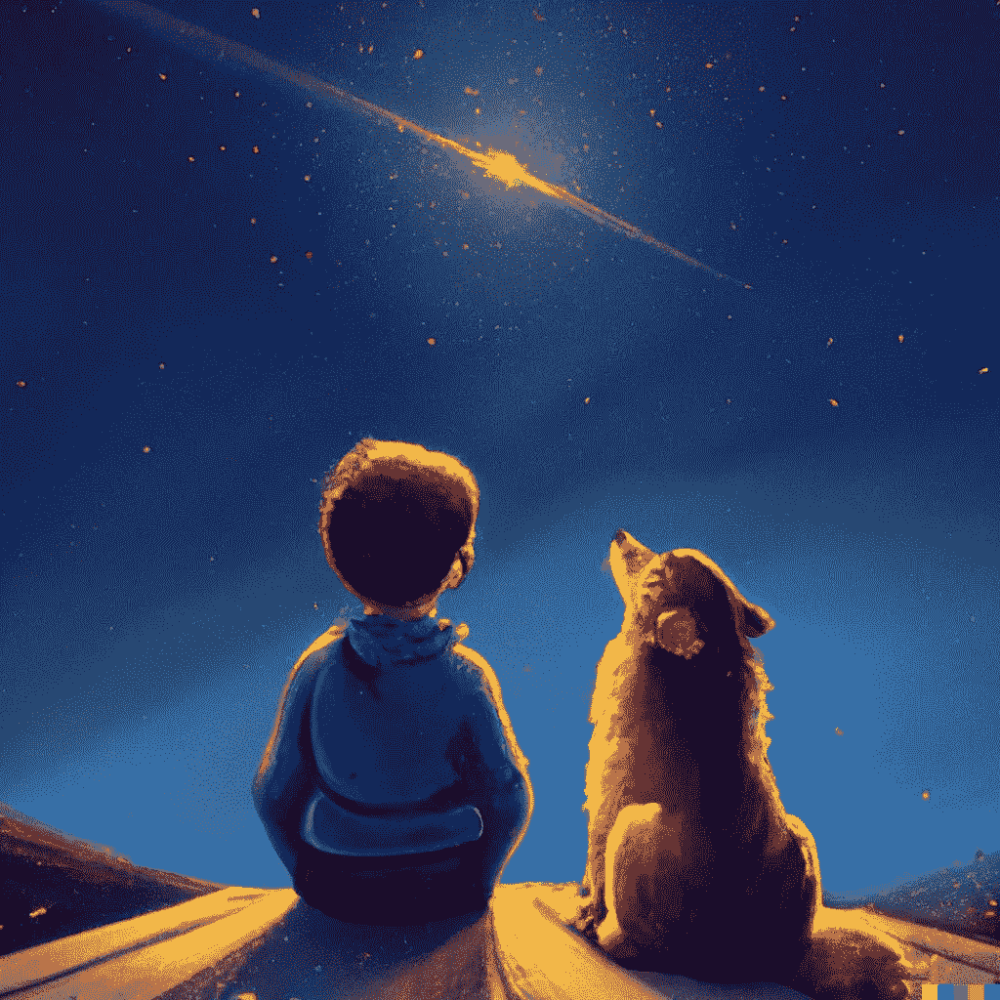

# 昨天标志着艺术行业的死亡

> 原文：<https://medium.com/geekculture/yesterday-marked-the-death-of-art-as-an-industry-1472b9c49c63?source=collection_archive---------1----------------------->

## 从昨天开始，人工智能现在几乎在任何意义上都比人类艺术家强。这就是人类艺术和设计即将崩溃的原因。

2022 年 3 月 6 日，OpenAI 发布了 [DALL-E 2](https://openai.com/dall-e-2/) :他们的“新人工智能系统可以从一个……