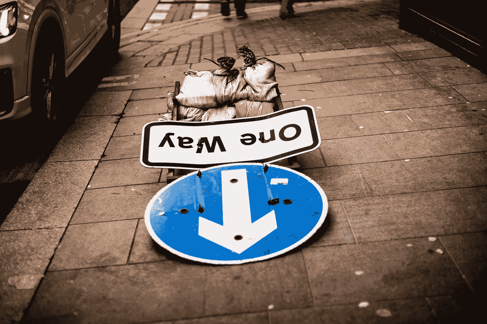

# 你现在正在赔钱。原因如下

> 原文：<https://medium.com/geekculture/you-are-losing-money-right-now-heres-why-1f9c1a767486?source=collection_archive---------34----------------------->

在为时已晚之前止住出血

Photo by [Rob Wicks](https://unsplash.com/@robwicks?utm_source=unsplash&utm_medium=referral&utm_content=creditCopyText) on [Unsplash](https://unsplash.com/s/photos/going-down?utm_source=unsplash&utm_medium=referral&utm_content=creditCopyText)

根据美联储的数据，6 月份通货膨胀率上升了 5.4%，但大多数专家认为可能会更高。杰罗姆·鲍威尔认为这只是暂时的，没有理由担心。一切都在控制之中。

是啊，没错！