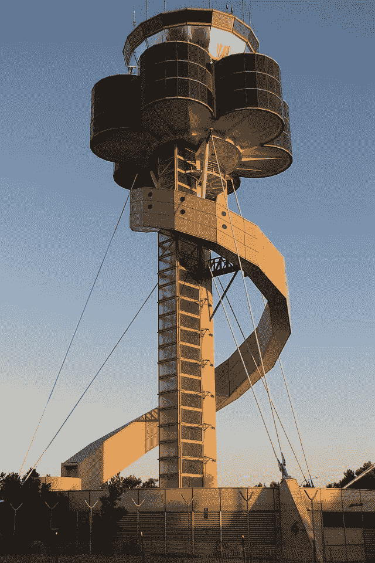

# 你是飞机交通管制员。

> 原文：<https://medium.com/geekculture/you-are-the-aircraft-traffic-contoller-e1dde30cff2b?source=collection_archive---------22----------------------->

Air traffic control tower in Sydney, Australia. Credit [Alan Kenneth Dicker](https://commons.wikimedia.org/w/index.php?title=User:Albyontour&action=edit&redlink=1) on Wikimedia Commons.

# 如何管理你的情绪和环境以获得更大的生产力

每天，我们都有一个关于如何完成工作的理想。当我们面对自己的情绪、身体状态以及许多其他人的情绪和身体状态时，这无疑与现实相冲突。然而，有一个哲学，你可以用来整理这些事情…