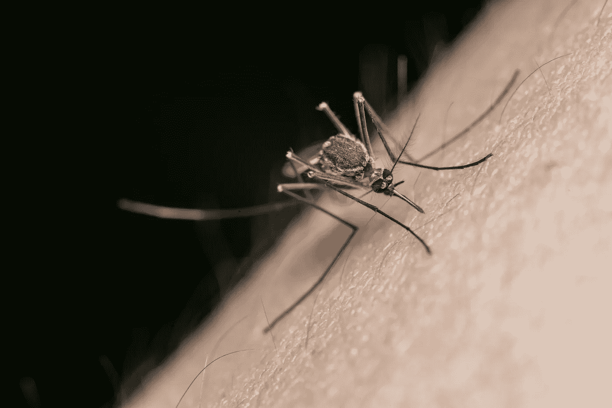
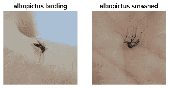
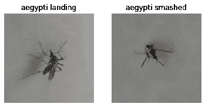
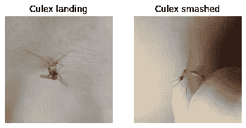
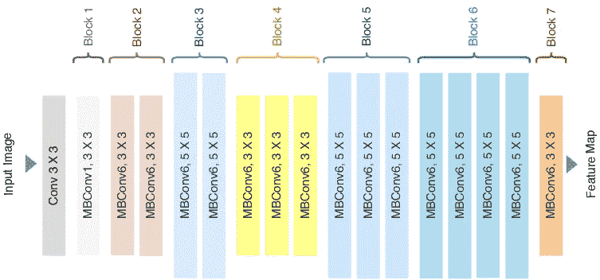
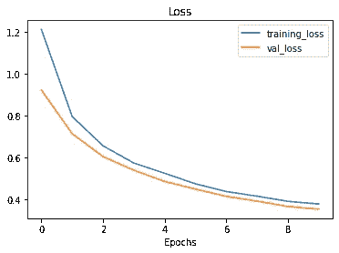
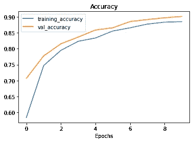
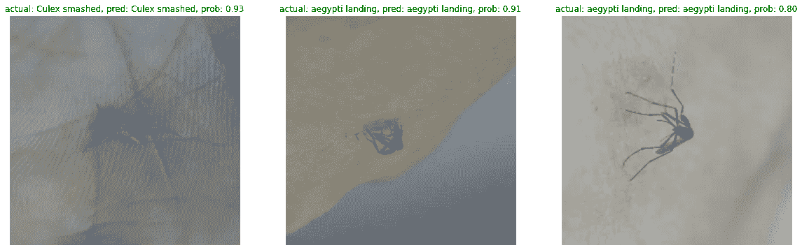
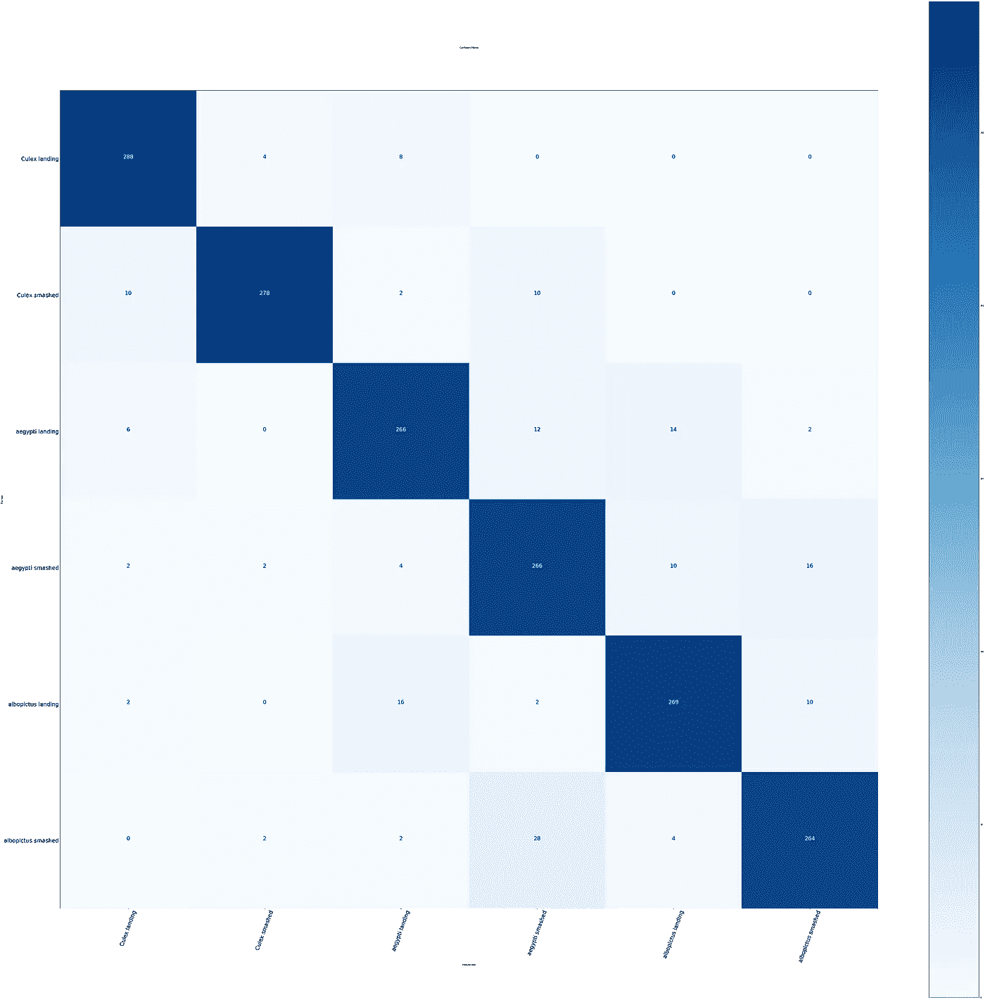
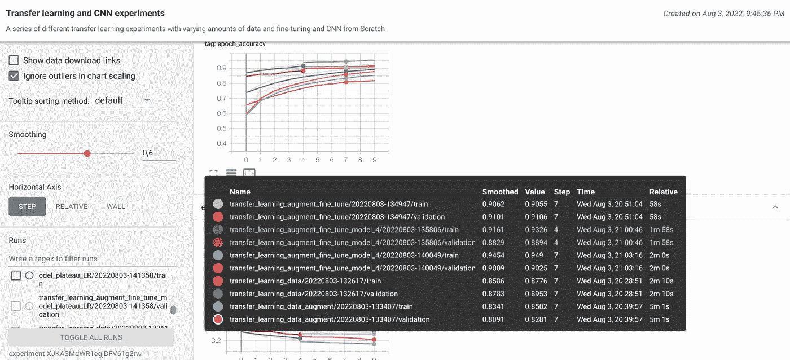

# 在图像数据分类问题中进行迁移学习可以获得更好的精度

> 原文：<https://medium.com/geekculture/you-can-get-a-better-f1-score-when-carrying-out-transfer-learning-in-your-image-data-classification-bc46165766b3?source=collection_archive---------7----------------------->

## 图像分类

## 如何用 Tensorflow 对人体皮肤上的蚊子进行类型分类？

Photo by Jimmy Chan: [https://www.pexels.com/photo/macro-shot-of-a-mosquito-on-human-skin-12972048/](https://www.pexels.com/photo/macro-shot-of-a-mosquito-on-human-skin-12972048/)

∘ **目录**
[图像预处理](#8341)
[建模与推理](#c79d)
[评估](#84b5)
[张量发展](#59a0)
[结论](#d5d4)
[参考文献](#5514)
[感谢阅读！](#3ab9)

识别昆虫的种类可以造福人类。你可以识别蝴蝶的种类，这可以帮助植物更快地繁殖，并识别其他昆虫，以了解它是否是一种危险的昆虫。通过了解这一点，你将能够看到它们如何生活以及如何与特定类型的昆虫互动。例如，你不想伤害那些会吃你花园里害虫的昆虫，以及更多你可以通过识别昆虫类型得到的例子。然而，我想到了一个问题，

> 有没有想过用科技给昆虫分类？有可能做吗？

绝对的，真的有可能做到。你将使用 **TensorFlow 对人类皮肤上的蚊子进行分类。**

通过执行基于可用数据的深度学习模型，您可以识别每种类型的昆虫，并**确定给定地点和时间的蚊子动物群的物种组成，以便进行更长时间的研究**。这对于研究或对未来有用的东西是必不可少的，无论是课本上的新知识还是作为参考的人。而且，对于特定类型的蚊子，可以了解害虫的类型。在深入研究这个实验之前，我建议阅读第 1 部分(共 2 部分),其中我解释了关于使用 Tensorflow 解决图像数据问题的基本知识，以及成功实现它需要了解的内容。

 [## 图像数据任务上的 Tensorflow 袖珍参考

### 如何使用 Tensorflow 为图像数据任务建立深度学习模型？

medium.com](/geekculture/your-tensorflow-pocket-references-on-image-data-88ff84a5a44d) 

在本实验中，您将在多分类问题上对人类皮肤上的蚊子类型进行分类。蚊子有 6 类，分别是**白纹落地、白纹粉碎、埃及伊蚊落地、埃及伊蚊粉碎、库蚊落地、库蚊粉碎**，如下图所示。

6 classes of mosquito types

# **图像预处理**

人体皮肤上的**蚊子是由研究员**王松泉**提供的数据集，他想为分类人体皮肤上的蚊子类型做出更多贡献。你可以在给出的链接上查看更多细节。数据集已经被分成 3 个部分**训练(Train)、验证(Predict)和测试数据。每个分裂平衡了 6 类蚊子类型。****

**你可以查看上面的代码，我们将图像预处理成合适的大小 224 *224，有 3 个颜色通道。我们使用 tf.keras.preprocessing 对它们进行预处理。同样，您可以查看本文的第 1 部分，其中我解释了一些预处理图像的方法。其中一个是 tf.keras.preprocessing，使用它的优点是可以更快地处理数据，还有一些功能，如执行训练优化、批处理和张量计算优化，这些都超出了本文的范围。您还可以使用 Tensorflow 提供的另一个类，如 **ImageGenerator** 实例。对于本文，我更喜欢使用 **tf.keras .预处理**。**

**上面的代码解释了我们如何基于一个数据集对图像进行预处理，该数据集被分成大小相似的训练、验证和测试数据。我们还使用批量大小 32 来帮助梯度下降在深度学习模型的训练期间进行反向传播时更快地收敛。我还解释了为什么在训练深度学习模型时，当它们适合上一篇文章中的图像/数据时，批量大小是必不可少的。**

** [## 图像数据任务上的 Tensorflow 袖珍参考

### 如何使用 Tensorflow 为图像数据任务建立深度学习模型？

medium.com](/geekculture/your-tensorflow-pocket-references-on-image-data-88ff84a5a44d) 

# **建模和推理**

我在这个数据集上尝试了很多实验，从使用 TensorFlow 从零开始执行 CNN，调整超参数，尝试各种迁移学习模型，发现使用超参数调整的 EffiecientNetB0 已经给出了更好的准确性( **~90%** )，如上面的代码所示。我使用 tf.keras.application 下载 EfficientNetB0，用于训练我们的特定数据集，在这种情况下，我们的蚊子在人类皮肤上。你可以看到使用 Tensorflow 实现迁移学习是多么容易。你可以在[的论文](https://arxiv.org/abs/1905.11946)中看到 Google 开发的 EfficientNetB0 的模型架构，以了解更多细节。根据我参加 Kaggle 竞赛的经验，我经常看到人们使用 **EfficientNet** 作为计算机视觉竞赛的基础。如果你对 Kaggle 中的竞争相当熟悉，这就像 XGBoost 对表格数据的竞争。在下面的 EfficientNetB0 模型架构中，我们的输入数据大小为 224*224(我们对数据进行了预处理和调整)。同样，因为迁移学习模型架构超出了本文的范围，所以我认为阅读本文是理解模型架构的更好方法，如下所示

EfficientNetB0 model architecture

你可以看到，只需几行代码，你就可以用基于模型架构预处理过的数据实现 EfficientNetB0。一个重要的收获是，我们添加了一个隐藏层，使用 **softmax 激活函数**来获得图像的预测概率。最大的预测概率将是基于在我们的训练模型上测试的每个图像上的 6 类蚊子类型的预测。你可以在我的 Kaggle 笔记本上看到

 [## 人类皮肤上的蚊子

### 使用 Kaggle 笔记本探索和运行机器学习代码|使用人类皮肤上蚊子的数据

www.kaggle.com](https://www.kaggle.com/code/naiborhujosua/mosquito-in-human-skin) 

在那里，我使用 Tensorflow 从头开始尝试了各种预处理数据，如数据增强和迁移学习模型架构或 CNN。您将看到使用超参数调整的迁移学习如何优于从头开始执行的 CNN 模型。与使用迁移学习的 **90%** 相比，CNN 模型只给出了大约 **70%** 。**需要注意的一件重要事情**是根据迁移学习模型架构中使用的数据使用所有输出，或者根据我们的具体任务使用 suit。在这种情况下，您将选择 6 个类作为输出，而不是使用 **EfficientNetB0** 上的所有输出。我们通过在使**成为 base_model 实例**和时更改参数 **include_top=False** 来做到这一点，并使用 softmax 激活函数将输出更改为 **6 个类**和**。**然后，我们编译模型并选择损失函数和 Adam 优化来帮助梯度下降更快地收敛**。**在深度学习模型的许多实现中，当拟合到数据**、**时，大多数深度学习实践者经常使用 **Adam 优化**，因为它可以改变学习速率以收敛到全局最小值**。**拟合数据并完成训练过程后，您可以绘制图来比较训练和验证数据的损失和准确性。如下图所示，当周期达到 **10 个周期**时，损耗减少，当周期达到 **10 个周期**时，精度增加到大约 **90%** 。

The Comparison of Loss and Accuracy on training(TRAIN) and validation data(PRED)

如下图所示，您可以通过比较基础真实值和预测类来了解我们的训练模型有多有效。你可以从这三个测试图像中看到，我们正确地预测了它们，预测概率显示为更好地理解它的注释。

Code for comparing test images and ground truth labels

The comparison between Ground truth and prediction classes

你可以在第一张图片上看到我们在基础真实和预测类之间的比较，其中基础真实是 culex smashed，而我们的预测类也是 **culex smashed** 。与 **aegypty landing** 类似，为第二张和第三张图像上的地面实况和预测类。

# **评估**

评估在建模过程结束后起着重要的作用。尽管**在现实生活中，作为机器学习实践者，我们将进行机器学习循环过程，我们将总是一次又一次地评估，以查看我们训练过的模型的性能，这种性能往往会随着时间的推移而下降**。然后，您需要评估新图像(测试数据)中的训练模型，以查看我们的训练模型在基于我们从训练数据中获得的模式的未知数据上的测试效果。因为我们做的是一个图像分类问题，很多人用准确率评分来看我们的模型在数据平衡的情况下有多有效。准确性分数是我们的模型正确预测的分数。我们的数据集对于训练、预测和测试数据中的每个拆分都相当平衡。在这种情况下，我们可以使用精确度。我们可以使用 scikit-learn 库获得如下代码所示的 accuracy_score

Accuracy Score implementation on Scikit-learn

使用此代码，我们将我们的基本事实或 y_labels 与预测(测试数据中最大的预测概率)进行比较。分数越高，我们得到的准确度就越高。在这个实验中，调整了一些超参数，如学习率、运行多少个历元，并尝试了早期回采，我们得到了大约 90%的**准确度分数。你可以在[笔记本](https://nbviewer.org/github/naiborhujosua/Medium_Notes/blob/main/notebook/mosquitos_on_human_skin.ipynb)里查看代码。**

** [## 基于 nbviewer 的人体皮肤蚊虫图像分类

### 看看这个 Jupyter 笔记本！

nbviewer.org](https://nbviewer.org/github/naiborhujosua/Medium_Notes/blob/main/notebook/mosquitos_on_human_skin.ipynb) 

除此之外，通过可视化下图中混淆矩阵表上的预测标注和基本事实，您可以看到我们的准确度分数是多么有效

Confusion matrix for multiclass classification

Confusion Matrix

X 轴显示预测的标注，y 轴显示实际情况。该表的对角线部分越暗，我们得到的分数就越好，如上图所示，在 90 %的准确率分数中，我们得到的错误分类标签越少。你也可以在笔记本上看到我们如何对混淆矩阵进行编码的更多细节。

# **张量板开发**

跟踪我们的机器学习模型是监控我们模型性能的好方法。你可以在下图中看到，我们在各种深度学习模型上跟踪我们的准确度分数，并将其上传到 tensorboarddev。这是使用 Tensorflow 的优势之一，我们可以跟踪训练好的模型并公开分享。你可以查看我解释 tensorboard 以及如何将你的评估指标分数上传到**tensor board . dev .**的第一部分。你可以通过访问这个 [tensorboard.dev](https://tensorboard.dev/experiment/XJKASMdWR1egjDFV61g2rw/#scalars&runSelectionState=eyJzY3JhdGNoX2Nubi8yMDIyMDgwMy0xMjUyMTEvdHJhaW4iOmZhbHNlLCJzY3JhdGNoX2Nubi8yMDIyMDgwMy0xMjUyMTEvdmFsaWRhdGlvbiI6ZmFsc2UsInNjcmF0Y2hfY25uX2F1Z21lbnQvMjAyMjA4MDMtMTI1NzU2L3RyYWluIjpmYWxzZSwic2NyYXRjaF9jbm5fYXVnbWVudC8yMDIyMDgwMy0xMjU3NTYvdmFsaWRhdGlvbiI6ZmFsc2UsInRyYW5zZmVyX2xlYXJuaW5nX2F1Z21lbnRfZmluZV90dW5lLzIwMjIwODAzLTEzNDY1OC92YWxpZGF0aW9uIjpmYWxzZSwidHJhbnNmZXJfbGVhcm5pbmdfYXVnbWVudF9maW5lX3R1bmUvMjAyMjA4MDMtMTM0NjU4L3RyYWluIjpmYWxzZSwidHJhbnNmZXJfbGVhcm5pbmdfYXVnbWVudF9maW5lX3R1bmVfbW9kZWxfcGxhdGVhdV9MUi8yMDIyMDgwMy0xNDEzNTgvdmFsaWRhdGlvbiI6ZmFsc2UsInRyYW5zZmVyX2xlYXJuaW5nX2F1Z21lbnRfZmluZV90dW5lX21vZGVsX3BsYXRlYXVfTFIvMjAyMjA4MDMtMTQxMzU4L3RyYWluIjpmYWxzZX0%3D) 来跟踪图表

Monitoring accuracy on training and validation dataset in tensorboard dev

# **结论**

图像分类在动物分类、医学成像、物流、汽车等许多领域中使用最多。它被用在许多用例中，在这些用例中，我们识别特定的图像并预测特定图像的标签。你可以在我们的实验中看到，我们用张量流来预测蚊子的类型。对于深度学习实践者来说，拥有一个对图像进行分类的好知识是一件对社会产生影响的好事。

# **参考文献**

*   Ong，Song-Quan (2022)，“人皮上的蚊子”，门德利数据，doi: 10.17632/zw4p9kj6nt.2 关于[人皮上的蚊子数据集](https://data.mendeley.com/datasets/zw4p9kj6nt/2)** 

# **感谢您的阅读！**

***真的很感谢！*🤗*如果你喜欢这个帖子并且想看更多，可以考虑* [***关注我***](https://naiborhujosua.medium.com/) *。我发布与机器学习和深度学习相关的主题。我尽量让我的帖子简单而精确，总是提供可视化和模拟。***

****

****Josua Naiborhu** 是一名业务发展分析师，后来成为一名自学成才的机器学习工程师。他的兴趣包括**统计学习、预测建模和可解释机器学习**。他喜欢跑步，这教会他不要放弃做任何事情，即使是在实施**机器学习生命周期(MLOps)** 的时候。除了追求他对机器学习的热情，他还热衷于投资印度尼西亚证券交易所和加密货币。他一直在跑 2015 年**雅加达马拉松和 2019 年**大阪马拉松的全程马拉松。他的下一个梦想是参加波士顿马拉松、TCS 纽约市马拉松和 Virgin Money 伦敦马拉松。**

***你可以在****LinkedIn****，****Twitter****，G****ithub****，***上和他联系或者直接在他的* ***个人网站上联系他。********