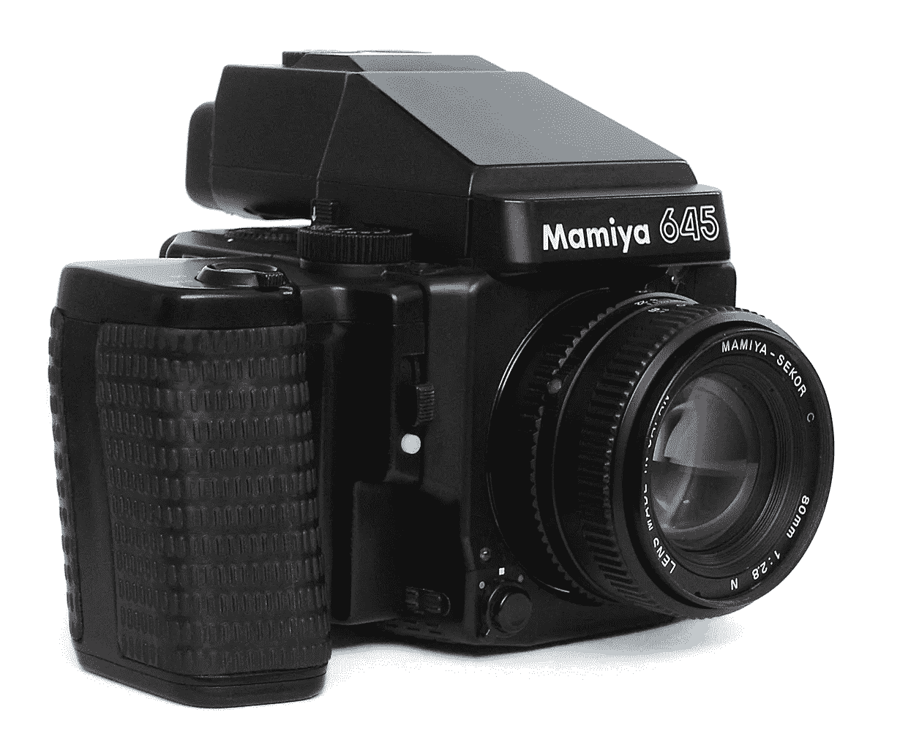

# 2022 年中画幅电影摄影还是可以入门的

> 原文：<https://medium.com/geekculture/you-can-get-started-in-medium-format-film-photography-even-nowadays-fea91edf5f33?source=collection_archive---------4----------------------->

我几乎一生都喜欢摄影，从 80 年代我十二岁时使用胶片相机开始，到 21 世纪现代数码单反相机和智能手机结束。有一次，我在当地的网络市场上看到一台 Mamiya 中画幅胶片相机，价格不错，于是我决定“为什么不呢？”。

Mamiya 645 Camera, Image Source © [https://en.wikipedia.org/wiki/Mamiya_645](https://en.wikipedia.org/wiki/Mamiya_645)