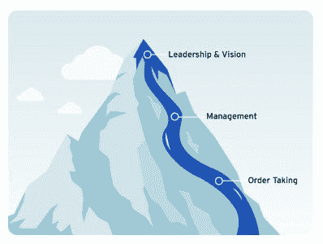

# 你不需要“技术战略”

> 原文：<https://medium.com/geekculture/you-dont-need-a-tech-strategy-44a425e68a97?source=collection_archive---------12----------------------->

作为一名顾问，我最讨厌的事情之一就是有潜在客户向我寻求帮助，帮助他们制定技术战略。乍一看，这似乎是一个显而易见的合适人选:我与技术高管一起工作，我提供有感觉的战略研讨会。问题的关键在于，当你决定制定一项技术战略时，你已经成功了一半。

只有当你满足于让 R&D 纯粹充当公司决策的传递工具时，专注于技术战略才有意义。你得到一份路线图；你提供你所承诺的。大获成功！(?)努力将 R&D 作为一个创新中心和推动整个公司前进的力量，而不仅仅是一群订单接受者和一台过于昂贵的吉拉解析机，这一点怎么了？

# 不要被划分

让人们认为制定“技术战略”是正确的一步，这种误解源于未能意识到他们在公司中的真正角色。越来越多的企业开始认识到技术是任何现代公司的主要原则。《华尔街日报》将这位转世的首席信息官吹捧为半个首席运营官:我们必须为商业责任而奋斗。

如果你等着别人先告诉你公司的“总体战略”是什么，然后才开始考虑如何最好地实现它，那么最大限度地发挥世界级 R&D 组织的潜在优势是不可能的。这意味着你没有在适当的时候参与讨论，从而允许技术在你的公司中被分割。

在科技高管操作系统 的 [*中，我深入探讨了向上游发展的重要性:你必须在决策桌上占据一席之地。不再有人给你战略；你应该是它构想中的一个伙伴。*](https://techexecutiveoperatingsystem.com)

# 真正的策略

你有没有被一个倡议击中，只是对自己说，“*我希望他们早点让我参与进来*”？这是一个滞后指标，表明在决策流中的位置不够高。

不宣称你的位置可能感觉很自然。对许多人来说，这是阻力最小的道路。然而，这实质上是免除甚至放弃你作为公司高管的责任。你应该直接参与到公司中来，也是为了你有才华的团队。

当您参与制定实际战略时，您会立即获得几个明显的好处:

**减少需要扑灭的火灾:**通过了解事情的发展方向，你不太可能在执行本季度的“技术战略”时陷入困境，没有意识到两周后首席执行官将告诉你下个季度的计划，该计划需要在两个月前就应该进行的人员配备。让自己高高地站在决策流的顶端，可以让你看到前进的方向。

首先要有更好的计划:我们都知道，决策需要改变的地方越往后，代价就越大。通过参与制定计划，你可以帮助制定计划，从而获得最大的投资回报。您可以了解需求和目标，并提出实现这些目标的理想团队利用方式。你为形成[产品团队而不是功能团队](https://svpg.com/product-vs-feature-teams/)打开了大门。

**培养产品工程师:**只有在战略过程中扮演积极(甚至主动)的角色，你才能对公司的方向和目标有深刻的理解。这些知识是你个人产品掌握的先决条件，也是你能够在团队中灌输同样的产品掌握的先决条件。这就是如何培养更多能够专注于正确事情的产品工程师的方法。这些产品工程师知道该问哪些问题。他们会对不同功能和决策的内在 ROI 有一种直觉。而且，有时最重要的是，他们将拥有必要的知识来获得真正的技术资本，而不是纠结于技术债务。

*Aviv Ben-Yosef 2021 —最初发表于* [*科技高管最佳时事通讯*](https://avivbenyosef.com/newsletter/)