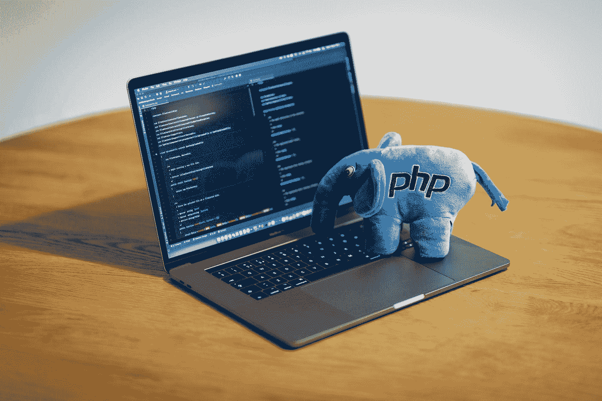

# 你懂 PHP 吗？

> 原文：<https://medium.com/geekculture/you-down-with-php-18b17172b8db?source=collection_archive---------41----------------------->



Photo by [Ben](https://unsplash.com/@benofthenorth?utm_source=medium&utm_medium=referral) on [Unsplash](https://unsplash.com?utm_source=medium&utm_medium=referral)

所以在我的上一篇文章中，我写了一些关于 WordPress 的内容。在同样徒劳的情况下，我要写 PHP，WordPress 是用这种语言编写的。我将介绍历史和一些最佳实践。这可能会成为一个多篇文章的主题，就像 Java 一样。然后我们会讲一些语法，有例子。所以让我们开始吧。

PHP 或超文本预处理器是一种通用脚本语言，非常适合 web 开发。由丹麦裔加拿大程序员拉斯马斯·勒德尔夫于 1994 年创建，但现在由 PHP 团队控制。它通常由 PHP 解释器在 web 服务器上处理。在 web 服务器上，解释和执行 PHP 代码的结果将构成 HTTP 响应的全部或一部分。此外，PHP 可以用于 web 环境之外的许多编程任务。PHP 代码也可以直接从命令行执行。

据我所知，大多数最佳实践对于任何语言都是一样的，但我仍然会提到一些。第一个是免费阅读 PHP 手册，你可以在这里找到它。缩进和使用空格来提高阅读能力，这是对任何编码来说都是好主意的习惯之一。考虑把 MAMP 作为一个数据库。我最近开始用它来学习 WordPress。这些只是少数，但标准仍然适用，如使用干燥(不要重复自己)的原则。确保使用注释，以及正确的命名约定。

对于语法，我们将讨论一些简单的语法。PHP 有几个关键词，可能最有用的一个是 *echo* 。为了节省篇幅，我们还将在同一个例子中讨论变量。在这个例子中，你会注意到变量以$符号开始，可以包含字母、数字和下划线。你还会注意到在例子中我使用了*回声*和*回声*。现在我可以这样做了，因为 PHP 不区分大小写，两个版本都可以接受。

```
 $name = "marvin";
 echo $name;
   //prints marvin $new_name = "Ford Prefect";
 Echo $new_name;
   //prints Ford Prefect $new_9_variable = 42;
 echo $new_9_variable;
   //prints 42
```

就像在大多数其他语言中一样，您可以通过使用赋值操作符来重新分配变量。

```
$name = "marvin";$name = "Ford Prefect";
echo $name;
  /prints Ford Prefect
```

如果想将两个字符串连接在一起，只需使用。(点)运算符。

```
echo "Intergalactic"."Gargle Blaster";
  //prints Intergalactic Gargle Blaster
```

我发现 PHP 的一个优点是(。=)，它将一个字符串追加到另一个字符串的末尾。

```
$gold_brick = "Intergalactic";
$gold_brick .= "Gargle Blaster";
echo $gold_brick;
  //prints Intergalactic Gargle Blaster
```

echo 的一个问题是它不创建分页符。这就是字符串转义序列派上用场的地方。它实际上有利于在字符串中添加特殊字符。

```
echo "*Oh freddled gruntbuggly,";
echo "Thy micturations are to me, (with big yawning)";
//prints Oh freddled gruntbuggly,Thy micturations are to me, (with big yawning)".  -This is onlt on this line because of the size of the box.* echo "*Oh freddled gruntbuggly,";
echo "\n Thy micturations are to me, (with big yawning)";
//prints Oh freddled gruntbuggly, 
         Thy micturations are to me, (with big yawning)*
```

这是深入 PHP 的第一步。我很兴奋能进入其中，因为我开始了一份经常使用 WordPress 的兼职工作。我希望了解 PHP 将有助于 WordPress 的具体细节。