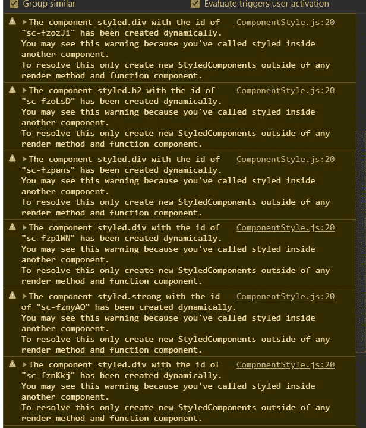
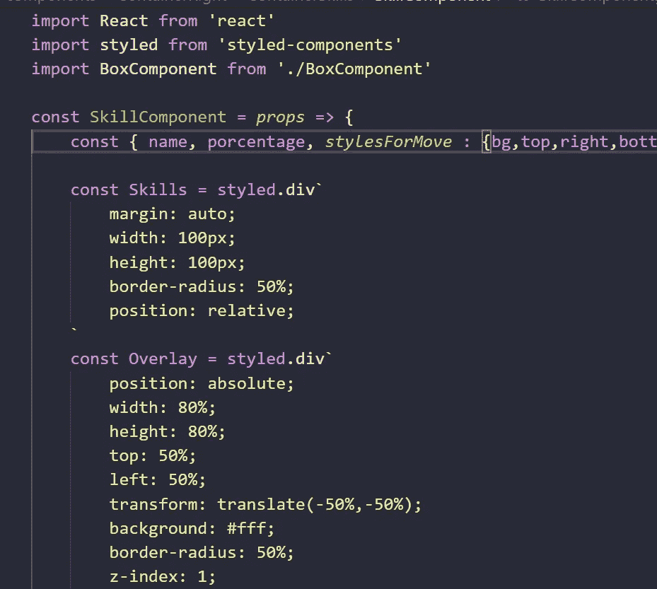
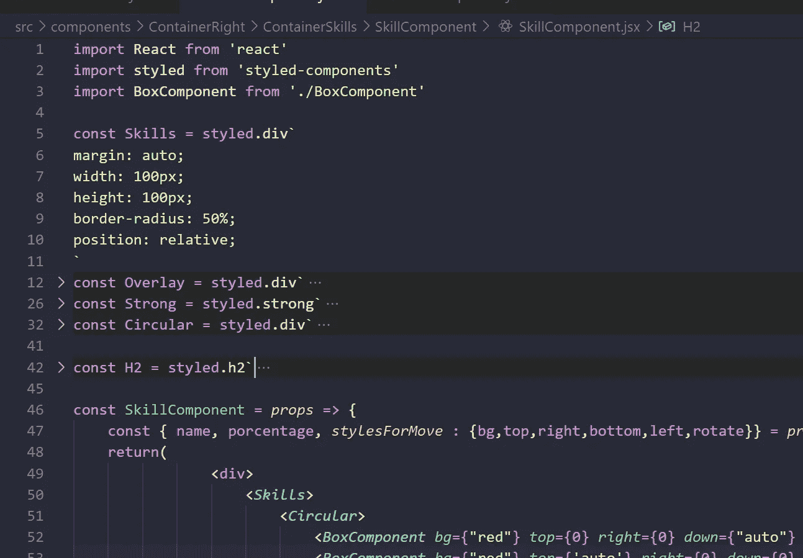
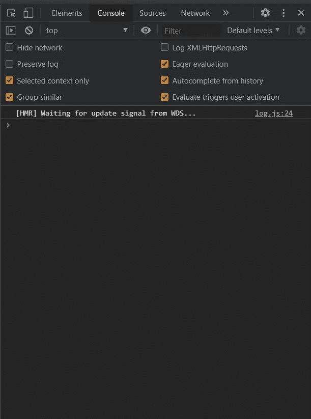

# 您可能会看到这个警告，因为您已经在另一个组件中调用了 styled。样式-组件

> 原文：<https://medium.com/geekculture/you-may-see-this-warning-because-youve-called-styled-inside-another-component-styled-components-7766b4740b22?source=collection_archive---------1----------------------->

id 为" sc-fzplWN "的 styled.div 组件是动态创建的。
您可能会看到这个警告，因为您已经在另一个组件中调用了样式。
要解决这个问题，只需在任何渲染方法和函数组件之外创建新的 StyledComponents。

# 首先，不要惊慌！

You may see this warning because you’ve called styled inside another component.

# 问题示例

Code of styled-component warning

# 解决办法

将所有样式化组件放在组件之外

Example of how to put your code

# 控制台终于清晰了

Finally Step of warning

# 结论

不要惊慌，我们需要冷静下来，然后阅读并试着思考正在发生的事情，然后试着减少警告，用一段代码，你必须尝试它们，最后当事情有点复杂时，保持耐心。