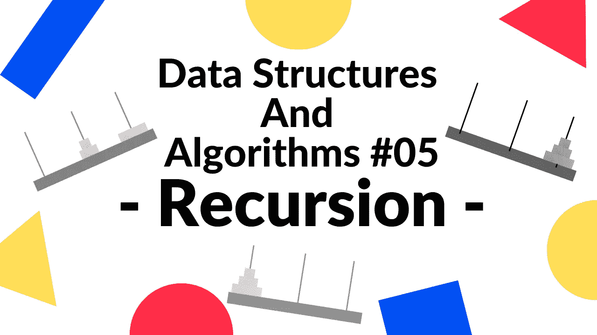

# 下次面试前你必须知道递归

> 原文：<https://medium.com/geekculture/you-must-know-recursion-before-the-next-interview-91cd917999e6?source=collection_archive---------18----------------------->

## 准备好今天的下一次面试了吗#5

在这个故事中，我将讨论递归。递归是计算机科学的主要解题概念之一。所以你在工程生活中一定要懂得解决这类问题。如今，每个技术面试者都准备问一个或多个解决问题的问题来衡量…