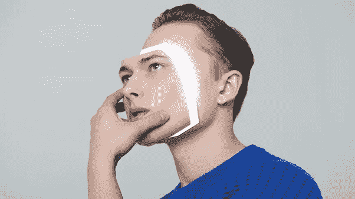
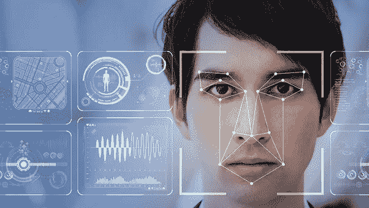
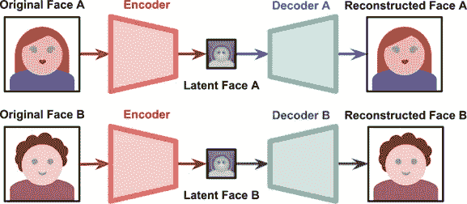
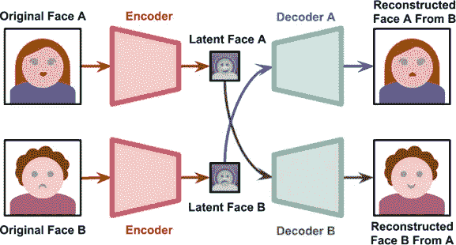
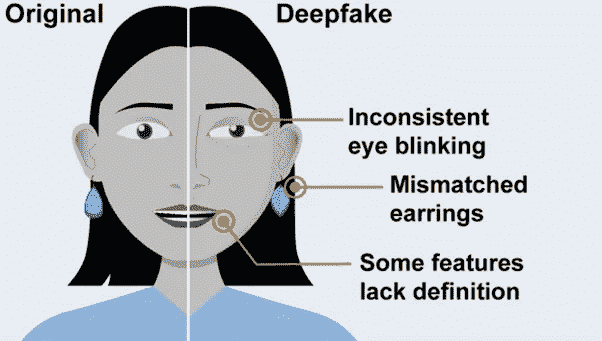
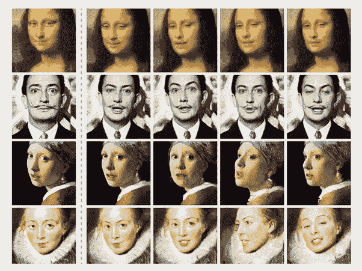

# 你必须学会什么是真实的，什么是伪装的！

> 原文：<https://medium.com/geekculture/you-must-learn-what-is-real-and-what-is-deep-faked-70fabfc1e598?source=collection_archive---------33----------------------->

当权者不再需要压制信息。他们现在可以向我们灌输太多，没有办法知道什么是真实的，什么不是。随着深度造假技术的发展，成为知情公众的能力只会越来越差”。

Google Image

随着深度伪造技术的进步，现在可以使用数字转换技术创造出令人信服的虚构图像。有了这项技术，自己或他人的新身份可能会在社交媒体上一夜之间建立起来。这种改变可能会对人们的生活造成严重破坏，尤其是当深度造假成为病毒的时候。另一方面，深度假不一定是负面的；他们有时可能会产生积极的影响。它对电影业产生了影响，因为演员不再需要做危险的特技；取而代之的是，利用这项技术，被雇来表演这些特技的专业人员被改造成真正演员的形象。

**历史**

早在 1997 年，一项关于计算机图形和交互技术的研究发表了，其中一位专家展示了一个演讲者当前视频片段的新音轨。

这个看似无关紧要的视频内容更改实验很可能是今天演变成“深度伪造”技术的最初一小步。现在，使用机器学习系统来自动化面部复活的过程是可行的。这是向前迈出的重要一步，它导致了世界范围内深度伪造视频创作的广泛采用。

像许多新技术一样，大规模采用发生在发明之后很长一段时间。2016 年，第一款 Face2Face 软件发布，展示了如何利用实时人脸捕捉技术以逼真的方式重现视频。它创造了一种可怕的可能性，摧毁了许多充满希望的未来。

在引爆点之后，这项技术的采用飞速增长。随着机器学习算法的普及，大量深度伪造的电影被创作出来，并在社交媒体渠道上传播开来。典型的例子是广为流传的著名的奥巴马骗局。社交媒体平台 Snap-chat 很快跟进开发了面部开关过滤器。随着人工智能变声器应用的出现，开源的深度伪造视频制作工具和过多的深度伪造项目出现了。

Google Image

深度造假的病毒式传播现在已经变得不可阻挡，而且有可能进一步扩散。对于某些应用程序来说，这可能是一件好事。一般来说，假货会对我们的社会产生巨大的负面影响。我们目前正在进入一个新时代，人工智能深度伪造将逐渐成为一系列领域的重要元素。

许多技术专家和未来学家多年来一直警告我们，人工智能(AI)和机器学习算法是深度伪造技术的基本底层流程，有能力对全球社区产生负面影响。当我们从更广泛的角度来看，他们有充分的理由这么说，因为深度假货比众所周知的“假新闻”要糟糕得多。深度伪装要有效得多:它们能把谎言变成万无一失的真理。

当人们第一次遇到深度造假和深度造假技术时，他们立刻意识到了它们带来的好处。这使得许多发烧友可以随时尝试制作任何人的深度赝品。它只需要一点软件和大量的处理能力。虽然这看起来不合理，但这项技术的娱乐价值是巨大的，尤其是当人们制作电影明星和政治家的深度赝品时。毫无疑问，这是人们接触这项技术的第一步，但是现实世界的应用程序通常要简单得多。

**造假有多深？**

创建面部交换视频有几个过程。首先，数百张两个人的面部照片由一个被称为编码器的人工智能系统处理。在压缩图片时，编码器识别并学习两张脸之间的共性，将它们简化为它们共有的共同特征。

接下来，一个解码器，第二个人工智能系统，被训练从压缩图片中检索人脸。因为人脸不同，你训练一个解码器来恢复第一个人的脸，训练另一个解码器来恢复第二个人的脸。要执行面部交换，只需将编码图片输入“错误的”解码器。

根据研究，深度伪造背后的主要概念是两个自动编码器的并行训练。我们已经看到，原始图像可能具有过多的维度，自动编码器已被用于减少维度并创建图像的紧凑表示，如图所示的潜在面。

Google Image

*例如*，人 A 脸部的压缩图像被输入到训练在人 B 身上的解码器。解码器然后用人 A 的表情和方向重建人 B 的脸部。对于一个令人信服的视频，这必须在每一帧上进行。

解码器与编码器的重量不同。据称，编码器可以去除一个人脸部的所有风格，如头发颜色、眼睛大小、鼻子大小等等。结果，潜伏脸唯一剩下的就是它的结构。然后，解码者用一种新的风格赋予隐藏的面孔新的身份。

生成式对抗网络(GAN)是另一种制造深度假货的方法。两种人工智能算法在一个 GAN 中相互对抗。第一种算法被称为生成器，它被赋予随机噪声并将其转换成图片。这张合成照片随后被添加到一串真实的照片中，比如名人的照片，这些照片被发送到鉴别器中，这是第二种算法。最初，合成照片与人脸没有任何相似之处。然而，如果该过程重复多次，并有关于性能的反馈，并且鉴别器和生成器都得到改进。有了足够的循环和反馈，生成器将开始创建完全逼真的人脸。

**制作深度赝品所需的技术**

用一台标准的计算机制作一个深度赝品是非常具有挑战性的。大多数都是在配有非常强大的显卡或使用云计算能力的高端台式机上创建的。这使得它的时间效率。它将时间从几天、几周减少到几小时。同样，这也需要专业知识。因此，深度伪造没有闪烁图像或面部不一致。现在有很多工具可以帮助人们制造深度赝品。有几家公司会为你创建 deep-fake，在云端处理一切。

**如何识别假货？**

随着基础技术变得越来越先进，识别深度造假变得相当困难。根据一些美国研究人员进行的一项研究，在深度伪造的创作中，人脸不会正常眨眼。不足为奇的是，输入到深度伪造生成器的大多数图像显示的是睁着眼睛的人，因此算法永远不会学习眨眼。最初，它似乎是检测深度伪造的完美解决方案。然而，技术很快克服了这个问题，深度假货开始出现眨眼。

质量差的假货更容易被发现。要么是嘴唇同步不正确，要么是肤色不均匀。

此外，围绕转置面的边缘闪烁也是可能的。精细的细节，比如头发，对于深度赝品来说很难表现得很好，尤其是在边缘可以看到发丝的地方。渲染不佳的珠宝和牙齿，以及不寻常的照明效果，如不一致的照明和虹膜反射，也可以找到。政府、大学和技术研究中心一直致力于检测深度假货。同样，微软、脸书和其他大公司也加入了这场深度造假检测挑战。

## **深度造假的利弊**

每种技术都有利弊，同样深度造假技术也有利弊。其中一些列举如下

> **优点**

*   **艺术**

在 2016 年的《侠盗一号:星球大战》中，深度伪造技术被用来让演员彼得·库欣起死回生，但该技术也可能被用于其他各种有益的艺术应用。这些功能包括返回并修改视频或电影的对话而无需重新拍摄，以及通过从演示者菜单中选择并输入剧本来制作整部电影的功能。

> 一个总部设在英国的组织去年利用深度伪造技术制作了一段视频，视频中大卫·贝克汉姆用九种不同的语言发表抗疟疾信息。
> 
> 营销公司 WPP 开发了企业培训电影，这些电影雇佣人工智能来构建一个演示者，可以说接收者的语言，并称呼他们的名字。

一些俄罗斯研究人员利用这项技术让蒙娜丽莎栩栩如生，生成了一部她移动眼睛、头部和嘴巴的电影。此外，尽管深度伪造技术在打击假新闻的斗争中构成了一个重大问题，但它也被用来生成针对特定观众的主持人主导的新闻广播。

Google Image

*   **轻松定制**

我们现在可以使用一个应用程序来构建我们自己的 3D 结构，改变我们头发的颜色、风格和衣服，以及试穿各种服装。所有这些都借助于深度伪造技术。为时装设计师创建一个虚拟空间，让他们可以快速定制和试穿服装，而不必从头开始制作。

> **缺点**

*   **信任**

让我们从最简单的开始。有几个理由让人们害怕一项可以让任何人看起来在做任何事或说任何话的技术。假设你正在看晚间新闻，偶然发现首相召开了一个煽动暴力的记者招待会。但整件事是个骗局。首相可能会否认，但你怎么知道这不是一个深刻的假呢？你用什么标准来决定相信什么？

当美国研究人员在 2017 年发表一篇论文，解释他们如何生成巴拉克·奥巴马总统的虚假视频时，他们阐明了生殖技术可能存在的危险。谷歌首席执行官马克·扎克伯格也是一个深度伪造视频的目标，在视频中，他似乎将社交网络的成功归功于一个秘密组织。

Deepnudes 是一项允许用户将任何人的头像叠加在色情视频上的服务，最近有人提出了这一建议。尽管该网站的首次亮相被取消了，但这项技术目前是可以使用的。

*   **诈骗**

另一个令人担忧的原因是金融欺诈。音频深度假声以前曾被用来克隆声音和欺骗听众，让他们相信他们正在和他们认识的人交谈。今年早些时候，骗子们用一个科技公司首席执行官的声音来试图说服一名公司员工将钱转移到骗子的账户上。这并不是骗子第一次使用同样的伎俩来诈骗公司。今年早些时候，骗子制造了一个科技公司首席执行官的声音，试图说服一名公司员工向骗子的账户汇款。这并不是骗子们第一次使用同样的策略来诈骗生意。

## **结论**

深度假货是可怕的，它们引起了很多人的共鸣，尤其是那些被这种智能技术伤害的人。

没有一个规则或条例可以阻止使用目前可用的开源软件解决方案。没有立法可以阻止一个有明确目标却没有什么可失去的人。假货已经来了，他们想留下来。假货在这里，而且会一直存在。

信息是明确的**，缓解行动必须优先考虑。**我们必须学会生活在一种文化中，在这种文化中，社交媒体或传统媒体告诉我们的一切都可能是完全不真实的。因此，作为人，我们必须对我们的周围环境保持持续的批判意识。这是在一个几乎任何媒体都可能对你撒谎，而你却无法核实他们所说的是否准确的世界里，试图生存下去的唯一方法。未来是一个迷人的时代，深度伪造技术的出现会带来一些不可预见的变化。