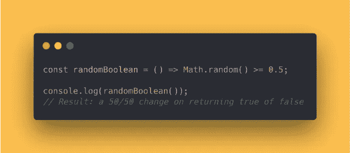
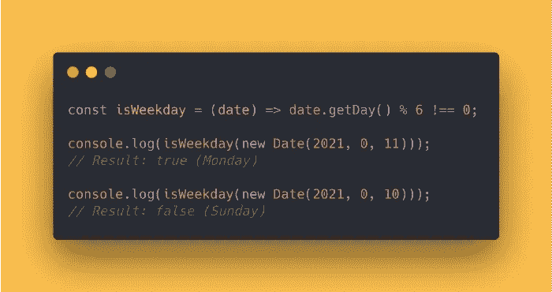
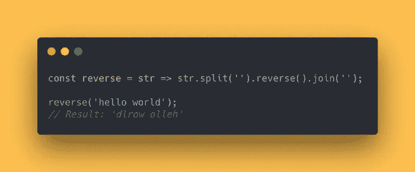
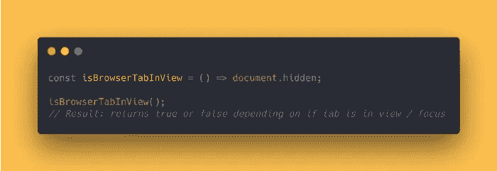
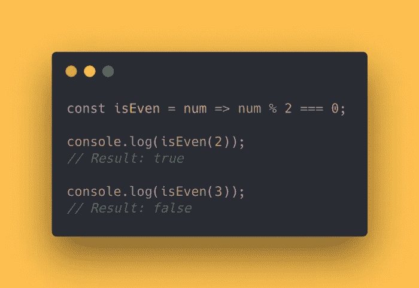
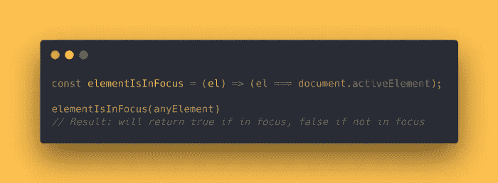
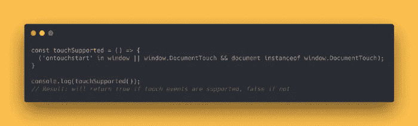
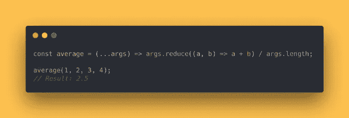
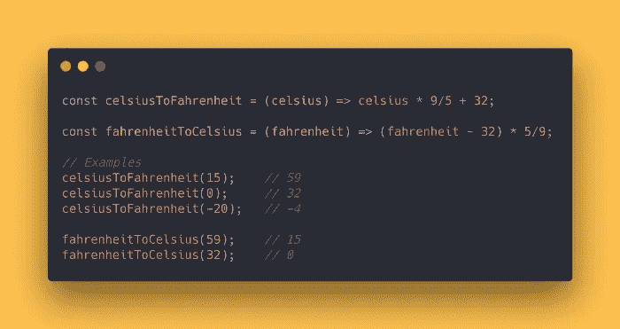
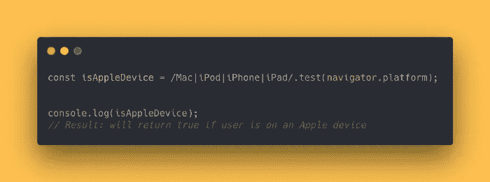

# 使用下面列出的 10 个 JavaScript 一行程序，你会显得很专业

> 原文：<https://medium.com/geekculture/you-will-seem-professional-by-using-the-10-javascript-one-liners-listed-below-a43c8d644f5b?source=collection_archive---------3----------------------->

## 在短时间内，加深你对 JS 的认识。

JavaScript 能够做一些令人惊奇的事情！简而言之，从使用 API 到利用复杂的框架，有很多东西需要学习。不过，它也允许你只用一行代码完成一些不可思议的工作。更多内容，请看这 10 个 JavaScript 一行程序，它们会帮助你显得更专业！

## 1.获取随机布尔值(真/假)

这个函数将使用 **Math.random()** 方法产生一个布尔值(真或假)。将使用 **Math.random** 生成一个介于 0 和 1 之间的随机数，然后我们将确定它是高于还是低于 0.5。因此，有 50%的概率接收到真或假。



```
const randomBoolean = () => Math.random() >= 0.5;console.log(randomBoolean());
// Result: a 50/50 change on returning true of false
```

## 2.验证给定的一天是否是工作日。

通过使用这种技术，您可以确定在函数中提供的日期是工作日还是周末。



```
const isWeekday = (date) => date.getDay() % 6 !== 0;console.log(isWeekday(new Date(2021, 0, 11)));
// Result: true (Monday)console.log(isWeekday(new Date(2021, 0, 10)));
// Result: false (Sunday)
```

## 3.翻转一根线

这里有几种不同的方法来扭转字符串。使用`join()`、`reverse()`和`split()`技术，这是最简单的方法之一。



```
const reverse = str => str.split('').reverse().join('');reverse('hello world');     
// Result: 'dlrow olleh'
```

## 4.验证当前选项卡是否可见并处于焦点中。

`document.hidden`属性可用于确定当前标签页是否可见或是否为焦点。



```
const isBrowserTabInView = () => document.hidden;isBrowserTabInView();
// Result: returns true or false depending on if tab is in view / focus
```

## 5.验证一个数是奇数还是偶数。

模运算符(%)可以处理的一个非常简单的问题。关于栈溢出，[如果你不太熟悉的话，有一个很精彩的图形解释。](https://stackoverflow.com/questions/17524673/understanding-the-modulus-operator/17525046#17525046)



```
const isEven = num => num % 2 === 0;console.log(isEven(2));
// Result: trueconsole.log(isEven(3));
// Result: false
```

## 6.验证组件现在是否在焦点上。

`document.activeElement`属性可以用来确定一个元素现在是否是焦点。



```
const elementIsInFocus = (el) => (el === document.activeElement);elementIsInFocus(anyElement)
// Result: will return true if in focus, false if not in focus
```

## 7.验证当前用户是否支持触摸事件。



```
const touchSupported = () => {
  ('ontouchstart' in window || window.DocumentTouch && document instanceof window.DocumentTouch);
}console.log(touchSupported());
// Result: will return true if touch events are supported, false if not
```

## 8.确定平均参数值

为了获得我们为此函数提供的输入的平均值，我们可以利用 reduce 方法。



```
const average = (...args) => args.reduce((a, b) => a + b) / args.length;average(1, 2, 3, 4);
// Result: 2.5
```

## 9.将摄氏温度转换为华氏温度

管理温度有时会很困难。您可以使用这两个例程在华氏温度和摄氏温度之间进行转换。



```
const celsiusToFahrenheit = (celsius) => celsius * 9/5 + 32;const fahrenheitToCelsius = (fahrenheit) => (fahrenheit - 32) * 5/9;// Examples
celsiusToFahrenheit(15);    // 59
celsiusToFahrenheit(0);     // 32
celsiusToFahrenheit(-20);   // -4fahrenheitToCelsius(59);    // 15
fahrenheitToCelsius(32);    // 0
```

## 10.验证用户是否正在使用 Apple 设备

为了确定当前用户是否正在使用苹果设备，我们可以利用`navigator.platform.`



```
const isAppleDevice = /Mac|iPod|iPhone|iPad/.test(navigator.platform);console.log(isAppleDevice);
// Result: will return true if user is on an Apple device
```