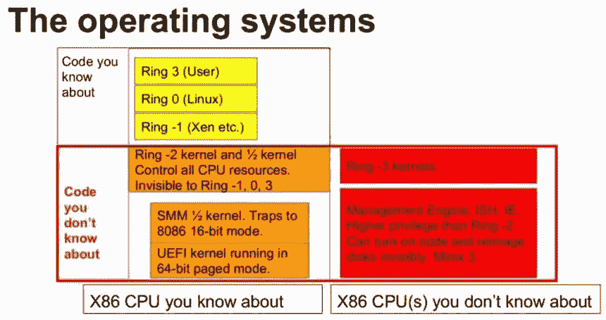
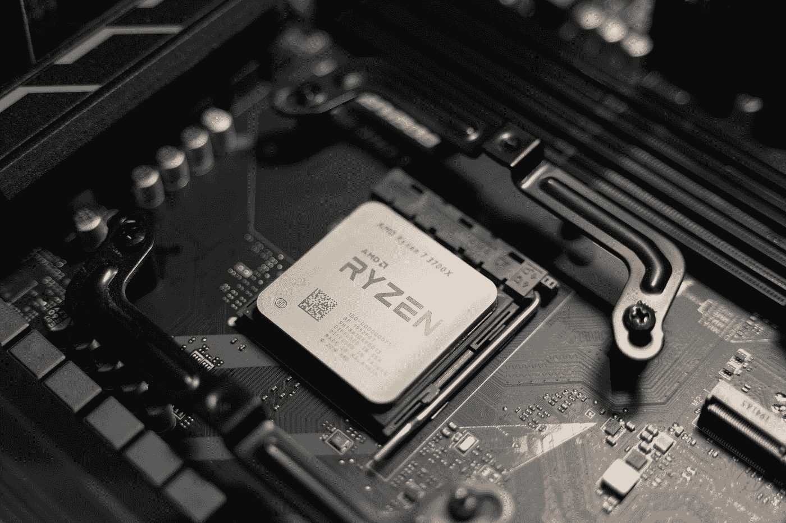

# 你的电脑被窃听了

> 原文：<https://medium.com/geekculture/your-computer-is-bugged-626169b0ddcf?source=collection_archive---------3----------------------->

## 公司是如何将后门植入你的电脑的？

Photo by [Slejven Djurakovic](https://unsplash.com/@slavudin?utm_source=medium&utm_medium=referral) on [Unsplash](https://unsplash.com?utm_source=medium&utm_medium=referral)

大多数人都知道使用互联网带来的隐私问题。从用来跟踪你的利益集团的大规模监控到把你的数据卖给广告商。你可能认为从你的生活中屏蔽掉所有这些大的技术服务，比如谷歌、脸书等等，将会停止所有这些追踪，然而，人们没有意识到的是追踪发生在固件层面。你不能修改你的固件而不阻塞你的电脑，不像谷歌搜索这样的进程[。你将在这篇文章中学到的信息会让你变得如此偏执，以至于你开始购买二手的 Thinkpads，并在上面刷新 Libre 引导的固件。或者至少脱离主流制造商。](/@dretechtips/the-dark-truth-about-using-google-on-your-phone-2aec68041dbf)

英特尔管理引擎是一种与您的主操作系统并行运行的操作系统。它是为企业用户远程管理多台机器而设计的管理界面。然而，它已被用作等待被政府团体和恶意行为者利用的后门。以下是如何使用英特尔管理引擎来调试您的计算机。

## 英特尔管理引擎的起源

英特尔管理引擎是开源操作系统 Minix T3 的一个分支。这个操作系统是 Unix 的轻量级版本，不需要大量系统资源就能正常运行。非常适合嵌入每台机器的东西。由于其[轻巧的特性](/geekculture/your-linux-terminal-is-bloated-12e5b83a1180)，它被整合到每一个处理英特尔 CPU 的微控制器中。甚至被英特尔直接嵌入芯片组。

大多数人都知道 Linux 内核运行在 Ring 0 特权上，这意味着它可以控制运行在上面的用户和系统应用程序。这在大多数大学和 IT 认证课程中都有教授。但是，课堂上没有教的是，有一个更低的特权等级。这就是负戒特权。

Figure 1 from [https://itigic.com/](https://itigic.com/)

很少有人谈论的计算机体系结构的地下世界。你不知道的在后台运行的固件是所有在上面运行的软件的主人。你[有 Ring -1，它是类似 KVM 和 Xen 的 hypervisor](/geekculture/stop-using-virtual-box-on-linux-51e02739f812) 。然后是运行英特尔管理引擎的 Ring -3。它可以控制运行在它上面的所有软件。

这是等待恶意演员开发的金矿。这完全取决于英特尔管理引擎对机器的控制能力。

## 为什么英特尔管理引擎如此强大？

您会看到英特尔管理引擎是固件。硬件、固件和软件是有区别的。硬件是计算机中的物理电子组件。软件是在你的计算机上运行的二进制代码。但是固件是允许硬件与软件通信的层，反之亦然。

这一关键特性使得英特尔管理引擎如此强大。就像在 Windows 或 Android 等任何操作系统中一样，你可以切换 WiFi 按钮。但是，如果你的 WiFi 芯片上的固件可以选择不监听你的软件，继续连接 WiFi。英特尔管理引擎的封闭源代码特性意味着您不知道该软件在做什么。

英特尔管理引擎拥有一项名为英特尔主动管理技术的技术。这项技术允许组织在固件级别将这些计算机直接连接到互联网。不清楚为什么这种技术会存在，因为操作系统级别的远程管理软件已经很发达了。大多数普通消费者不需要企业级特性。从金钱的角度来看，英特尔不会因为包含面向非企业用户的英特尔管理引擎而获得任何好处。您无法在不阻塞设备的情况下禁用英特尔管理引擎(少数情况除外)。

你可以得出你的结论，为什么每个 CPU 都不支持这个特性，而不仅仅是服务器的 CPU。然而，已知的是，这些后门已被恶意行为者用来获得对计算机的未授权访问。这就把我们带到了下一点。

## 英特尔多年来管理引擎后门

许多攻击利用英特尔管理引擎来危害安全性。字母男孩已经发布通知，一旦严重程度达到一定程度，公司就要清理他们的混乱。

以下是使用英特尔管理系统的主要黑客的简短时间表:

*   [2017:远程利用 AMT](https://mjg59.dreamwidth.org/48429.html)
*   [2018: AMT MEBx 旁路](https://blog.f-secure.com/intel-amt-security-issue/)
*   [2020 年:AMT 加密密钥泄露](https://www.newsweek.com/intel-csme-cpu-bug-unfixable-security-vulnerability-chipsets-five-years-1490746)

随着时间的推移，这个名单还在增加。联邦政府有一个零日漏洞库，等待着对任何目标发动攻击。即使他们没有正确的利用方式，他们也会与其他网络安全研究公司签订合同。公众知道的是政府和公司希望公众知道的。可能有成千上万的漏洞等待外国实体和恶意行为者利用。你只是网络军备竞赛中的一枚棋子。

## 就用 AMD？

Photo by [Krzysztof Hepner](https://unsplash.com/@nsx_2000?utm_source=medium&utm_medium=referral) on [Unsplash](https://unsplash.com?utm_source=medium&utm_medium=referral)

AMD 将其管理引擎技术内置于其 CPU 技术系列中。[这项技术被称为 AMD 安全技术。而且从 2013 年](https://en.wikipedia.org/wiki/AMD_Platform_Security_Processor)就有了。在这个问题上，没有一家主流 CPU 制造商是安全的。

ARM 芯片可能是个例外。因为它们最初是为移动和物联网设备市场设计的。然而，这些芯片越来越多地被用在笔记本电脑上，如苹果 M1 芯片，甚至也用在服务器上。但是这些芯片对厂商来说是开源的，所以厂商要不要在 CPU 芯片中加入一个闭源管理接口就看厂商的了。你也有其他开源 CPU，如 [OpenRISC](https://wiki.debian.org/OpenRISC) 。

## 你能做些什么呢？

您需要弄清楚如何禁用英特尔管理引擎。这并不是一件容易的事，因为英特尔很难完全移除英特尔管理引擎。解决这个问题的一个方法是对设备进行 CoreBoot 或 LibreBoot，这样它就会删除主板上的专有 BIOS。

不要购买 2012/2013 年以后生产的主流电脑。英特尔要求主板制造商包含英特尔管理引擎，以支持特定年份的最新 CPU 系列。您将无法禁用它。对于旧设备，您必须刷新 BIOS，以便禁用管理界面。这个过程可能会阻塞您的设备。你有两个选择。

*   将笔记本电脑带到第三方维修店，他们会为您闪存 CoreBoot
*   购买一台预装的电脑，附带 Coreboot 或 LibreBoot。

对于那些想购买最新硬件的人来说，看一看带有 CoreBoot 或 LibreBoot 的计算机。我想到的一些电脑制造商是 [System76，它有开箱即用的笔记本电脑](https://opensource.com/article/19/11/coreboot-system76-laptops)。或者，如果你认为现代笔记本电脑，你可以得到一个带有最大规格的改进型 Thinkpad。

## 最后

在线隐私是 21 世纪面临的最紧迫的问题之一。[订阅免费电子邮件列表，获取更多关于在线隐私的内容。](/subscribe/@dretechtips)遵循以下指南，前往[保护您的电子邮件隐私](/geekculture/protect-yourself-with-email-alias-f10ce787cae)。

**加入我们，成为 100 多位想要改善在线隐私的人。**

你可以订阅[媒体多层次营销方案](/@dretechtips/membership)来支持这个渠道。

达到这一点可能意味着你同意大部分已经写了。留下大量的掌声和分享，以获得向大众推广不受欢迎的在线隐私信息的算法。

**相关内容:**

*   [信号将被破坏](/geekculture/signal-will-be-compromised-eb18a91fd51f)
*   [完全去谷歌化指南](/@dretechtips/how-to-dismantle-the-google-empire-e652bff6d2)
*   [抖音:该应用致力于建立一个不断变化的世界秩序](/geekculture/tiktok-the-app-bent-on-asserting-a-changing-world-order-d09b3077ddc8)