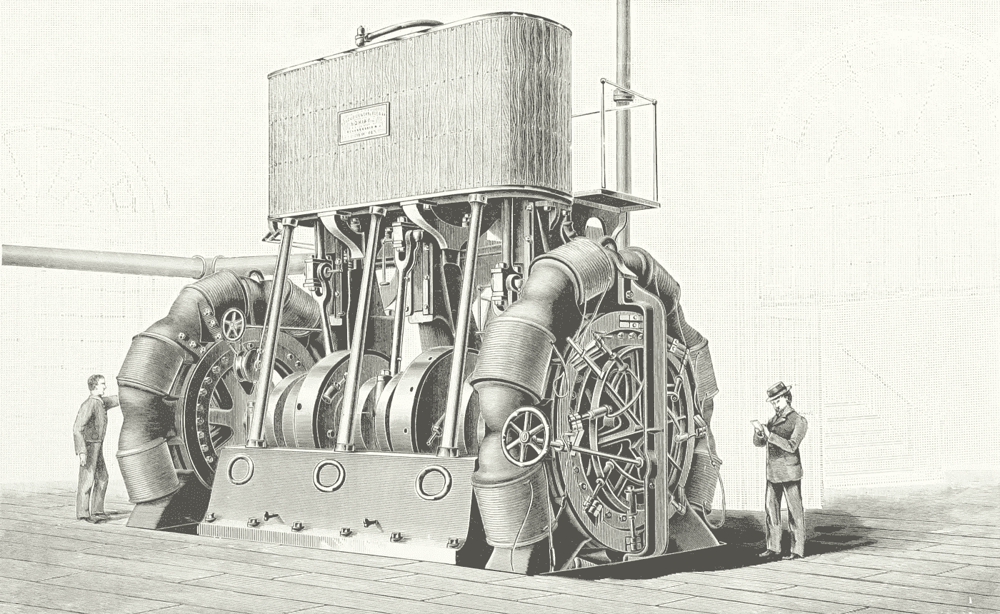

# 您的第一个 Python 自动化项目

> 原文：<https://medium.com/geekculture/your-first-python-automation-project-6a7456b2d652?source=collection_archive---------3----------------------->

## 了解如何安排脚本来组织您的下载文件夹并简化您的数字生活

Photo by [British Library](https://unsplash.com/@britishlibrary?utm_source=unsplash&utm_medium=referral&utm_content=creditCopyText) on [Unsplash](https://unsplash.com/s/photos/automation?utm_source=unsplash&utm_medium=referral&utm_content=creditCopyText)

我们的第一个 python 自动化项目应该包括广泛适用的技术，并简化您的日常生活。考虑到这些标准，创建和安排一个脚本来组织您的下载文件夹是最完美的…