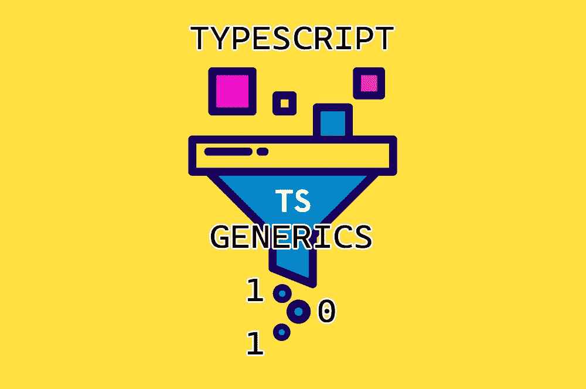

# TypeScript 最有用的概念之一的指南

> 原文：<https://medium.com/geekculture/your-guide-for-one-of-typescripts-most-useful-concepts-8e62b92d1d93?source=collection_archive---------52----------------------->

## TypeScript 的泛型 101

[Original picture](https://indepth.dev/posts/1334/building-a-type-agnostic-cache-using-generics-in-typescript) + additional text by Author

Typescript 中的[泛型是如何工作的？是一个合理的问题。](https://www.digitalocean.com/community/tutorials/typescript-generics-in-typescript)

[作为 C#](https://docs.microsoft.com/de-de/dotnet/csharp/fundamentals/types/generics) ，TypeScript 也知道所谓的[泛型](https://www.typescriptlang.org/docs/handbook/generics.html)，这些类型可以定义得更一般，但也可以定义得更具体。

*快速定义:*泛型是可参数化的数据类型。某种程度上类似于正常变量…