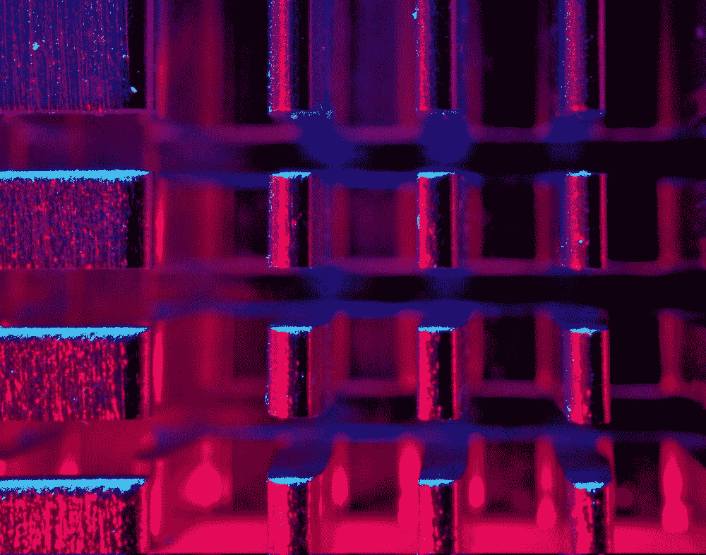

# 你的量子算法指南

> 原文：<https://medium.com/geekculture/your-guide-to-quantum-algorithms-68c4e94a152b?source=collection_archive---------0----------------------->

## 深入介绍量子计算的基础知识，量子与经典，以及一些最著名的量子算法。

Photo by [Michael Dziedzic](https://unsplash.com/@lazycreekimages) on [Unsplash](https://unsplash.com/photos/nLFqr9Mr9H8)

# 什么是量子计算？

量子计算是一种计算形式，它利用**量子力学**以比经典计算机更快的指数速度处理信息。

经典计算机使用由 0 或 1 组成的经典位来编码信息。另一方面，量子计算机使用量子位，或量子位，如光子、原子、离子等。将信息编码成两个可区分的**量子态**。

现在你可能在想，使用量子比特比经典比特有什么好处？答案在于量子比特的量子行为能力，特别是**叠加**和**纠缠**的量子现象。

## 叠加

当一个量子系统处于叠加态时，它可以是 0 或 1，或者同时是两者的组合。这使得量子计算机处理信息的速度明显高于经典计算机。

例如，4 个常规位一次只能表示总共 16 种组合中的 1 种。然而，叠加的 4 个量子位可以同时是 16 种组合！

## 纠缠

纠缠是当一对或一组量子系统强烈相关时，使它们能够完全一致，无论它们相距多远。这意味着量子计算机只需要测量 1 个量子位，并瞬间计算出这对量子位中另一个量子位的值，因为它们是同一个纠缠系统的一部分。

# 量子算法

算法本质上是解决问题的一系列步骤。然而，这些步骤受到运行算法的硬件的限制。

例如，假设我们已经写下了求多项式函数导数所需的步骤。如果我们把这些方向给一个数学家，他们会很容易得出正确的答案，因为他们懂微积分。如果我们给一个正在学习微积分的学生这些指导，他们也能够得到正确的答案，但是这可能需要更多的时间，因为他们几乎没有所需的经验/知识。但是，如果我们把这些指示给一个幼儿园小朋友，他们会非常困惑，不会得到答案。这一页上可能只有潦草的字迹。

在这个例子中，计算导数的步骤代表一个算法，使用它们的不同的人代表不同程度的计算软件。就像在上面的类比中，随着一个人对物理学的了解越来越少，所执行的步骤的效率会降低一样，计算机算法也是如此。

某些算法在遵守宏观物理定律的经典计算机上需要更长的时间，因为它们的硬件可能无法有效地执行某些步骤。

这些算法被称为**量子算法**，它们只能在量子计算机上运行，因为量子计算机的构建与经典计算机有着根本的不同。

# **例句**

## 1.西蒙算法

西蒙的问题是第一个证明量子算法可以比经典算法以指数速度解决问题的计算问题之一。

这种算法虽然本身没有提供多少实用价值，但却启发了肖尔算法中的量子傅立叶变换，这是有史以来最著名的量子算法之一！

**Qiskit 实现:**

 [## 西蒙算法

### 西蒙的算法，首先在参考文献[1]中介绍，是第一个量子算法显示指数加速…

qiskit.org](https://qiskit.org/textbook/ch-algorithms/simon.html) 

**Cirq 实施:**

 [## 量子库/Cirq

### 一个 python 框架，用于创建、编辑和调用噪声中等规模量子(NISQ)电路。…

github.com](https://github.com/quantumlib/Cirq/blob/master/examples/simon_algorithm.py) 

## 2.肖尔算法

Shor 算法是迄今为止最著名的量子算法之一，因为它可以在多项式时间内分解整数。它是由 Peter Shor 在 1994 年发明的，用来解决寻找一个给定数字的质因数的问题。

Shor 的算法甚至有可能在一台理想的量子计算机上破解现代公钥密码系统，比如广泛使用的 RSA 密码系统。RSA 依赖于将两个质数的乘积分解为一个足够大的数的不可能性质。然而，这种情况在不久的将来不太可能发生，因为在降低当前量子计算机中的量子噪声和量子退相干方面，我们还有很多进展要做。

尽管如此，Shor 的算法是一个非常有效的项目，可以让您亲身体验如何使用量子傅立叶变换，尤其是对于那些对量子控制和密码学的交叉领域感兴趣的人！

**Qiskit 实现:**

 [## 肖尔算法

### Shor 算法以在多项式时间内分解整数而闻名。因为最著名的经典算法需要…

qiskit.org](https://qiskit.org/textbook/ch-algorithms/shor.html) 

**Cirq 实施:**

 [## 量子库/Cirq

### 此时您不能执行该操作。您已使用另一个标签页或窗口登录。您已在另一个选项卡中注销，或者…

github.com](https://github.com/quantumlib/Cirq/blob/master/examples/shor.py) 

## 3.Deutsch-Jozsa 算法

Deutsch-Jozsa 算法是由 David Deutsch 和 Richard Jozsa 于 1992 年提出的，旨在展示量子算法如何比任何可能的确定性经典算法都快。

除了被特别设计成对于量子算法来说容易而对于任何确定性的经典算法来说困难之外，算法本身并没有提供太多的实际用途。

Deutsch-Jozsa 问题包括一个 oracle，它实现了一个隐藏的布尔函数，该函数将一串位作为输入，并返回 0 或 1。Deutsch-Jozsa 量子算法产生的答案总是正确的，只需对函数进行一次评估。

**Qiskit 实现:**

 [## Deutsch-Jozsa 算法

### 我们有一个隐藏的布尔函数$f$，它接受一串位作为输入，返回$0$或$1$，即…

qiskit.org](https://qiskit.org/textbook/ch-algorithms/deutsch-jozsa.html) 

**Cirq 实施:**

 [## 量子库/Cirq

### 一个 python 框架，用于创建、编辑和调用噪声中等规模量子(NISQ)电路。…

github.com](https://github.com/quantumlib/Cirq/blob/master/examples/deutsch.py) 

## 4.格罗弗算法

Lov Grover 创建了这个算法来解决非结构化搜索的问题。它可以找到产生特定输出值的黑盒函数的唯一输入，只使用函数的 O(sqrt N)求值，N 是函数的定义域。

换句话说，假设我们有一副洗好的牌，任务是找到一张特定的牌。*经典的*算法将通过逐一检查一副牌中的所有牌，或 *N* 次评估来解决这个问题。另一方面，Grover 的算法只需要 O(sqrt N)计算就可以完成同样的工作。

与前面提到的量子算法不同，Grover 的算法只为非结构化搜索提供了二次加速，而不是指数加速。尽管如此，Grover 算法中采用的振幅放大技巧在尝试为各种其他算法获得二次运行时间改进时非常有用。

**Qiskit 实现:**

 [## 格罗弗算法

### 你可能听说过量子计算机比经典计算机有许多优势，其中之一就是它的优势…

qiskit.org](https://qiskit.org/textbook/ch-algorithms/grover.html) 

**Cirq 实施:**

 [## 量子库/Cirq

### 一个 python 框架，用于创建、编辑和调用噪声中等规模量子(NISQ)电路。…

github.com](https://github.com/quantumlib/Cirq/blob/master/examples/grover.py) 

## 5.伯恩斯坦-瓦齐拉尼算法

Bernstein-Vazirani 算法是 Ethan Bernstein 和 Umesh Vazirani 在 1992 年发明的。这是 Deutsch–Jozsa 算法的受限版本。

创建该算法是为了解决一个问题

所以，我们就假设给了我们一个**盒子**。盒子里藏着一个秘密数字。这个“秘密数字”是由 0 和 1 组成的 6 位来表示的。我们需要弄清楚这个“秘密数字”是什么。

传统上，计算机会发现通过计算函数 *n* 次来计算“秘密数”是最有效的，其中 x = 2^i，I 是 0，1，… n-1 的和。

现在想象一下，如果你能在**一次尝试中找出秘密数字是什么，**不管它的大小。这正是在**量子计算机**上运行 Bernstein-Vazirani 算法所能做到的。

**Qiskit 实现:**

 [## 格罗弗算法

### 你可能听说过量子计算机比经典计算机有许多优势，其中之一就是它的优势…

qiskit.org](https://qiskit.org/textbook/ch-algorithms/grover.html) 

**Cirq 实施:**

 [## 量子库/Cirq

### 一个 python 框架，用于创建、编辑和调用噪声中等规模量子(NISQ)电路。…

github.com](https://github.com/quantumlib/Cirq/blob/master/examples/bernstein_vazirani.py) 

*嗨！我是尼迪·贾达夫。我今年 16 岁，对人工智能和量子计算有着难以置信的热情。非常感谢您阅读我的文章！如果你想了解更多关于新兴技术的信息，请关注我，通过*[*Linkedin*](https://www.linkedin.com/in/nidhii-jadhav/)*与我联系，或者发电子邮件到 nidhivjadhav@gmail.com 询问任何问题。再次感谢！*