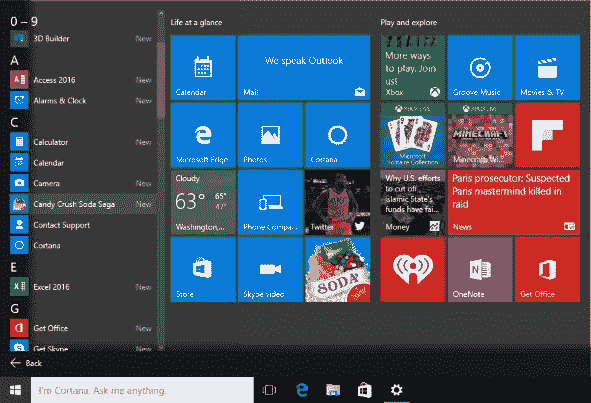
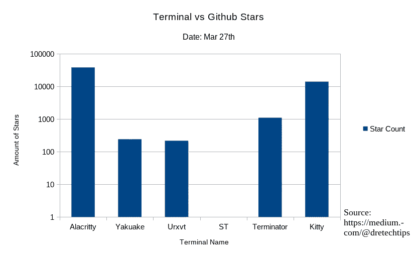
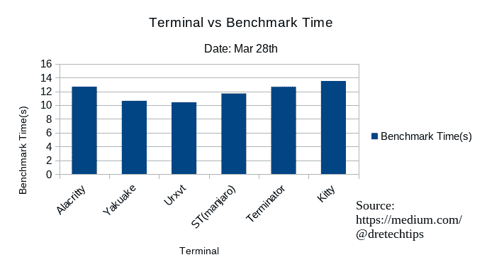
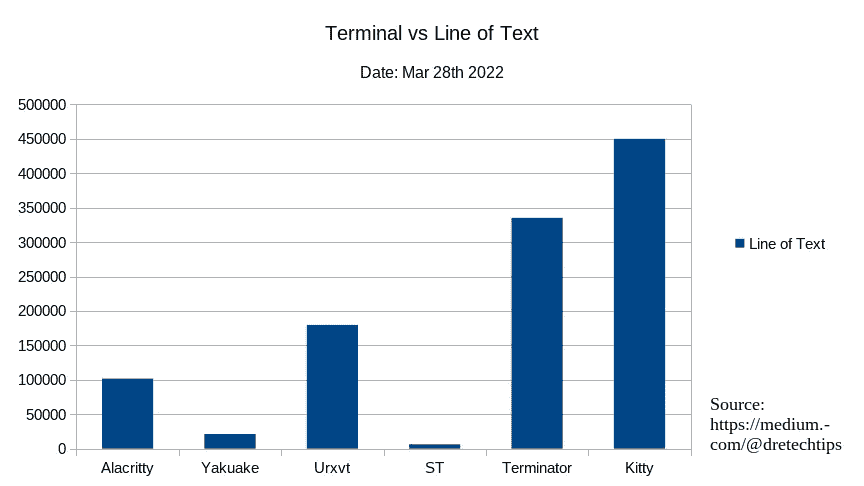
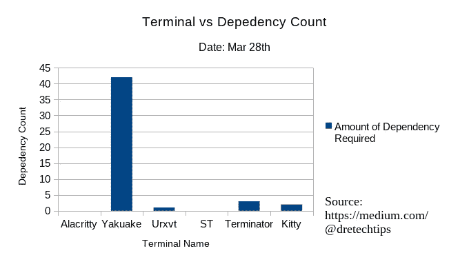

# 你的 Linux 终端很臃肿

> 原文：<https://medium.com/geekculture/your-linux-terminal-is-bloated-12e5b83a1180?source=collection_archive---------2----------------------->

## 为什么我的终端是高级终端？为什么你要换到我的终端？

Photo by [Goran Ivos](https://unsplash.com/@goran_ivos?utm_source=medium&utm_medium=referral) on [Unsplash](https://unsplash.com?utm_source=medium&utm_medium=referral)

大多数专业技术人员和业余爱好者将不得不在日常工作中使用他们的终端。无论是远程连接到在线服务器。或将定制固件闪存到物联网设备上。不可否认，终端是任何技术工作不可或缺的一部分。但是，如果我告诉你，你的终端臃肿了呢？

Photo from [http://www.404techsupport.com/](http://www.404techsupport.com/)

是的，我指的是臃肿，就像你的[充满广告的 candy crush 操作系统](https://www.neowin.net/news/microsoft-reportedly-considers-adding-more-ads-to-file-explorer-in-windows-11/)继续[吸走越来越多的系统资源](https://blogs.windows.com/windows-insider/2021/06/28/update-on-windows-11-minimum-system-requirements/)，而[将数据发送到中央云](https://slate.com/technology/2015/08/windows-10-privacy-problems-heres-how-bad-they-are-and-how-to-plug-them.html)。切换到 Linux 桌面环境并不意味着你将摆脱臃肿，因为你可以很容易地切换到臃肿的发行版，如 Gnome 或 KDE，随主流 Linux 发行版。因为这些发行版带有臃肿的终端。

这就是你的 Linux 终端臃肿的原因。

## 我使用的模糊终端

Figure from Dre Chang

尽管缺乏 GitHub 的存在，就膨胀而言，最好的终端是 st 或简单/无奶终端。这是一个由乳臭未干的团队设计的软件，他们开发的软件并不臃肿。ST 几乎没有膨胀，甚至没有 GitHub 的存在。甚至没有一面镜子。他们确实有自己的在线 Git 回购，由他们自己托管。

玩笑归玩笑。所以实际问题是什么是膨胀？具体来说，什么是软件膨胀？软件膨胀是指一个软件消耗的资源超过了它运行所需的资源。例如，Windows 是一个臃肿的软件，因为它包含了大量大多数人默认不需要的功能。更多的特性意味着更多的代码行和依赖性，这会占用更多的系统资源。所谓不臃肿，是指软件必须尽可能用最低级的语言开发，包含尽可能少的代码行来执行功能，具有最少的依赖性，等等。

请留下您对终端的看法。

## 进行基准测试的系统规格

我们将使用相同虚拟机的相同副本来减少基准测试中的混淆变量。

这是系统规格。

*   曼哈罗·XFCE
*   i5–7400 CPU 上的 4 个虚拟内核
*   64 GB M.2 驱动器
*   8 GB DDR4 内存

## 比较所有终端的基准

除了感觉上的草率，肯定还有确凿的证据。[因为有许多方法可以操纵](https://keep.lib.asu.edu/items/157435)系统的感知[急速性。对于基准测试，我们将使用](https://keep.lib.asu.edu/items/157435)[终端基准](https://github.com/Dica-Developer/terminal-benchmark)作为我们的基准软件。虽然一些应用程序可以利用 GPU，但我们将假设没有 GPU 用于覆盖最多的人。这不是一个带有置信区间测试的有力研究，所以我们将只评估每个终端条件的一个样本。

ST 排在第三位。但是，请记住，这个程序有 Manjaro 补丁，不是应用程序的基础版本。

## 一行代码分析

多一行代码总是会导致程序执行时间的增加。这是源代码目录中所有文件的总文本行。

源代码库的文本行可以用作代码行的代理。ST 继续遥遥领先于大多数其他码头。但是，你可能会说，文本行数越少意味着文档越少。然而，这恰恰是重点。

更多的“[内容创建者](https://www.youtube.com/results?search_query=st+terminal)”将通过减少文档来为他们创建文档。因此，他们通过将文档和营销工作外包给其他人来减少膨胀。这遵循了极简模块化设计的 UNIX 哲学。你知道你的产品已经达到了设计和工程的顶峰，而其他人甚至没有问你就为你推销它。

## 每个终端使用什么语言

一般来说，你越接近机器码就意味着你的程序执行得越快。因此，从最小到最大的最快执行时间的例子是机器码、汇编、C、C++、Java、JavaScript 和 Python。然而，许多语言都在这个范围之内。这是所有的终端和它们的编码语言。

*   ST: C
*   阿拉克里蒂:铁锈
*   URxvt: C
*   yaku ke:c++
*   终结者:Python
*   凯蒂:C++

正如您所见，ST 和 URxvt 在语言膨胀方面击败了所有终端。

## 每个终端需要的依赖程度

有些终端会拉下整个桌面环境才能正常工作。依赖性的数量与系统膨胀的数量成正相关。我所说的所需的依赖程度是指在基本桌面环境之上所需的依赖程度。

如你所见，ST 和 Alacritty 胜出，因为它不需要依赖，除非编译。

## 大多数终端是 GUI 驱动。

还有用户输入时间优化问题。是的，用户的行为也可以决定膨胀。因为键盘和鼠标之间的移动通常会提高效率。这可以通过保持键盘上的动作来抵消。对于使用鼠标和键盘或鼠标的人来说，生产力是最差的。然而，这假设用户已经在仅使用键盘的设置上被训练到足够的程度。一旦用户在学习曲线上达到足够的水平，他们将收获生产率提高的好处。

大多数终端都有某种键盘绑定。然而，他们也有鼠标输入。所以有鼠标键盘切换习惯的人通常会坚持同样的习惯。多年来使用 Windows 和 macOS 等专有操作系统以及脸书等需要鼠标和键盘输入的网络应用，强化了这一习惯。通过正确使用 ST，你将[学会如何自然地成为一个超级用户](https://en.wikipedia.org/wiki/Power_user)。

请留下您还使用的其他 GUI 和 CLI 应用程序的评论。

## 但是学习 ST 很难

尽管没有放在基准之上(因为它包括了基础版本的附加补丁)，终端在其他指标上得分最高。因此可以被认为是最好的极简终端。然而，接下来的问题是为什么你应该学习所有这些东西。给软件打补丁，然后编译，看起来不像是浪费时间吗？归根结底，这是一场关于便利与自由的辩论。有些人愿意牺牲他们所有的自由来最大化他们的安全。[和其他人会以便利为代价最大化他们的自由。大众位于中间的某个地方。](http://www.thewayofthepirates.com/piracy-history/somali-pirates/)

只要你放弃你的自由，你就会有一个继续向你推销广告的操作系统。你将拥有[一个能够决定你知道什么的搜索引擎/媒体平台](https://www.eutimes.net/2022/03/duckduckgo-announces-mass-censorship-of-russian-disinformation/)和[当你能够知道它的时候](https://freebeacon.com/coronavirus/facebook-fact-checks-scientific-piece-arguing-coronavirus-originated-in-chinese-lab/)。并且[你将拥有一个电子邮件系统，它会不断阅读你的电子邮件，以决定默认情况下接下来给你显示什么广告](https://support.google.com/mail/answer/6603?hl=en)。由你来决定在哪里划线。

就像 Linux 系统一样，它是从自下而上的方式工作的，而不是自上而下的方式。这意味着您必须花时间学习如何解决补丁。编译软件会很困难。然而，通过学习所有这些，你会得到一个直接满足你需求的系统。

你可以观看关于如何安装 ST 的无休止的视频教程。

## 最后

IT 和工程领域是快速发展的领域。跟不上意味着你将被落在后面。跟上的最好方法是保持最新的新闻和教育内容。[订阅免费电子邮件列表，将您的职业生涯提升 10 倍。](/subscribe/@dretechtips)

**加入我们，因为 50 多名想要快速提升职业生涯和知识基础的人已经注册。**

达到这一点可能意味着你同意大部分已经写了。留下大量的掌声，让算法向大众推广关于软件极简主义和 Linux 桌面的不受欢迎的观点。

**相关内容:**

*   Linux 内核初学者指南
*   [如何安全地连接到您的 Linux 服务器](/geekculture/ssh-securely-connect-to-your-servers-8895faab7083)？
*   [如何在 Linux 中实现任务自动化？](/geekculture/how-to-automate-tasks-in-linux-bsd-91d0b0560f5)