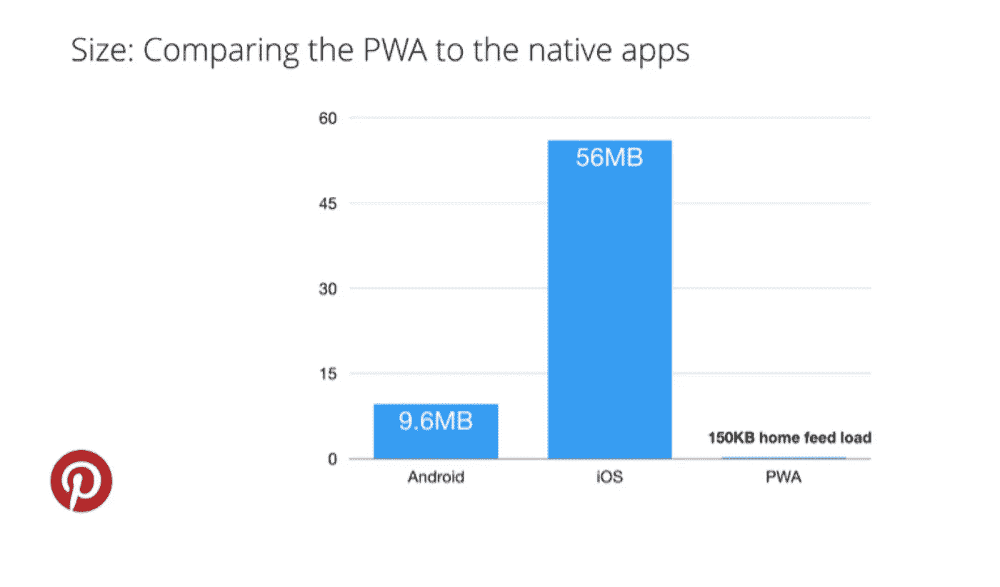
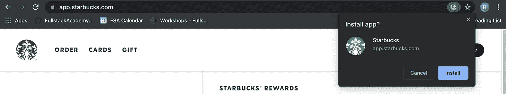
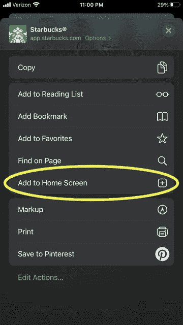
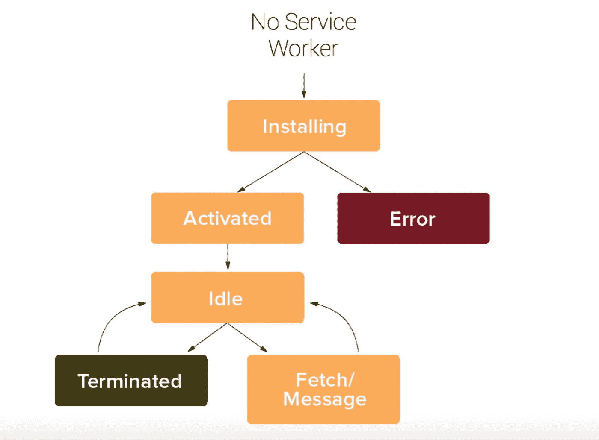

# 您对 PWAs 的一站式介绍

> 原文：<https://medium.com/geekculture/your-one-stop-shop-intro-to-pwas-4770fcc5ccd5?source=collection_archive---------15----------------------->


PWA！PWA！我们听到每个人都在赞美 PWAs(渐进式 web 应用程序)的优点，但它到底是什么，为什么如此受欢迎，它是如何工作的？

这到底是什么？

PWAs 是 web 应用程序，它允许您拥有一个适用于 web 和本地环境的单一代码库。我们可以使用我们熟悉的技术来构建一个普通的网站(即 HTML/CSS/ Javascript)，但也可以通过访问设备硬件、推送通知和离线功能来获得无缝、独特的原生体验，这只是其中的几个例子。

**我们为什么要关心？**

我们已经确定，PWAs 本质上是一个在跨平台设备上工作的增强型网站。因为 PWA 是通过互联网提供的，所以不需要下载就可以像本地应用程序一样运行。对于用户来说，与同一应用程序的本地版本相比，这将减少本地设备上使用的空间。与 Android 和 iOS 原生应用相比，Pinterest 的 PWA 只占下载成本的一小部分，只有 150KB(见下图)。作为一名开发者，你可以绕过通过应用商店发布应用的更严格的规则。也就是说，pwa*可以在 app store 中部署，这对可发现性是一个很好的补充。*

**

*Source: [https://www.simicart.com/blog/pwa-case-studies/](https://www.simicart.com/blog/pwa-case-studies/)*

*另外，PWAs 得到了*速度，*小✨.实现可靠、快速性能的最佳方法是通过[应用程序外壳架构。](https://developers.google.com/web/updates/2015/11/app-shell)把你的应用外壳想象成一个模板——一个应用启动所需的准系统——其中的内容将通过必要的 API 调用动态加载。您的 PWA 可以利用服务人员在初始加载时缓存您的应用程序外壳及其内容，以便页面可以在线和离线查看。这意味着用户仍然可以离线浏览您的应用程序，并通过您的服务人员在您的 web 浏览器中即时查看缓存的任何内容。请注意，在离线模式下发出的任何请求都可以排队，以便在连接可用时通过实现[后台同步来恢复。](https://blog.bitsrc.io/5-reasons-to-choose-pwa-for-your-web-and-mobile-apps-515c6d0e784d)很酷吧？*

*难怪主要玩家已经进入这个领域，并享受其成果: [Twitter 报告称，通过尽可能依赖缓存数据，数据消耗减少了 70%](https://developers.google.com/web/showcase/2017/twitter),[Forbes 看到每用户会话增加了 43%](https://developers.google.com/web/showcase/2017/forbes)和[lanc me 增加了 17%](https://developers.google.com/web/showcase/2017/lancome) 。令人印象深刻。公司正在认识到 PWAs 作为一种解决方案的经济性和高效性，以便为他们的品牌建立更好的用户体验。*

*我们在哪里可以找到野生的 PWA？👀*

*你可能已经见过甚至自己使用过 PWA。让我们在网络浏览器上浏览星巴克的网站。请注意，PWA 在 Chrome 浏览器的地址栏右侧会有一个“安装”图标，这将作为一个独立的应用程序打开星巴克网站。*

**

*在 iOS 设备上，在 Safari 中打开应用程序，然后轻按“添加到主屏幕”瞧，您已经成功地在您的设备上安装了 PWA！*

**

***准备好潜得更深了吗？***

*让我们来看看使你的应用程序可安装并具有离线功能所需的最低要求。此外，查看 [PWA 清单](https://web.dev/pwa-checklist/)并在你的 Chrome 开发者工具中生成一份 Lighthouse 报告，以确保你的应用满足核心要求并检查其性能得分。*

1.  *Manifest.json*

*manifest.json 文件只是根目录中的一个`.json`文件，其中保存了应用程序的元数据。看看来自 [Google](https://web.dev/add-manifest/) 的样本`manifest.json`文件:*

```
*{
  "short_name": "Weather",
  "name": "Weather: Do I need an umbrella?",
  "icons": [
    {
      "src": "/images/icons-192.png",
      "type": "image/png",
      "sizes": "192x192"
    },
    {
      "src": "/images/icons-512.png",
      "type": "image/png",
      "sizes": "512x512"
    }
  ],
  "start_url": "/?source=pwa",
  "background_color": "#3367D6",
  "display": "standalone",
  "scope": "/",
  "theme_color": "#3367D6"
}*
```

*这里的数据保存了你的应用程序的最小视图，而不需要发出网络请求。名称和至少一个图标(通常是您的徽标)是必需的。Chrome 还将使用这些数据来创建一个闪屏，这样你的应用程序的用户在加载时就会有一个品牌视图。当用户查看你的应用程序时，他们总是知道自己在哪里，而没有空白加载屏幕的悬念。*

*确保你还记得在你的脚本中链接你的清单文件，并在 Chrome DevTools 的应用程序标签中测试它的配置是否正确😉*

```
*<link rel="manifest" href="/manifest.json">*
```

*2.服务人员*

*根据谷歌的说法，服务工作者“本质上是一个 JavaScript 文件，它独立于主浏览器线程运行，拦截网络请求，缓存或从缓存中检索资源，并传递推送消息。”它是一个强大的基于事件的异步 API，可以执行不同的任务，并从本质上改变请求。因此，必须通过安全连接为服务人员提供服务，以通过 SSL 认证加密您的网络请求(除了`localhost`)。请注意，服务人员无权访问 DOM、localStorage 或您的窗口，因为它是一个完全独立于您的站点的线程。*

*对于服务人员来说，有 3 个关键的生命周期事件:注册、安装和激活。*

**

*source: [https://www.simicart.com/blog/pwa-service-worker/](https://www.simicart.com/blog/pwa-service-worker/)*

*首先，注册服务人员将在安装位置查找并下载您的`service-worker.js`文件，然后被激活。注册通常位于您的`app.js`或`index.html`文件中:*

```
*if('serviceWorker' in navigator) {
  navigator.serviceWorker.register('./service-worker.js');
};*
```

*接下来，一旦您的服务人员成功注册，下一步就是安装它——这是大部分缓存魔术发生的地方。在您的`service-worker.js`文件中，服务人员利用[缓存 API](https://web.dev/cache-api-quick-guide/) ，您可以在这里传入您的[应用程序外壳文件](https://developers.google.com/web/fundamentals/architecture/app-shell)。*

```
*const cacheName = 'demo-cache-name'const appShellFiles = [ ... ] // put your files paths hereself.addEventListener('install', (event) => {
  event.waitUntil(async () => {
    const cache = await caches.open(cacheName);
    await cache.addAll(appShellFiles);
  });
});*
```

*最后，我们可以激活我们的服务人员，您可以在那里管理您的缓存文件。请注意，一次只能运行一个版本的服务工作程序。如果已更新，它将不会运行，直到先前版本的服务工作程序没有客户端(刷新将导致客户端重叠)。这是清理缓存和整理服务人员版本的好地方。作为开发人员，如果`self.skipWaiting()`更符合您的需求，您会发现它有助于在安装后立即激活服务人员。*

```
*self.addEventListener('activate', (event) => {
  // delete any caches that aren't in expectedCache
  // which will get rid of previous sw
  self.skipWaiting();
  event.waitUntil(
    caches.keys().then(keys => Promise.all(
      keys.map(key => {
        if (key !== expectedCache) {
          return caches.delete(key);
        }
      })
    ))
  );
});*
```

*这三个事件总结了服务人员的生命周期，但是另一个经常使用的事件是`fetch`。你猜对了，这就是我们可以告诉我们的服务人员使用 Fetch API 管理和处理缓存文件的地方。*

```
*self.addEventListener('fetch', (event) => {
  event.respondWith(
    caches.match(event.request)
  );
});*
```

*在这一点上，你可以在 Chrome DevTools 中导航到你的网络标签，并检查你的缓存文件在你勾选“离线”框时是否仍然可见。🥳*

*对于服务人员来说，其他一些真正酷的用例是如上所述的后台同步、推送通知、集成 IndexedDB 以获得更大的数据存储容量，以及更多的自定义任务。*

***最终想法***

*没有什么新奇的技术，进入门槛很低，而且当你利用 PWAs 时，回报相当可观。已经转变为高质量 pwa 的公司的结果很有说服力，并推动了底线。现在，这一切都解释了为什么它们会风靡一时。*

*唷！我们已经了解了 PWAs 的大部分内容，但是如果你还不满足，下面是一些进一步的阅读材料:*

*   *[如何将 IndexedDB 整合到您的 PWA 中](https://developers.google.com/web/ilt/pwa/live-data-in-the-service-worker)*
*   *[进步的网络应用:逃离标签而不丢失我们的灵魂](https://infrequently.org/2015/06/progressive-apps-escaping-tabs-without-losing-our-soul/)*
*   *[到底是什么让某个东西成为一个进步的网络应用](https://infrequently.org/2016/09/what-exactly-makes-something-a-progressive-web-app/)*
*   *[服务人员心态](https://web.dev/service-worker-mindset/)*