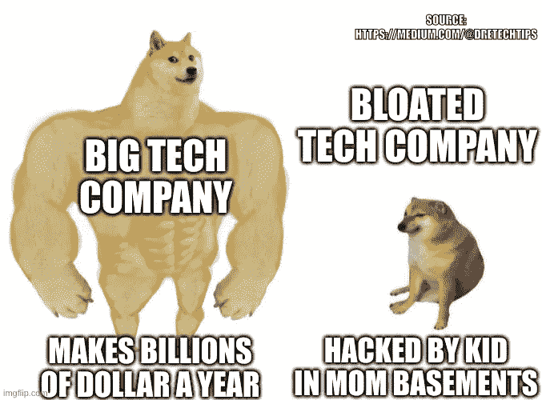

# 您的在线服务将受到威胁

> 原文：<https://medium.com/geekculture/your-online-services-will-be-compromised-d8eeed96990b?source=collection_archive---------5----------------------->

## 停止使用集中式认证服务来保护您自己的在线服务

Photo by [Mohammad Hoseini Rad](https://unsplash.com/@mhrlife?utm_source=medium&utm_medium=referral) on [Unsplash](https://unsplash.com?utm_source=medium&utm_medium=referral)

您需要了解的内容:

*   Lapsus$ Group 黑掉了英伟达、苹果、三星等公司
*   认证服务的集中化是不好的
*   使用自托管认证服务，如 [WSO2 身份服务器](/@dretechtips/how-to-dismantle-the-google-empire-e652bff6d2)

几周前，一个名为 Lapsus$ group 的黑客组织入侵了美国主要的科技公司。这个小组有。他们通过损害这些公司正在使用的集中式身份认证服务来获取所有这些信息。作为一名软件工程师或技术爱好者，您可能想知道可以采取什么措施来防止此类攻击发生在您提供的在线服务上。

这就是为什么您应该停止使用集中式身份认证服务，转而使用自托管身份认证服务。

## 公众对这一失误的了解

Photo by [Jefferson Santos](https://unsplash.com/@jefflssantos?utm_source=medium&utm_medium=referral) on [Unsplash](https://unsplash.com?utm_source=medium&utm_medium=referral)

新闻媒体已经发布了大量关于黑客组织的交易。以下是该小组所做工作的总结。

[**公布 NVIDIA 源代码公开**](https://analyticsindiamag.com/lapsus-hack-leaves-nvidia-in-a-tight-spot/)

有趣的是，这位黑客做的少数事情之一是向公众发布 NVIDIA 闭源旧 GPU 驱动程序，作为移除最新 GPU 上 DRM 的赎金。对黑客组织来说这有点愚蠢。

因为代码可能已经被秘密发布给公众，这样像 nouveau 这样的开源组织就可以对 DRM 进行逆向工程。互联网上有关于移除旧显卡上已有的 DRM 的信息。

[**从 Globant**](https://techcrunch.com/2022/03/30/lapsus-globant-breach/) 复制数据

他们从 Globant 窃取了 70 GB 的数据。该公司是最大的软件开发公司，为世界上一些最大的客户开发软件。

服务的集中化不仅仅伤害了顶层的人。但这也伤害了供应链下游依赖这些服务和产品正常运行的人们。

[**发布苹果健康应用数据**](https://www.theverge.com/2022/3/30/23003194/lapsus-gang-new-hack-apple-facebook-globant)

该黑客组织还发布了关于苹果健康应用的信息，他们正在使用该应用来监控健康数据。他们还发布了开发该应用程序的合作信息。

他们还损害了其他公司，如三星、微软等。根据这些信息，您可能会认为这个组织是最危险、最邪恶的黑客组织之一，从不同的公司和政府组织窃取信息。并在黑网上出售获利。不，是一些孩子想引起注意。我的意思是，通过 Telegram 向公众宣传信息，这清楚地表明了集团的意图和优先事项。这些黑客组织甚至不适合犯罪生活，因为罪犯的首要原则是永远不要告诉任何人你的犯罪活动。根据公众所知的信息，可以假设该组织这样做是为了引起注意。关注最大的科技公司，尤其是那些几乎价值数千亿美元的公司，实际上是一件有趣的事情。这是一种可记忆的注意力水平。

Photo by Dre Tech Tips

然而，你不希望[吸引“错误”类型的注意力](https://www.cbsnews.com/news/did-jeffrey-epstein-kill-himself-60-minutes-investigates-2020-01-05/)。没有人能逃脱西方联邦政府，[，尤其是美国。玩笑归玩笑。](https://www.youtube.com/watch?v=MqzZnRX6EyY)

## 对黑客组织的惩罚

[该组织的七名嫌疑人被英国政府逮捕](https://www.theverge.com/2022/3/24/22994563/lapsus-hacking-group-london-police-arrest-microsoft-nvidia)。未经授权进入公司财产会受到法律的惩罚。因此，负责任的家伙将受到某种惩罚，尽管在法律上他仍然被认为是一个孩子。如果负责入侵这一认证服务的[青少年被 glowies 给予工作机会，以减轻对他的惩罚](https://www.forbes.com/global/2011/1010/feature-sean-parker-agent-disruption-napster-facebook-plaxo-steven-bertoni.html?sh=341d4b6c7c28)，我不会感到惊讶。

## 你能做些什么呢？

[我们集中技术的程度是不好的](https://www.cnbc.com/2022/04/06/jack-dorsey-im-partially-to-blame-for-the-state-of-the-internet.html)。这就像把所有的鸡蛋放在一个篮子里。随着越来越多的公司和政府转向集中式单点登录技术，预计将来会有更多这类攻击发生。

事情不一定是这样的。你看，自托管永远是一种选择。这在过去一直是一个受欢迎的选择。像亚马逊网络服务和微软 Azure 这样的服务在过去是不存在的。当涉及机密信息时，自托管应该是默认选项。它们只能用于公开信息或非机密信息。我觉得很奇怪，人们通过互联网上传他们的照片和视频备份到一些在线云，没有任何自我加密。历史学家会把这段历史称为数字封建主义的黑暗时代**。**

**在此之前，您必须使用 LDAP 来整合您的[认证服务。只有专业技术人员知道如何配置 LDAP。即使您正确地配置了 LDAP，它也可能不被您集成的所有开源服务所支持。但是认证技术已经很成熟了，已经存在的一个盒子软件里就有认证。我想到的一项技术是 WSO2 身份服务器。它允许您为自己托管的应用程序套件创建身份验证网络。它支持以下单点登录协议。](/geekculture/the-only-guide-you-need-to-get-started-with-ldap-6f526385934f)**

*   **SAML2 Web SSO**
*   **OAuth/OpenID 连接**
*   **WS-联邦**
*   **克伯罗斯·KDC**

**我使用该技术构建了一个自托管的 Google Workspace/Microsoft 365 服务。以及[自主托管的网飞和 Spotify 替代服务](/@dretechtips/how-to-build-your-own-illegal-streaming-service-ff353ef70cd0)。你像数字房东一样拥有这项服务。因此，你不必像其他数字农民一样，为使用这些“免费”服务的特权而支付月租或出售数据给广告商。**

## **最后**

**在线隐私是 21 世纪面临的最紧迫的问题之一。[订阅免费电子邮件列表，获取更多关于在线隐私和安全的内容。](/subscribe/@dretechtips)遵循本指南[保护您的电子邮件隐私](/geekculture/protect-yourself-with-email-alias-f10ce787cae)。**

****加入我们，成为 100 多位想要提高在线隐私和安全性的人。****

**你可以订阅[媒体多层次营销方案](/@dretechtips/membership)来支持这个渠道。**

**达到这一点可能意味着你同意大部分已经写了。留下大量的掌声和分享，以获得向大众推广关于自托管身份验证的不受欢迎的信息的算法。**

****相关内容:****

*   **[信号会被破坏](/geekculture/signal-will-be-compromised-eb18a91fd51f)**
*   **[完全去谷歌化指南](/@dretechtips/how-to-dismantle-the-google-empire-e652bff6d2)**
*   **[抖音:该应用致力于建立一个不断变化的世界秩序](/geekculture/tiktok-the-app-bent-on-asserting-a-changing-world-order-d09b3077ddc8)**