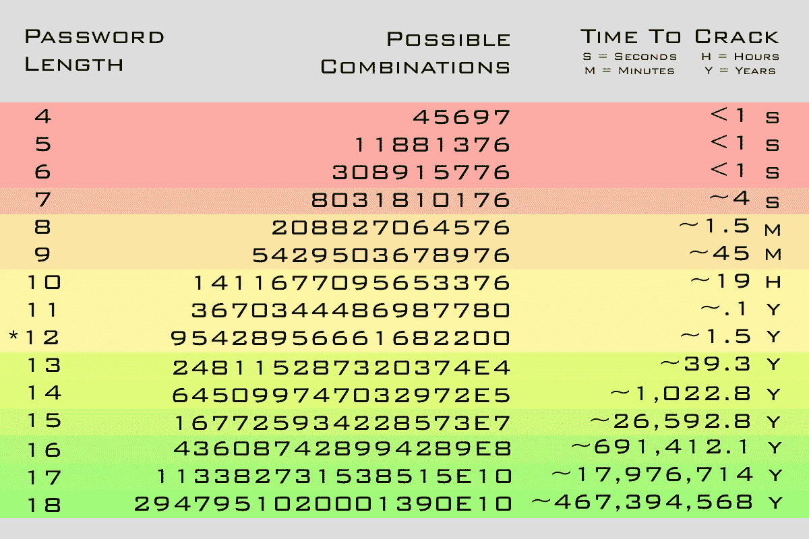

# 你的密码没用

> 原文：<https://medium.com/geekculture/your-passwords-are-useless-5087cdcb1433?source=collection_archive---------9----------------------->


Photo by [Mourizal Zativa](https://unsplash.com/@mourimoto?utm_source=medium&utm_medium=referral) on [Unsplash](https://unsplash.com?utm_source=medium&utm_medium=referral)

世界上最大的数据泄露发生在去年，2021 年社交媒体网站 RockYou 泄露了 32 亿个密码。许多人反复使用相同的密码。您所使用的服务可能已经遭到破坏。

传统身份认证是在组织处于封闭网络的时代创建的。随着越来越多的人和服务上线，越来越多的人暴露于这些密码泄露。于是问题出现了。密码在现代网络上仍然有用吗？

## 为什么你的密码毫无用处？

**增加计算能力**



许多在线系统都内置了暴力防御功能。但是当服务受到损害时会发生什么呢？假设您使用散列密码访问数据库或 LDAP 服务器，并且您知道散列方案。随着计算能力的提高，任何低于 12 个字符的密码都可能在一年内被暴力破解。也许你认为你保管你的密码超过 12 个字符。不，事实上，量子计算的进步意味着你更加不安全。任何加密的信息都可以通过量子计算机破解密文而近乎即时地被解密。

[](https://www.aclu.org/issues/national-security/privacy-and-surveillance/nsa-surveillance) [## 国家安全局的监控

### 自 2001 年 9 月 11 日以来，美国国家安全局的大规模监控已经大大扩展…

www.aclu.org](https://www.aclu.org/issues/national-security/privacy-and-surveillance/nsa-surveillance) 

[美国国家安全局之前通过互联网上发送的未加密信息监控其公民。当这些量子计算机从公司的研究实验室向公众推出时，期待他们再次这样做。好消息是有望设计出新的产品和服务来解决这个问题。](https://www.aclu.org/issues/national-security/privacy-and-surveillance/nsa-surveillance)

**网络钓鱼诈骗增加**

由于新冠肺炎疫情，许多离线基础设施突然变成了在线。这意味着越来越多的人转向网络。这意味着很多人陷入网上骗局也在增加。2020 年 2 月，钓鱼邮件在一个月内激增了惊人的 667%。你可能在想责怪人们太粗心而被这些骗局骗了。但是它们可以简单到有一个域名

```
https://protonemail.ch
```

超过

```
https://protonmail.ch
```

人们会上当的。然而，这是由公共云服务的扩展造成的。这只是公司自我托管的一个原因。你看，VPN 最初的设计不是像你看到的所有营销垃圾一样，让用户在互联网上匿名，而是让员工通过互联网访问业务资源。因此，远程工作的员工必须连接到 VPN。通过这样做，对服务的访问将防止许多攻击，如点击电子邮件。但是人们很懒，因此他们把方便看得比安全更重要。

**密码数据库受损**

互联网上的大多数人在多个服务上使用同一个密码。问题在于数据库配置不正确。当数据库遭到破坏时，这些密码就会在 deep web 上出售以获取利润。这些人也会把它卖给其他人。他们可以利用这些泄露的信息来勒索你。或者，他们可以创建脚本来测试多个网站上的凭据，以获得对您帐户的访问权限。

你可以通过这个网站查看你的密码是否被泄露。

https://haveibeenpwned.com/

**安全问题**

安全问题是一个人可能被要求验证其身份的问题。这个人可能需要回答一个关于他们过去做过的事情或者只有他们知道的事情的问题。

安全问题毫无意义，因为人们在互联网上放了如此多的信息。Z 世代是第一代通过脸书和 Instagram 在互联网上记录他们整个生活的人。通过查看某人的简介，你可能会找到他第一只宠物的名字。或者他们小学的名字。人们在互联网上发布的关于自己的信息之多令人震惊。

安全问题现在是一个过时的方法来恢复您的帐户。因此，许多大型组织已经停止使用它。

## 组织如何解决这个问题？

**多因素认证**

最好的身份验证形式是多重身份验证。

[](https://www.cs.cornell.edu/courses/cs513/2005fa/NNLauthPeople.html) [## CS 513 系统安全——你知道的、拥有的或正在拥有的东西

### 讲师:弗雷德·b·施耐德教授讲座笔记汤姆·罗德尔鉴定人的方法各不相同…

www.cs.cornell.edu](https://www.cs.cornell.edu/courses/cs513/2005fa/NNLauthPeople.html) 

最好，你应该有一些你知道的东西，比如你的密码。像一次性密码或 Yubico 钥匙之类的东西。你就像是生物计量数据。

实现这种身份验证方法很麻烦。幸运的是，已经有了可以执行这种身份验证的解决方案，称为 WSO2 Identity Server。

[](https://wso2.com/identity-server/) [## 使用 WSO2 Identity Server 提供无缝登录体验

### 速度工具——开发人员需要在瞬间提高工作效率的一切。SDK、代理、预建连接器和…

wso2.com](https://wso2.com/identity-server/) 

## 最后

虽然许多在线服务正在转换为多因素身份认证，但一些服务仍停留在使用常规身份认证。这些使用常规身份验证的服务可能是您需要访问的关键服务。防止使用常规身份验证出现大多数问题的最佳方法是为每个服务使用不同的密码。也许你想知道如何记住每个密码？在这篇[博客文章](/@stemtalk/your-password-manager-the-most-insecure-way-to-secure-your-passwords-c815d1903096)中，我回顾了如何设置密码管理器的指南。