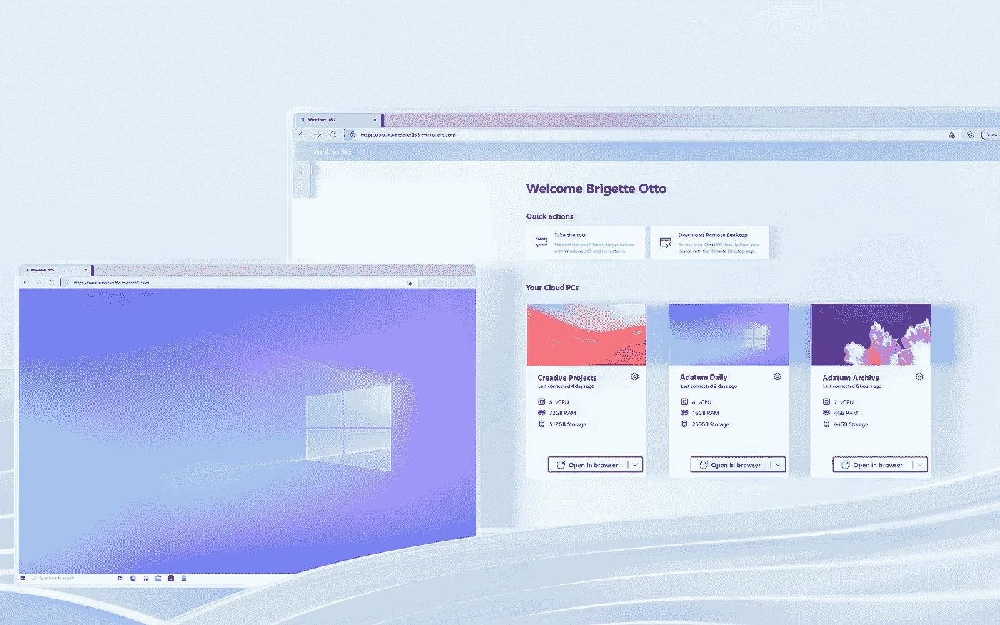

# 云中的个人电脑:这可能是最后的时刻了

> 原文：<https://medium.com/geekculture/your-pc-in-the-cloud-it-may-finally-be-time-c68c62e61fb3?source=collection_archive---------9----------------------->

## 未来就在这里…算是吧

## 微软的 Windows 365 可能是我们今天所知的计算时代终结的开始。是的，真的。

Running the full Windows 10 operating system and any compatible application over the Internet is an option that businesses and people will have in August. The Cloud PC is officially real, people. (Image: Microsoft)

看似无处不在——关于“Windows 云版本”的谣言去年夏天在网上到处都是，但从那以后再也没有出现过——微软…