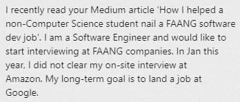
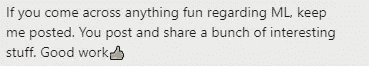

# 你应对 FAANG 面试的计划

> 原文：<https://medium.com/geekculture/your-plan-for-acing-faang-interviews-20a35fa6be1c?source=collection_archive---------2----------------------->

## 一切都在一步一步地分解

为了帮助我了解您[请填写此调查(匿名)](https://forms.gle/7MfQmKhEhyBTMDUD7)

你已经看到 FAANG 公司支付了多少赔偿金。你想要与 FAANG 公司合作的金钱、小吃和声望。现在你想进入其中一个。事情很有挑战性；以每年 300 多万份申请，**谷歌的录取率为 0.2%。你被哈佛录取的可能性要大 20 倍。**

大多数人永远都过不了第一阶段。然而，你是一个有多年经验的开发人员。这使得通过招聘人员把你的简历交给面试官变得简单明了。



This person went to the FINAL round of their Amazon interview before failing

然而，有一点令人担忧。即使你有多年的经验，编码面试也是一场噩梦。你不记得使用什么数据结构，优化你的代码似乎总是不可能的，当你的面试如此紧张时，你甚至应该如何计算时间和空间的复杂性。这是我经常遇到的事情。


He was able to get to the interviews no problem. Getting through them was another matter

经验丰富的开发人员也会遇到这种情况。上述人员在该行业工作了 15+年。所以获得面试不是问题。但是在我们的第一次治疗中，他们告诉我，即使是 Leetcode 的简单问题对他们来说也是不可能的。


One of the many success stories

不幸的是，由于我的工作、承诺，或者只是我们之间的不匹配(时间、学生可用性等)，我不能总是辅导那些伸出援手的人。在这篇文章中，我会给你一步一步的足迹，我推荐给每个伸出手的人(无论是不是学生)。有了这个，你将对如何准备和通过编码面试有一个清晰的想法。如果你需要我的帮助，请随时联系我。

# 第一步:掌握数据结构和算法(暗示惊喜)


这可能是你对此的反应。每个人和他们的祖母都建议这是第一步。他们没有告诉你的是你应该怎么做。你最需要哪些数据结构？需要学多少？对于图，是不是要学网络流，克鲁斯卡尔的算法等东西？图形神经网络？一般的，“学 DSA”的问题是太模糊了。

根据我在竞争性编程、大量面试以及(最重要的是)帮助许多人面试方面的经验，你可以通过关注一些关键结构和概念来最大化你的结果。它们是:

1.  **散列表+集合**。理解散列背后的思想，以及为什么它们的查找/插入是恒定时间的。仔细阅读这些也会对你有所帮助，因为一些较难的问题需要你写自己的散列作为优化。经常出现在字符串操作问题中。[这个微软的问题就是一个很好的例子](https://codinginterviewsmadesimple.substack.com/p/problem-2-find-all-occurrences-of)
2.  **图表。图表是最棘手的话题之一。他们会出现在意想不到的地方。理解什么是图。了解它们的作用/为什么有用。并研究遍历。**
3.  LinkedList、Arrays、Stacks 和 Queues :确保你可以从头开始构建它们。学着用的很好。了解副产品(优先级队列等。)
4.  **Heaps:** 不时出现。了解基础知识很好。
5.  **树/递归**。我把这些放在一起是因为简单的树问题是理解递归和用递归解决问题的完美工具。练习从头开始构建树，并进行基本操作(大小、深度、遍历、插入等)。).这是大多数问题的标准树形模式:

```
def treeFunc(root, **other params):
    if(root==null):
        return baseCase/other relevant params
    val=operation(treeFunc(root.left), treeFunc(root.right))
    return val
```

这显然不是详尽无遗的。但这是一个良好的开端(并将涵盖大多数问题)。然后我们用下一步来微调我们的理解。

# 第二步:大量练习

接下来，我们要练习。很多。根据你的能力，我们将混合简单、中等和困难的问题。平均来说，你每天至少要花 1-1.5 个小时。这相当于每天大约 1-2 个问题。如果你想从每一个问题中获得最大的收获，请阅读 Medium 上的这篇文章。我深入了解程序，从每个问题中尽可能多地学习。记住从简单的问题开始，然后一步步向上。

以正确的方式提问将有助于你发现自己的薄弱环节，给你进一步的反馈，告诉你如何改进。

# 第三步:模拟面试(将此纳入第二步)

一旦你能够始终如一地回答简单的问题，我们会增加每周模拟面试。在与我共事过的许多学生交谈后，这一直是建立自信最有效的方法。


Getting feedback from a successful student about the tutoring process

理想情况下，我们希望每周为此保留 1 天。一周有 6 天你在练习你的问题，有一天你只是模拟面试。模拟面试会帮助你养成口头表达想法的习惯，这非常重要。为了在模拟面试中获得最佳效果，请使用以下格式。

# 关闭

这个过程相对简单。没有网上常见的 3-4 小时的建议。因为本来就应该这样。重要的是一致性和从反馈中不断改进。能够这样做将让你从相对适度的时间投入中获得指数级的结果。


If you’re looking for help, I have great reviews :)

如果你在寻找能帮你获得大公司面试机会的项目，看看这个简短的(60 秒)视频。该视频给出了一个很好的项目示例，可以突出您的编码技能(查看描述以了解更多详细信息)。



A reason to connect with me :p

如果你喜欢这篇文章，看看我的其他内容。我定期在 Medium、YouTube、Twitter 和 Substack 上发帖(所有链接都在下面)。我专注于人工智能、机器学习、技术和软件开发。如果你正在准备编码面试，看看:[编码面试变得简单](https://codinginterviewsmadesimple.substack.com/)。

为一次性支持我的工作，以下是我的 Venmo 和 Paypal。任何数额都值得赞赏，并有很大帮助:

https://account.venmo.com/u/FNU-Devansh

贝宝:[paypal.me/ISeeThings](https://www.paypal.com/paypalme/ISeeThings)

# 向我伸出手

如果那篇文章让你对联系我感兴趣，那么这一部分就是为你准备的。你可以在任何平台上联系我，或者查看我的其他内容。如果你想讨论家教，发短信给我。如果你想支持我的工作，请使用我的免费 Robinhood 推荐链接。我们都有免费的股票，对你没有风险。**所以不使用它只是失去免费的钱。**

查看我在 Medium 上的其他文章。:[https://rb.gy/zn1aiu](https://rb.gy/oaojch)

我的 YouTube:[https://rb.gy/88iwdd](https://rb.gy/88iwdd)

在 LinkedIn 上联系我。我们来连线:[https://rb.gy/m5ok2y](https://rb.gy/f7ltuj)

我的 insta gram:[https://rb.gy/gmvuy9](https://rb.gy/gmvuy9)

我的推特:[https://twitter.com/Machine01776819](https://twitter.com/Machine01776819)

如果你正在准备编码/技术面试:[https://codinginterviewsmadesimple.substack.com/](https://codinginterviewsmadesimple.substack.com/)

获得罗宾汉的免费股票:[https://join.robinhood.com/fnud75](https://www.youtube.com/redirect?redir_token=QUFFLUhqa0xDdC1jTW9nSU91WXlCSFhEVkJ0emJvN1FaUXxBQ3Jtc0ttWkRObUdfem1DZzIyZElfcXVZNGlVNE1xSUc4aVhSVkxBVGtHMWpmei1lWWVKNzlDUXVJR24ydHBtWG1PSXNaMlBMWDQycnlIVXNMYjJZWjdXcHNZQWNnaFBnQUhCV2dNVERQajFLTTVNMV9NVnA3UQ%3D%3D&q=https%3A%2F%2Fjoin.robinhood.com%2Ffnud75&v=WAYRtSj0ces&event=video_description)