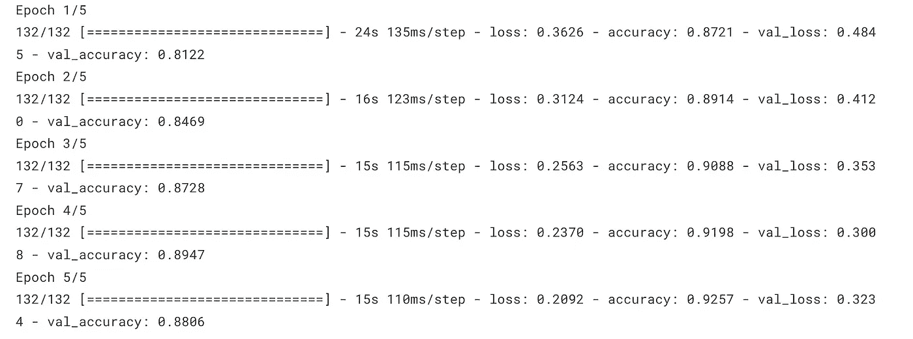

# 图像数据任务上的 Tensorflow 袖珍参考

> 原文：<https://medium.com/geekculture/your-tensorflow-pocket-references-on-image-data-88ff84a5a44d?source=collection_archive---------18----------------------->

## 张量流

## 如何使用 Tensorflow 为图像数据任务建立深度学习模型？

Tensorflow in 100 Seconds

> 在阅读这篇文章之前，我想让你看一下这个 100 秒的 Tensorflow 视频。我发现它很有趣。喜欢读这篇文章。

Tensorflow 一直是最深入的学习框架之一。基于 Stackoverflow 的[最新调查](https://survey.stackoverflow.co/2022/?)。据说 **18%** 的人比 Pytorch( **8%** )更可能使用 Tensorflow 进行深度学习框架的相同比较。因此，花时间学习 Tensorflow 来建立更好的深度学习模型是非常有益的。我将尽可能多地解释大多数 TensorFlow 开发人员在从初级到高级建立深度学习模型时使用的技术。

目录
[张量](#45ae)
[张量流](#9cd3)
[预处理数据](#dd32)
[建模](#f8a2)
[超参数调谐](#1ec2)
[张量板](#465d)
[感谢阅读！](#e6f9)

# **张量**

在进入你能在文档中看到的 TensorFlow 库中的许多方法之前，最好先了解一下叫做**张量的基本概念。**

> 张量是什么？

张量是运行在 GPU 上的 n 维数组。大多数深度学习模型都是基于张量的。因此，在适合深度学习模型之前，必须将数据转换为张量。张量有几种类型，即**标量(仅幅度)、矢量(幅度和方向)、矩阵(数字表)、3-张量(数字的立方)和 n-张量(任意数字> 3)，如以下注释所示。**

```
**scalar** = 60
**vector** = [1.5, 2.6, 3.9]
**matrix** = [[1, 4, 6], [7, 6, 8], [2, 5, 10]]
**3-tensor** = [[[4], [5], [6]], [[7], [9], [10]], [[16], [18], [20]]]
.....
**n-tensor**
```

如果你曾经使用 Numpy 做过矩阵计算，你将能够更快地学习张量，因为它们非常相似。它们之间的区别是 Numpy 是使用 CPU 计算的，而 tensor 是使用 GPU 计算的，这将加快我们的深度学习模型的运行速度，因为它的能力和一些优势。因此，张量非常需要运行深度神经网络来解决回归、分类等任何问题，甚至解决自动驾驶汽车问题，如(图像分割、实例分割和对象检测)。

# **张量流**

> 什么是张量流？

Tensorflow 是一个端到端的开源平台，用于构建深度学习模型。我们使用 Tensorflow 来计算张量和建立深度学习模型。我们可以使用 TensorFlow 创建任何类型的张量。

```
import tensorflow as tf 
scalar =tf.Variable(60)
vector =tf.Variable([1.5, 2.6, 3.9])
matrix =tf.Variable([[1, 4, 6], [7, 6, 8], [2, 5, 10]])
```

以上是在 Tensorflow 中创建张量的几个例子。有各种各样的方法可以使用，比如 tf.constant。我们不会深入探讨这些主题，因为我们将涵盖预处理数据、构建模型和调整超参数以使用 tensorboard 可视化数据的大多数技术和方法。

# **预处理数据**

数据以各种形式出现。它们可以是文本、图像、音频等。如果数据不是像字符串类型的文本那样的数字，所有这些类型的形式都不能适合神经网络。我们必须将其转换为数字形式，以便适应深度学习模型。在本文中，我们将重点关注图像数据。图像基本上是数字的形式。它是一个从 0 到 255 的像素数组的集合，可以是灰度图像(黑白)或 RGB 图像。


Grayscale Image in Pixels

您可以从由 0 到 255 之间的数字组成的灰度图像中看到。值越低，图像越暗，反之亦然。图像可以分为灰度和 RGB。我们在现实世界中看到的大多数图像都是 RGB 图像。RGB 是红色、绿色和蓝色的缩写。一幅图像由每个 R、G 和 B 部分上的 0-255 组成。大多数深度学习从业者将此称为术语通道。在将我们的数据拟合到深度学习模型之前，我们必须要做各种技术，例如通过将每个像素除以 255(归一化)，将数据重新缩放到 0 到 1。这种技术有助于神经网络更快地学习数据，与没有重新缩放/归一化的数据相比更快地收敛。在 TensorFlow 中，我们可以通过使用 TensorFlow 框架**中可用的 **ImageDataGenerator** 和**预处理实例**来重新缩放数据。**此外，它可以用于执行数据扩充，如以下代码所示

```
from tensorflow.keras.preprocessing.image import ImageDataGenerator
train_datagen_augmented = ImageDataGenerator(rescale=1/255.,rotation_range=0.2,
                                  zoom_range=0.2,
                                  width_shift_range=0.2,
                                  height_shift_range=0.0,)
```

对于数据扩充，Tensorflow 还提供了另一个类来扩充数据，如以下代码所示。当我们在不同的文章中对人类皮肤数据集上的**蚊子实现这些代码时，你会进一步理解。因此，在将其应用于深度学习模型之前，请确保您了解 TensorFlow 如何帮助增强图像数据。你可以看到我们水平翻转图像，旋转图像 20%，等等。**

```
from tensorflow.keras.layers.experimental import preprocessing
data_augmentation = keras.Sequential([
  preprocessing.RandomFlip("horizontal"),
  preprocessing.RandomRotation(0.2),
  preprocessing.RandomZoom(0.2),
  preprocessing.RandomHeight(0.2),
  preprocessing.RandomWidth(0.2),
  *#preprocessing.Rescaling(1./255) # keep for ResNet50V2, remove for EfficientNetB0*
], name ="data_augmentation")
```

在预处理图像之前，如重新调整数据、扩充数据等。最好是将数据可视化，以便知道我们要建模什么样的图像。使用 matplotlib 或 TensorFlow 有两种方法可以做到这一点。

**使用 Matplotlib**

```
from pylab import imread,subplot,imshow,show

import matplotlib.pyplot as plt

image = imread(target_image_url)  // choose target folder

plt.imshow(image)
plt.title(target_class)
plt.axis("off");
```

**使用张量流**

```
import tensorflow as tf
import matplotlib.pyplot as plt
img =tf.io.read_file("target_image_url")
img=tf.io.decode_image(img,3)
plt.imshow(img.numpy())
plt.axis(False)
```

# **建模**

大多数深度学习框架中的建模包括两种方式，要么从头实现，要么进行迁移学习。从零开始实施意味着通过实施所需的层来建立深度学习模型，并根据有多少图像可用来训练数据。迁移学习带来了不同的方式。我们受益于使用特定模型架构中可用的几个层，这些层已经在更大的数据集上进行了训练，可以在我们的特定数据集中使用。这可能是有帮助的，因为使用神经网络训练数据需要更多的计算机资源，这些资源可以通过使用迁移学习来减少。

下面显示了从头开始的模型架构的实现。

```
model = tf.keras.models.Sequential([
  tf.keras.layers.Flatten(input_shape=(224, 224,3)),
  tf.keras.layers.Dense(128, activation='relu'),
  tf.keras.layers.Dense(10,activation="softmax")
])
```

您可以看到这个简单的模型架构，它具有 224*224 的输入图像和 3 个 RGB 通道，以确定 10 个输出。你必须记住的一件事是，在对下一个隐藏层进行张量计算之前，不要忘记展平图像。在现实生活中，创建模型架构有多种方式，即**顺序 API、函数 API 和模型子类化**。上面的代码是一个顺序 API。我们将在另一篇文章中对此进行更深入的探讨。

使用迁移学习的模型架构的实现可以通过如下所示的两种方式进行

**使用 tf.keras.application**

```
IMG_SHAPE = (224,224) + (3,)
base_model = tf.keras.applications.MobileNetV2(input_shape=IMG_SHAPE,
                                               include_top=False,
                                               weights='imagenet')
```

**使用 Tensorflow Hub**

```
mobilenet_v2 ="https://tfhub.dev/google/tf2-preview/mobilenet_v2/classification/4"
IMAGE_SHAPE = (224, 224)

classifier = tf.keras.Sequential([
    hub.KerasLayer(mobilenet_v2, input_shape=IMAGE_SHAPE+(3,))
])
```

你可以看到我们使用 **MobileNet 版本 2** 对图像进行分类。我们使用 **include_top=False** 来表示我们基于自己的数据集有不同的输出。您可以通过查看 [**迁移学习模型架构**](https://www.tensorflow.org/api_docs/python/tf/keras/applications) 或[**tensor flow Hub**](https://tfhub.dev/)中的文档来调整不同的模型架构。

# **超参数调谐**

在建立深度学习模型时，我们必须设置一些超参数，以便在我们定义的指标上创建更好的分数。它们是学习速率、批量大小、引入非线性的激活函数以及时期的数量。**太大的学习率**会使步长爆炸，不能收敛到全局最小值，而太小的学习率会消失梯度下降。为了避免这种情况，可以实现这个回调 Tensorflow，并在拟合数据时实现这个实例。

```
reduce_lr = tf.keras.callbacks.ReduceLROnPlateau(monitor="val_loss",  
                                                 factor=0.2, *#multiply the learning rate by 0.2 (reduce by 5x)*
                                                 patience=2,
                                                 verbose=1, *# print*
                                                 min_lr=1e-7)
```

**批量大小**在达到收敛方面也起着重要作用。建议对图像数据使用 32。关于批量大小的有意义的见解可以在这条推特上查看，这条推特来自我最喜欢的机器学习的影响者之一(【PyTorch 和 Scikit-Learn 的机器学习的作者)，关于是否在批量大小中使用 2 的幂。

**次数**显示整个训练数据在训练网络中的次数。您可以看到，我们使用 5 个历元，并在前向和后向传播期间训练了 5 次，以根据损失来估计最佳权重。时代的数量取决于许多因素，无论我们是使用迁移学习还是从头开始实施。如果我们使用迁移学习，我们可以使用小的时期，因为它已经从更大的数据集(如 [**ImageNet**](https://www.image-net.org/update-mar-11-2021.php) )中学习了模式，并在从头实现模型架构时使用更大的时期。



Epochs

# **张量板**

Tensorboard 是我最喜欢的试镜之一。我们可以根据拟合数据时所做的训练来可视化数据。此外，Tensorflow 提供了 Tensorboard Dev，以便我们可以在**t**[**ensor board . Dev**](https://tensorboard.dev/)**中分享我们在云中开发的可视化。**通过评估训练和验证数据的准确性和损失，显示模型架构的摘要，解释从数据中学习到的每一层的模式等，可以将许多事情可视化。我发现这个工具相当不错。需要注意的一点是，您必须确定数据不是私有数据，因为其他任何人都可以访问它。您可以实现 tensorboard 回调并上传可视化，如以下代码所示

```
import tensorflow as tf
import datetimelog_dir = "logs/fit/" + datetime.datetime.now().strftime("%Y%m%d-%H%M%S")
tensorboard_callback = tf.keras.callbacks.TensorBoard(log_dir=log_dir, histogram_freq=1)
model.fit(x=x_train, 
          y=y_train, 
          epochs=5, 
          validation_data=(x_test, y_test), 
          callbacks=[tensorboard_callback])
```

**上传到 Tensorboard.dev**

```
tensorboard dev upload --logdir logs \
    --name "(optional) My latest experiment" \
    --description "(optional) Simple comparison of several hyperparameters"
```

不要忘记通过 **pip install -U tensorboard 安装 tensorboard。**

当我们建立深度学习模型来解决图像数据集中的任何问题时，这些都是口袋参考。然后，我将展示从零开始构建模型架构的真实世界示例，以及使用基于 [**蚊子对人类皮肤数据集**](https://data.mendeley.com/datasets/zw4p9kj6nt/2) 的真实数据的迁移学习，如下点击第二篇文章

[](/geekculture/you-can-get-a-better-f1-score-when-carrying-out-transfer-learning-in-your-image-data-classification-bc46165766b3) [## 在对图像数据进行迁移学习时，您可以获得更高的精度…

### 如何用 Tensorflow 对人体皮肤上的蚊子进行类型分类？

medium.com](/geekculture/you-can-get-a-better-f1-score-when-carrying-out-transfer-learning-in-your-image-data-classification-bc46165766b3) 

# 感谢您的阅读！

我真的很感激！🤗*如果你喜欢这个帖子并想看更多，可以考虑* [***关注我***](https://naiborhujosua.medium.com/) *。我发布与机器学习和深度学习相关的主题。我尽量让我的帖子简单而精确，总是提供可视化和模拟。*


**Josua Naiborhu** 是一名业务发展分析师，后来变成了一名自学成才的机器学习工程师。他的兴趣包括**统计学习、预测建模和可解释机器学习**。他喜欢跑步，这教会他不要放弃做任何事情，即使是在实施**机器学习生命周期(MLOps)** 的时候。除了追求他对机器学习的热情，他还热衷于投资印度尼西亚证券交易所和加密货币。他一直在跑 2015 年**雅加达马拉松和 2019 年**大阪马拉松的全程马拉松。他的下一个梦想是参加波士顿马拉松赛、TCS 纽约市马拉松赛和伦敦维珍马拉松赛(T21)。

*你可以在****LinkedIn****，****Twitter****，G****ithub****，* ***Kaggle，*** *上与他联系或者直接在他的* ***个人网站上与他联系。***