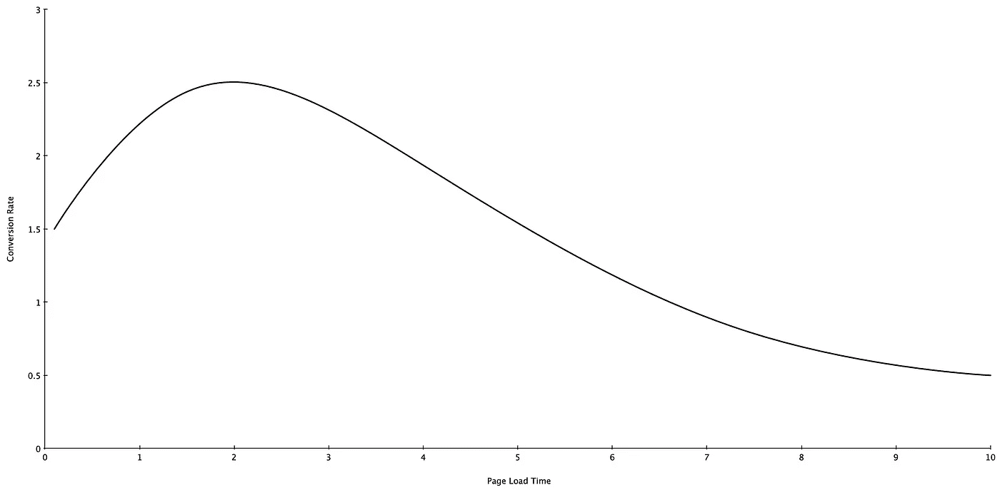
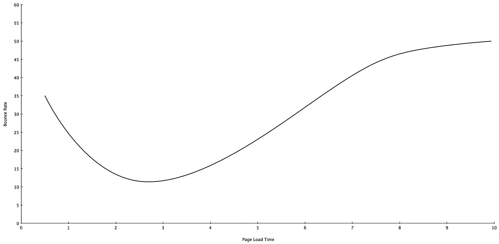

# 你的网络表现比你想象的更重要

> 原文：<https://medium.com/geekculture/your-web-performance-is-more-important-than-you-think-37b37c96809f?source=collection_archive---------15----------------------->

*你网站的缓慢正在损害你的业务*

如果你从来没有听说过网页性能，基本上它意味着一个网站有多快(和响应多快)。如果你从来不关注你网站的性能，那么，很有可能*正在*损害你的业务。

# 为什么网络性能很重要

## 绩效与您的核心业务 KPI 密切相关:

如果你在网上卖东西，不管是实物还是虚拟产品，你可能知道转换率的概念。首先。它是在网站上购物的访问者的百分比。

我们研究了全球数千家零售网站，从大品牌到个人企业，发现了性能(使用页面加载时间作为下表中的关键指标)和转化率之间的共同模式:

typical relation between performance and conversion rate

对于绝大多数零售网站来说，它们的转换率在相对较快的性能水平时达到峰值，然后随着页面变慢，客户逐渐溜走。

即使你没有(直接)销售任何东西，糟糕的表现仍然会从其他角度对你产生负面影响，比如用户参与度。

让我们以跳出率为例。如果你不熟悉跳出率，这只是进入你的网站，然后没有检查另一个页面就离开的访问者的百分比。跳出率低表明你的访问者愿意花更多的时间来探索你的网站。

typical relation between performance and bounce rate

我们的研究表明，最低的跳出率发生在快速的页面加载时间(通常是< 3 seconds), and then more and more visitors will leave the site when the performance getting worse.

## Performance impacts your SEO

Google introduced a series of performance metrics in 2020, which known as [网站生命指标](https://web.dev/vitals/))。web 重要指标的意义在于，这是谷歌第一次将 Web 性能直接纳入其 PageRank 算法。

因此，如果你的网站没有很好的表现，你的搜索引擎优化排名也会降低。

总的来说，糟糕的网站性能不仅会让现有的访问者更快地离开你的网站，还会让你的网站更难被新访问者发现。

# 如何检查网页性能

你可能会想:*“我知道我的站点很快，我自己测试过了。”*

当然你经常访问你的站点，但是你真的了解它的性能水平吗？

根据皮尤研究中心 2021 年 4 月发布的一项研究，大约四分之一的美国成年人家里没有宽带互联网服务。还有许多关于手机生命周期的研究表明，普通智能手机的寿命为两到三年。

我想说的是，并不是你所有的客户都是通过高速互联网上一个新的强大设备来访问你的网站的，你的一些客户住在离你很远的一些地方。你对这个网站的体验并不能反映他们的用户体验。这就是为什么我们需要性能测试和监控工具。

市场上有两种类型的 web 性能测试工具:合成和真实用户监控(RUM)。

## 综合监控

如果你以前从未做过性能监控，并且你的网站没有很高的流量，synthetic tool 是一个很好的起点。顾名思义，synthetic tool 可以模拟不同网络条件下来自不同设备和位置的用户访问。它可以帮助您发现性能问题，以便您知道需要在哪些方面下功夫。

我个人最喜欢的合成工具是[WebPageTest.org](https://www.webpagetest.org)。它在世界各地都有服务器，同时检查首次访问和重复访问，包括上述新的 Web 重要指标，并支持一些高级功能，如 SPOF(单点故障)测试。而且是免费的。

合成工具的缺点也很明显:测试结果来自机器人模拟。他们不了解你的客户的地理和人口分布。更常见的是，当您遇到实际问题和 bug 时，合成工具可能没有足够的信息供您和您的开发人员挖掘。如果你网站的一部分在登录之后，许多合成工具甚至不能访问它。

## 真实用户监控

如果这些警告对你来说成了问题，或者如果你的站点获得了更多的页面浏览量，你可能会考虑使用 RUM 工具。

大多数 RUM 工具在您的站点上注入一个 JavaScript 片段，并直接从浏览器收集大量指标。因为这些数据是从实际访问过你的网站的客户那里收集的，所以 RUM 可以准确地反映真实的用户体验。此外，RUM 还可以用于其他目的，如 A/B 测试、转换和收入跟踪等。综合使用这些功能可以帮助您根据真实用户数据做出业务决策，这是合成工具无法做到的。

市场上有几种流行的 RUM 工具，侧重点不同:Google Analytics 更多的是一种性能报告工具，而不是分析工具，这对于 SEO 优化和营销目的非常有用。Adobe Analytics(以前的 Omniture)也可以用于营销，但具有更高级的性能分析功能。与 Adobe Analytics 类似，Akamai mPulse 也支持实时仪表板中的高级性能分析。然而，mPulse 不是一种营销工具，而是更注重将绩效与业务成果联系起来，并帮助您根据业务目标设定绩效目标。

尽管 RUM 工具可能提供免费版本，但许多重要特性通常需要付费订阅。随着你的业务增长，这种工具将开始变得更有意义，因为相对于付费墙的成本，你往往会因为糟糕的性能而损失更多的钱。

# Web 性能诊断

一旦您了解了站点的当前性能水平，下一步就是进行性能诊断。

## 谷歌灯塔报告

Google Lighthouse 是一个免费的性能工具，内置在 Chrome DevTools 中。通过运行 Lighthouse，它会自动为需要改进的地方生成一个报告，并为您的站点提供一个关于性能、安全性和 SEO 的建议列表。

## 挖掘朗姆酒数据

Google Lighthouse 是诊断 web 性能的一个很好的起点，但是许多性能问题只影响您的部分使用，这可能不会被自动化工具捕获。

这就是 RUM tool 大放异彩的地方。如果您的 RUM 工具收集了所有访问者的数据，您可以快速比较不同访问者群体的表现，找出差距，并根据其对您业务的影响程度确定改进工作的优先级。

## 聘请一名绩效顾问

如果你的团队没有足够的知识或专业技能来满足你的需求，那么让一个专业人士来帮你审查这个网站不失为一个好主意。这一领域有许多声誉良好的公司和个人，他们可以利用自己的经验和专业知识来帮助您编写绩效诊断报告和改进计划。如果他们和你一样为同行业的其他客户服务过，你甚至可以从他们那里获得竞争分析。

# 一般性能优化建议

如果您还没有准备好进行定制的性能诊断，那么可以从不同的站点上看到一些常见的性能问题。关注这些方面将有助于你获得更好的站点表现。

## 少用第三方资源

从网页设计的角度来看，第三方资源很棒，但对性能发烧友来说就不那么好了。因为你不拥有它们，所以你对它们无能为力。

还记得 2021 年 10 月 4 日发生在脸书的持续了 6 个小时的停电吗？它的影响不仅限于脸书和 Instagram。事实上，许多使用脸书资源和 API 的网站当天也出现了不同程度的服务降级。

是的，脸书不常停电。然而，所有主要的美国互联网公司，谷歌，AWS，脸书，Twitter，你能想到的，今年都有过某种程度的中断。当你的网站使用来自许多第三方的资源时，你很可能一年中经历多次性能下降或中断。如果这些资源中的一个恰好是单点故障(SPOF)，当第三方发生中断时，您的业务就会关闭。

虽然避免所有第三方资源不太可行，但这里有一些建议可以帮助减少它们的影响:

1.  仅使用必要的第三方资源。
2.  避开 SPOF。尽可能自己掌控关键资源。更改默认显示属性以允许回退。
3.  取消第三方资源的优先级。如果一个资源在第一次绘制之前不需要，那么就不要那么早加载它。

## 图像优化

高分辨率图像非常适合展示产品，但你并不需要在任何地方都使用它。对于低分辨率的屏幕，5MB 的图像无法与压缩的 200KB 版本区分开来。除此之外，许多现代图像压缩算法可以以原始文件大小的一小部分实现近乎无损的质量。

您可以通过优化图像来减少页面加载时间:

1.  提供基于屏幕尺寸和分辨率的缩放图像。
2.  施加压力。
3.  使用下一代格式。

## 其他建议

*   缓存静态内容，设置更有效的缓存 TTL
*   使用 CDN 降低资源延迟

# 结论

网页性能直接影响你的销售，用户参与度和搜索引擎优化排名。一个表现不佳的网站不仅会让现有的访问者很快离开，还会让你的网站更难被新访问者发现。

理解绩效的真正影响是努力提高绩效的第一步。

那么，你的网站有多快呢？