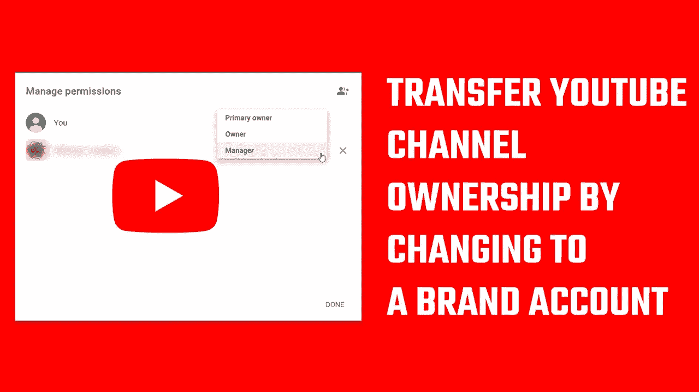

# YouTube 频道:如何更改所有者(google 帐户)或向您的 YouTube 添加管理人员？

> 原文：<https://medium.com/geekculture/youtube-channel-how-to-change-the-owner-google-account-or-add-managers-to-your-youtube-8080b2e181af?source=collection_archive---------7----------------------->

从个人 YouTube 转移到品牌账户

您是希望更改与您的 YouTube 帐户相关联的 Gmail id，还是希望更改主要所有者？在本文中，我们将讨论如何向您的 YouTube 添加新经理和/或更改您帐户的所有权。由于个人原因…