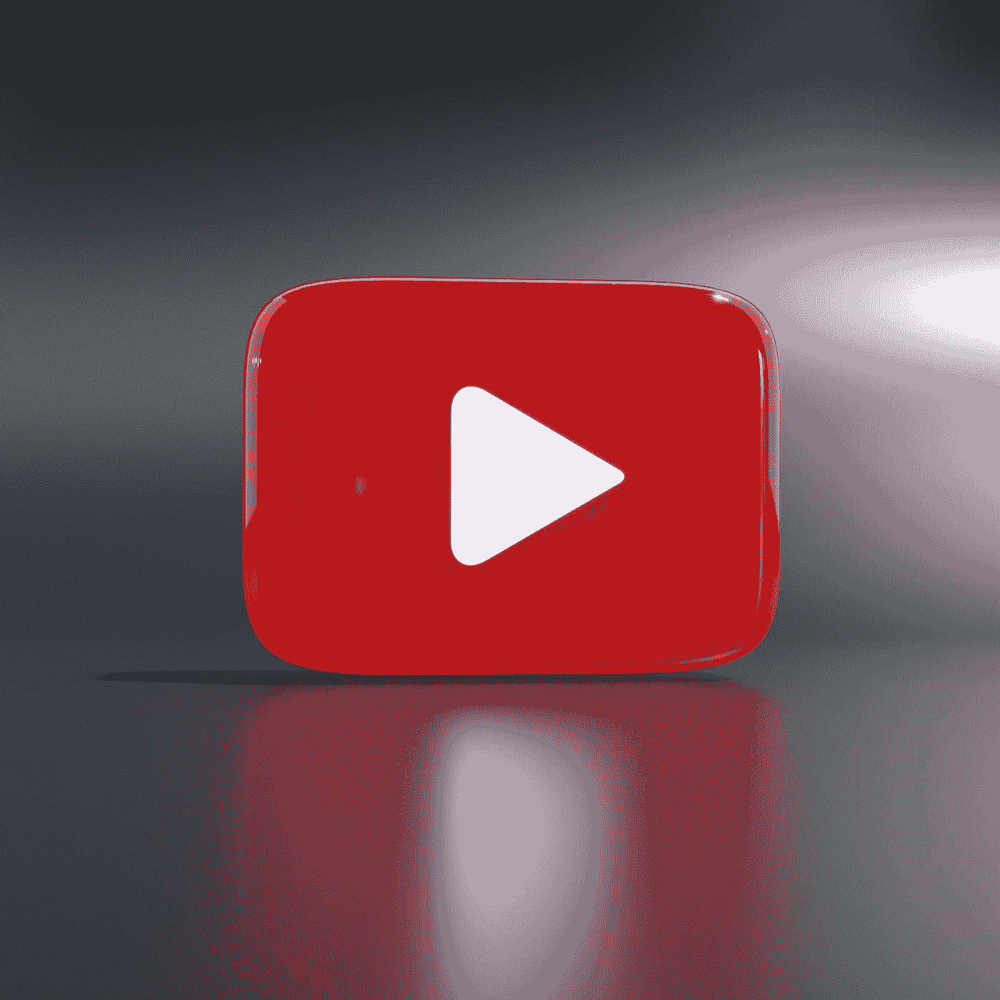

# Youtube 搜索的工作原理

> 原文：<https://medium.com/geekculture/youtube-search-31ef7a1f91d3?source=collection_archive---------19----------------------->

你有没有遇到过这样的情况，一首随机歌曲的一个随机行卡在你的脑海里，然后你来到 youtube，键入那个随机行，然后砰！！你得到了这首歌。就个人而言，我在找 Anne Marie-2002，搜索了“ba-ba-ba ”,让我非常惊讶的是，我竟然找到了一首连我自己都不确定的歌。

Photo by [Eyestetix Studio](https://unsplash.com/@eyestetix?utm_source=medium&utm_medium=referral) on [Unsplash](https://unsplash.com?utm_source=medium&utm_medium=referral)

Youtube 搜索是世界上最准确的搜索平台之一。从搜索视频到搜索镜头，youtube 显示的准确度绝对令人难以置信。为这个论点提供一些数据，

1.  Youtube 搜索是世界上第二大搜索引擎/平台，仅次于其母公司谷歌。
2.  前 100 个搜索中有 52%是针对特定的音乐艺术家或内容创作者的。
3.  全球 100 大 YouTube 搜索中的大多数都与音乐相关。

4.2022 年，印度拥有最多的 YouTube 用户，估计印度有 4 . 67 亿 T2 用户。

尽管这些数字看起来很有趣，但 youtube 在搜索背后投入了大量的研究和科学。保持文章简洁，这是 youtube 搜索或者更确切地说是 youtube 搜索引擎的预期工作。

**工作**

虽然 youtube 还没有公开发布他们的算法，但据信 youtube 搜索引擎遵循了与谷歌搜索弹出结果类似的搜索引擎优化和策略。Youtube 关注显示查询“q”结果的 4 个主要部分:

1.  **相关性** - >这包括视频的标签、描述、标题。这些标签离查询“q”越近，搜索到视频的机会就越大。此外，YouTube 还试图通过考虑用户的搜索和观看历史来确定每个用户的相关性。
2.  **参与度** - >特定视频的观看时间越长，其弹出查询 q 的几率就越大，例如:—在标题为“家”的 5 个视频中，全局观看时间最高的视频将排在第一位。**参与时间与相关性成正比。**
3.  **质量** - > Youtube 系统旨在识别信号，这些信号可以帮助确定哪些频道在给定主题/查询方面表现出专业知识、权威性和可信度。质量越好，视频的排名越好。
4.  **个性化** - >个性化是搜索的一个重要因素。用一个例子来解释，对于一个经常搜索动漫的用户来说，q 查询“子悟空”给出《龙珠 Z》上的视频的几率比“子悟空神”更大。

提到以上几点，不同的用户对同一个查询有不同的搜索结果是很常见的。除了上述 4 个因素，由于 youtube 也是一个搜索引擎**,它在搜索引擎结果页面(SERP)上对视频进行排名，以及创作者和品牌如何为 YouTube SEO 优化他们的视频。**

Youtube SEO 基于两个主要因素，

1.  基于**元数据**(标题、描述和关键字)的关键字相关性
2.  参与度**指标**(观看时间、**点赞、评论**等。)

虽然这又是上述 4 点的迭代，但 SEO 是一个单独的主题，并且更加复杂，可能涉及外部工具和数据工程。此外，在描述和视频标题的开头包含重要的关键字会大大提升视频的质量。**描述字段可帮助观众找到视频并决定是否观看。前几行描述将出现在 SERP 和视频页面上，帮助引擎对其进行更好的排名。**

总而言之，回答用户问题并保持观众兴趣的视频将从 YouTube 的搜索算法中受益最多。相关性、个人历史、元数据和统计数据是决定用户查询结果的因素。

感谢您阅读文章！
我会尽量把这种有趣话题的短文，每周一篇。关注更多此类内容。:)