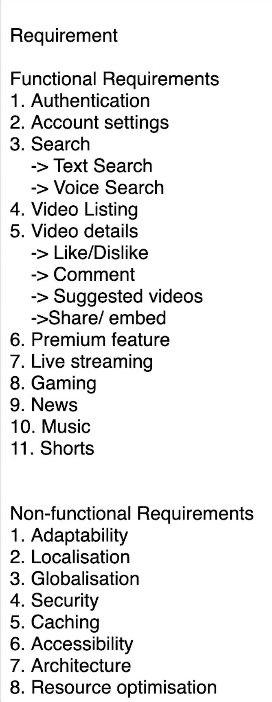
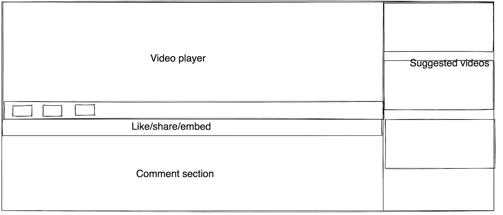

# Youtube —系统设计，MAANG 面试问题。Youtube 上的实时评论和分页是如何工作的？

> 原文：<https://medium.com/geekculture/youtube-system-design-maang-interview-question-20c9656b6ce8?source=collection_archive---------5----------------------->

Youtube 的系统设计是前端系统设计面试中最常见的面试问题之一。原因是 Youtube 的简单性，设计一个看起来非常简单的系统是非常困难的。如果你是前端开发人员，不知道什么是前端系统设计？我在这里写了一篇介绍性的文章[，你可以在看这个之前先看看。](https://mevasanth.medium.com/what-is-frontend-system-design-what-questions-to-expect-in-the-interview-705e5c05be9)

如你所知，用文字来解释整个系统设计是相当困难的。详细解释可以看下面的视频。你也可以阅读这篇文章，在这里我会从更高的层面解释一些事情。

Fig: System design of Youtube

让我们来看看前端系统设计的各个不同部分:

> **要求:**

需求主要包括两种类型:

1.  **功能需求**:功能需求由那些直接影响用户体验的需求组成。
2.  **非功能需求**。非功能性需求包括在大多数情况下不会直接影响用户，但是从产品的角度来看非常重要的东西。

下图列出了 Youtube 系统最常见的要求。

> **范围界定**

完成需求收集后，因为这是一个只有 40 分钟的面试，你不能建立一切。一般来说，面试官会挑选一些具有挑战性的项目，他们对此很了解。以下是我正在研究的项目。

**视频详情画面:**

->注释分页

**现场评论**

> **技术**

在需求和范围确定之后，下一步就是为构建“ **Youtube** ”选择正确的 UI 技术。你会选择以下哪种技术？

*   反应堆
*   安古拉吉斯
*   VenillaJS 和 HTML，CSS
*   VueJS

在选择正确的技术之前，这里有两件事

1.  **组织依赖性:**组织可能有一些内部问题。可能有一个团队全是 reactJs 开发人员，而没有 Angular 开发人员，反之亦然。正因为如此，虽然产品需要一种技术，但你不能选择它。

**2。项目依赖性:**满足项目需求的合适技术是什么？理想情况下，这应该优先于**组织依赖性。以“ **Youtube** ”为例，我们可以使用 ReactJS 或 AngularJS。另一方面，Youtube 不使用这两个框架，他们有一个专门针对他们产品的内部框架。**

> **组件架构**

这一步是可选的，取决于面试官，他们可以要求你创建一个设计的线框，然后开始提问，或者他们可以直接开始提问。

下面是 Youtube 视频详细信息屏幕的基本设计。

> **问题 1(讨论范围项目)**

1.  **视频播放器:**如何构建一个像 **Youtube 这样复杂的视频播放器？**如果我在设计阶段，我的第一个问题会是“我们必须在多少天内推出这款产品？？“如果我们有更多的时间，那么我们可以从头开始构建播放器。如果没有，建议购买一些现有的视频播放器，并在第一次或几次发布后构建我们自己的播放器。但是如果你想知道如何自己制作一个像 Youtube 这样的视频播放器，你可以阅读这篇[博客文章。](https://freshman.tech/custom-html5-video/)很简单，Youtube 用的是 HTML < video >标签和 mediaSource API。

> **问题 2(讨论范围项目)**

1.  **评论供稿:**这是一个有趣的问题，需要解决。因为热门视频会有 1000 条评论。**将评论添加到屏幕上的正确策略是什么？**

一个简单的答案是通过“**分页**”。当页面启动时，我们加载一些评论，当用户滚动到页面末尾时，更多的评论被添加到页面中。但是这里有两个主要问题。

*   **如果已经加载的评论被编辑了怎么办？你会刷新它吗？**
*   **如果你选择了新的过滤器来过滤旧的评论，当你点击结束时，**从技术上来说，你正在加载旧的评论。到那时，可能已经有很多新的评论了。会不会浮出水面？

有很多方法可以解决这个问题，考虑到 Youtube 的规模，我提出以下解决方案:

1.  仅过滤本地数据:我们不会在分页时加载新的注释。因为两个人同时打开的热门视频的评论数可能不一样。要获得新的评论，最好刷新页面。
2.  **分页时只加载旧评论:**同上。
3.  **有一个名为优先评论的特殊部分，用于刷新现有的评论列表:**某些评论可能会改变整个讨论过程。在这种情况下，添加这些评论是非常必要的，尽管这是一个新的评论。这些优先评论可以在 AI/ML 算法的帮助下在后端进行分析。

> **问题 3(现场评论)**

在视频直播过程中进行现场评论似乎是一个很容易解决的问题。但实际上不是，我来解释一下为什么？

1.  在视频直播过程中，每秒钟可能会有数千条评论涌入。要更新屏幕上的内容，从服务器获取评论的正确策略是什么？
2.  **你在本地存储了多少评论**？因为像新闻频道这样的直播视频可能会在 30 分钟内获得 10 万条评论，如果你全部存储，你的网站可能会变得非常慢。

让我们解决这两个问题。

1.  从服务器获取实时评论的正确策略是通过**投票。每隔 **X** 秒触发后端获取新的评论集。这个 **X** 由 AI/ML 通过观察一段时间内的流来确定。例如:对于新闻频道 **X** 可能很小，对于自然视频 **X** 可能很大。**
2.  我们不必将所有的评论都存储在本地。最好有一个固定大小的注释数组，并在新的注释到达时用新的替换旧的注释。因为大多数用户都没有时间回去阅读所有的评论。同样，存储多少注释可以由 AI/ML 固定或确定。

**你必须看我上面的 Youtube 视频才能知道直播是如何工作的**

# 结束语

1.  前端系统设计不涉及任何编码。
2.  它只涉及到给一个系统你将如何从头开始设计它。
3.  你不必知道你用的是什么系统。例句:亚马逊可能会在他们的电子商务网站上使用 ReactJS，而你提议用 Angular 来构建亚马逊，这没有问题。你不是在克隆产品，而是从头开始设计。
4.  选择您每天使用的系统，并尝试使用上述部分进行设计。

感谢您在下一篇文章中阅读 catch you。如果你还没有在媒体上关注我，那么请关注我，你可以在链接的[这里](https://www.linkedin.com/in/vasanth-bhat-4180909b/)关注我。别忘了订阅我的 YouTube 频道[非周末](https://www.youtube.com/channel/UCSCNvSCk_Z9mBvUM-FJexRg/videos)。

欢迎在评论区添加您的反馈。

如果你想亲自和我讨论模拟面试，面试或简历审核的技巧和诀窍，你可以在这里预约:

[https://topmate.io/vasanth_bhat](https://topmate.io/vasanth_bhat)

如果你是 reactJS 开发人员，正在寻找面试准备，请点击这里观看我的完整面试准备指南:

如果你正在准备前端开发者面试，请观看我的以下系列:

来自同一作者的更多文章:

1.  [我丢了 50L+包，因为我回答不了这个 JavaScript 问题。](/geekculture/i-lost-50l-package-because-i-couldnt-answer-this-javascript-question-2259bf90d021)
2.  [不要跳过| 2022 年要准备的 5 大前端面试题目](/geekculture/dont-skip-top-5-frontend-interview-topics-to-prepare-in-2022-8adc8801677e)
3.  [解决 Meta | Amazon | Google | Apple 面试问题。为 Array.flat()](/geekculture/solve-meta-amazon-google-apple-interview-question-write-custom-implementation-for-array-flat-8e0072961c29) 编写自定义实现
4.  [前端开发人员面试要避免的 5 个错误| 200 多次面试经验总结](/geekculture/5-mistakes-to-avoid-in-frontend-developer-interview-200-interview-experience-summarised-7e79bc87b062)