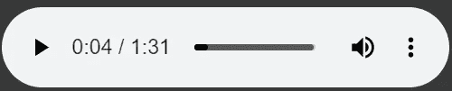
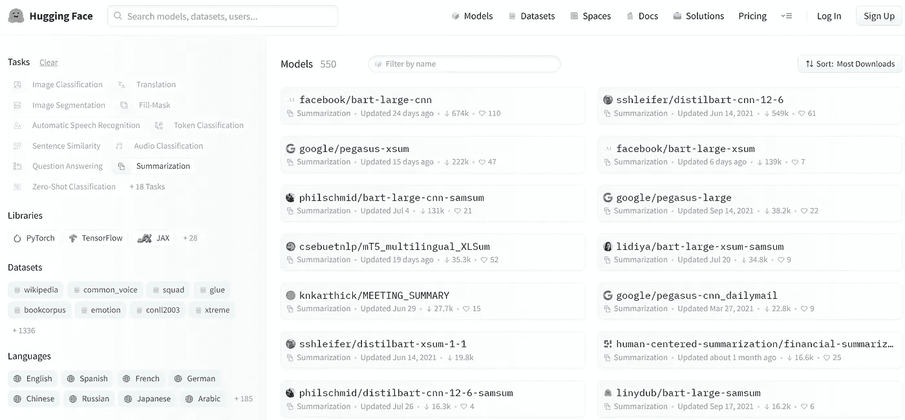

# 用 Python 制作 YouTube 视频摘要

> 原文：<https://medium.com/geekculture/youtube-video-summarization-with-python-52fc192a5004?source=collection_archive---------6----------------------->

Photo by [Eyestetix Studio](https://unsplash.com/@eyestetix?utm_source=medium&utm_medium=referral) on [Unsplash](https://unsplash.com?utm_source=medium&utm_medium=referral)

## 别浪费时间看没用的长视频了，我们来创造一个为我们总结的 AI 吧！

# 介绍

我不知道你是否也遇到过这种情况，但在空闲的时候，我会花几个小时在 Youtube 上观看各种各样的视频。这些视频通常是类似于*【7 个成功秘诀】*或者*【机器学习中最有用的 10 个工具】*或者甚至是*意大利最美丽的 5 个地方。但是一旦你打开视频，这个家伙并不只是告诉你你想知道的，而是开始一个无休止的独白，目的是让视频持续更长时间，吸引更多的流量。*

但是有时候，就像变魔术一样，你会在评论中找到一个圣人，他会为你做总结，给你列表或视频的基本信息，而你不必花 30 分钟(或 2 倍的 15 分钟)盯着那个该死的视频！

所以有一天我想:“*既然我擅长机器学习，我就不能自动创建这些视频的摘要吗？*”

我试着写了一个可以运行的小 Python 程序(尽管还有待改进),我将在本文中解释它。

# 从 Youtube 下载视频

首先，我们需要一个从 youtube 下载视频的方法。实际上，我们不需要整个视频，只需要音频。因此，我们将从视频中提取音频，并仅下载该音频。

我用来和 youtube 互操作的库是 [*youtube_dl*](https://github.com/ytdl-org/youtube-dl) ，你可以在 GitHub 上了解更多。

所以我们用 pip 安装库，用下面的方法从 youtube 下载音频。

请注意，在第 8 行中，我们选择以 *wav* 格式下载音频，但是如果您愿意，mp3 或其他格式也可以。
另一方面，在第 15 行，你必须输入你想要的视频的链接。

# 听听音频

我们下载的音频正确吗？让我们通过直接从笔记本上重新播放音频来检查一下。

# 音频转文本

下一步是将音频文件转换成文本，希望得到较低的单词错误率。这将是有用的，因为我们可以直接在文本上运行摘要 NLP 算法。

你可以在这里阅读更多关于我们将用于文本转换为文本[的模型。](https://huggingface.co/facebook/wav2vec2-large-960h-lv60-self)

# 文本摘要

现在剩下我们要做的就是把我们从视频中提取出来的文字，进行总结。有数百种总结模式，你所要做的就是点击总结按钮上的[拥抱脸](https://huggingface.co/models?pipeline_tag=summarization&sort=downloads)过滤器，选择最适合你的模式。

对于这个项目，我将使用 *google/pegasus-xsum* 模型。你可以在这里阅读这个模型的细节(在以后的文章中，我还会继续解释这些总结算法背后的理论)。

使用这些在 HugginFace 上找到的预先训练好的模型真的很简单，看看我在几行代码中使用摘要。

# 结论

很有趣，对吧？通常当我在 Medium 上写文章时，我会详细解释算法是如何使用的，库是如何工作的。但是在意大利的八月很难找到焦点太热了！所以我只是想，我会用 HuggingFace 上发布的模板做一个不错的、希望有用的小项目，你可以根据自己的喜好使用和改进。

# 结束了

*马赛洛·波利蒂*

[Linkedin](https://www.linkedin.com/in/marcello-politi/) ， [Twitter](https://twitter.com/_March08_) ， [CV](https://march-08.github.io/digital-cv/)