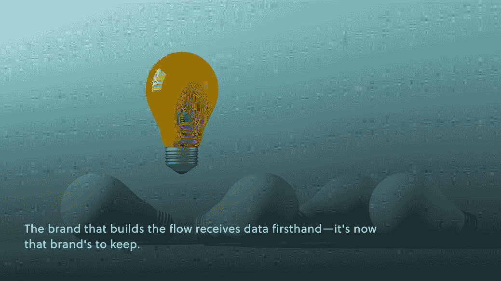
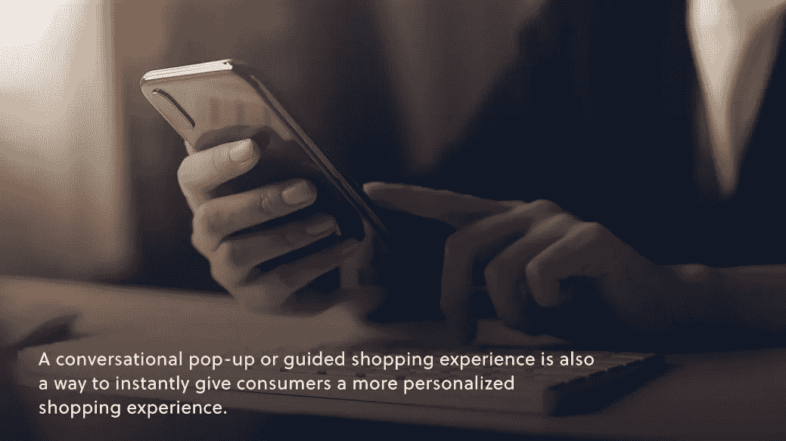

# 电子商务在线测验

> 原文：<https://medium.com/geekculture/zero-party-data-and-the-role-that-quizzes-and-surveys-play-7a03b319396f?source=collection_archive---------16----------------------->

## 品牌的电子商务

## 零方数据以及测验和调查的作用

[Octane AI](https://www.linkedin.com/company/octane-ai/) 的本帕尔加入了*咖啡电商的一集？！*揭示今年最相关的话题之一。

Ben 带着适当的咖啡因和活力来谈论零聚会数据以及在线测验和其他数据收集在电子商务中的使用。

在与节目主持人内特·斯沃博达讨论了他每天的咖啡因摄入量后，本开始讲述他的公司是如何起步的。

那是 2016 年，他和他的团队走在了为 Shopify 店面提供零聚会数据收集的前沿。Ben 反思了后来有多少开发商和品牌向他寻求建议。他说，他早年学到的最重要的一课是如何建立关系和品牌文化。

在自己的企业声名远扬之后，本还谈到了如今品牌要吸引最优秀的人才必须做些什么。“最好的人才是寻求灵活性的人，”他坚持说，主要指的是远程工作。“世界已经变了，唯一的问题是，企业做出了哪些改变来应对这些变化。”

从我们的工作方式到我们的购物方式，世界真的变了。在采访的早期，Ben 巧妙地从他自己的起源故事转移到今年和去年电子商务已经“从根本上改变了”的方式。他断言，最关键的变化之一是我们收集数据的方式。

# 零方数据

第三方数据(你知道，脸书和谷歌等公司收集的用户网站活动的 cookies)在今年的 iOS 14 更新中基本上被取消了。自从那次更新(及其新的隐私设置)以来，现在 96%的 iOS 用户已经选择退出追踪。苹果设备平台确实在隐私问题上有了自己的见解，因此，第三方 cookies 正在迅速被淘汰。

零方数据是品牌收集目标消费者信息的新方式，很快也将是唯一的方式。根据 Ben 的说法，零派对数据是通过“你(品牌)拥有的内容和网站”收集的，包括调查、测验和引导购物体验。

想象一下:用户在你的登录页面上回答一连串的问题，点击简单的“如果/那么”语句来表达他们的偏好。构建流量的品牌获得第一手数据——现在是品牌保留的时候了。

所以是“零方”数据。

Ben 详细阐述了第三方 cookies，并反思了“电子商务是如何由购买[第三方]数据的公司建立的；但那不会再发生了。”零方数据是品牌现在收集消费者偏好、兴趣甚至行为数据的新方式。

零聚会数据收集改善了买家之旅，Ben 在采访中解释了原因。再想想那次被引导的购物经历。在这些情况下，零方数据是消费者实际上想要给一个品牌的数据，因为它有助于他们得到他们想要的东西。“这是少有的真正有利于品牌和消费者的情况之一，”本说。

# 如何收集零方数据

本建议，对于任何开始采用零聚会数据收集策略的品牌，“从一个对话式的小测验开始”。他说，这更容易建立，来自弹出窗口的数据将帮助品牌决定在稍后的测验中应该做什么。

对话式弹出窗口或引导式购物体验也是一种即时为消费者提供更个性化购物体验的方式。

品牌所有者可以在本的网站上做一个[测试，开始他们自己的零聚会数据收集。](https://www.octaneai.com/)

零方数据给品牌带来了另一个好处，那就是它能帮助品牌减少噪音。这是如何工作的:

*   如今，各品牌使用的每一款应用和软件都是为了让他们的产品上线，并在各渠道间进行优化，最终让这些品牌能够访问内置的报告和指标。
*   如今，品牌最擅长的一件事就是报告数据。起初，这似乎是一件好事。
*   然而，实际上，从这些数据中寻找有用的金块，并在推动变化的数字背后聚集力量，对任何人来说都不是自然而然的事情。
*   这就是为什么品牌越来越多地雇佣数据分析师和数据可视化服务来帮助解析所有这些数字。

**各种各样的数字都有它们的用处，但这些应用程序中的报告不会告诉品牌消费者最热衷的是什么。品牌现在需要的数据必须直接来自消费者。**

使用这类数据来帮助确定[哪些 KPI 对你的品牌真正重要](https://www.amberengine.com/blog-content/how-to-pick-kpis-that-matter?utm_source=blog&utm_medium=referral&utm_campaign=medium-blogs)。

# 如何处理零方数据

在接下来的采访中，本提出了这样一个问题，当一个品牌拥有这些零派对数据时，该如何处理呢？在采访的后半部分，他详细回答了问题。

**“第一、第二、第三【要做的事情】:把它连到你的邮箱里。”请收听完整的一集，了解当今品牌的发展趋势。**

要诚实。当你看到“在线测验”时，你首先想到的是 BuzzFeed 式的性格测试。对吗？Ben 认识到了这一点，然后举例说明了正确使用测验和调查对于弄清楚消费者想要什么样的产品和包装是至关重要的。

**消费者不想要更多的选择，他们想要*更好的*选择。这个新标准是最近消费者期望** [**转变**](/amberengine/trends-in-consumer-expectations-6b11a59d9a7f) **的一个组成部分。**

无论你的品牌现在是否在零方数据收集上有所行动，这将决定数据趋势在以后会产生什么样的影响——是好是坏。如今的广告策略完全基于 cookies(来自第三方数据)，那些生态系统用不了多久就会被彻底打破。

本警告说:“如果你现在过于依赖广告和第三方数据(并且不要在接下来的一年或一年半内改变这一点)，你的情况就很糟糕。”。

听完整集了解更多！