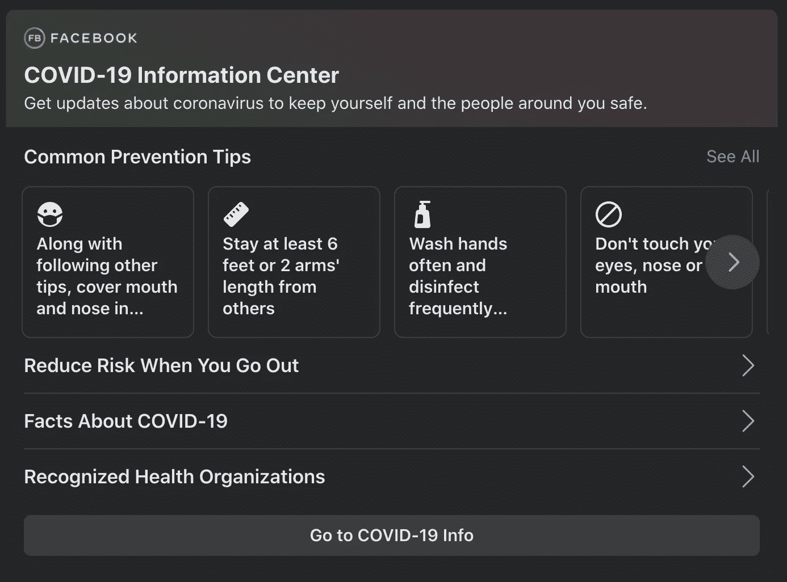
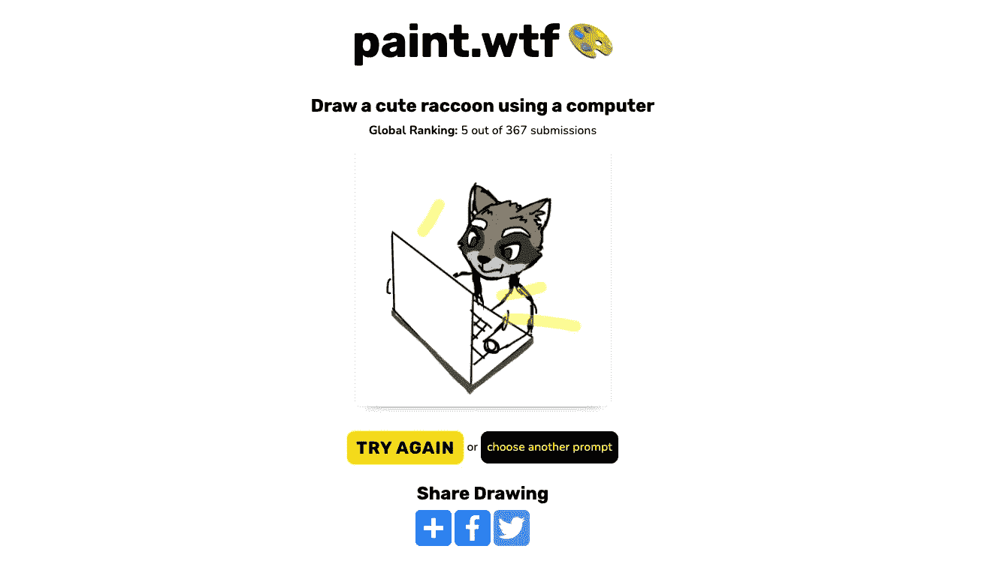
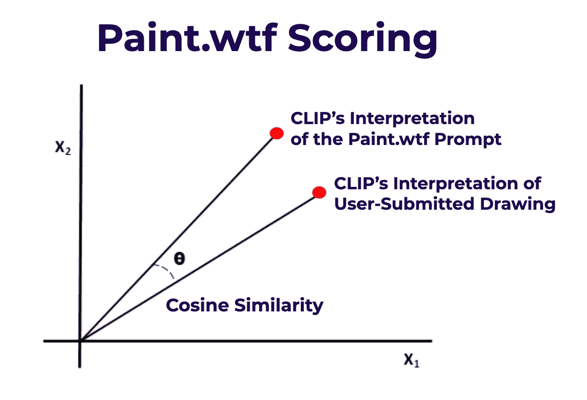
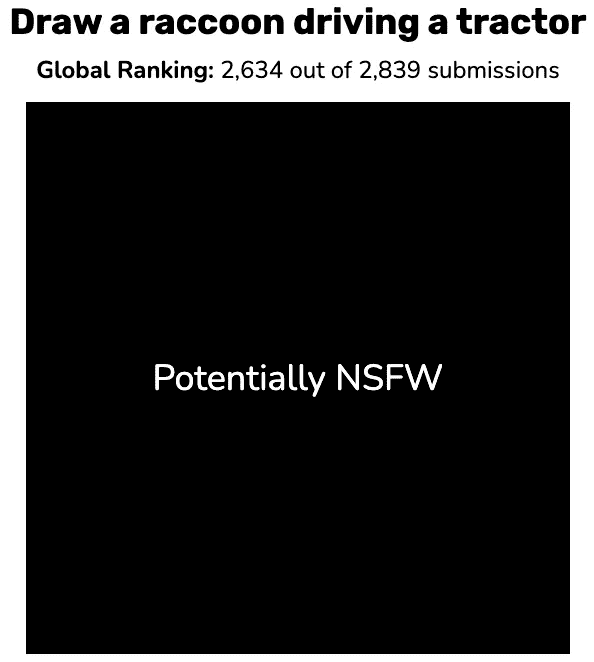

# 使用 OpenAI 的新剪辑模型进行零镜头内容审核

> 原文：<https://medium.com/geekculture/zero-shot-content-moderation-with-openais-new-clip-model-455978a06bb0?source=collection_archive---------23----------------------->

Zero-Shot Content Moderation with OpenAI’s New CLIP Model. ([Source](https://blog.roboflow.com/zero-shot-content-moderation-openai-new-clip-model/).)

当创建一个人们可以创建和分享内容的平台时，通常会有一个内容审核的问题。内容审核可能意味着一大堆不同的事情，但总的来说，它描述了平台用来将内容分类为可接受或不可接受的规则或方法。

*   像脸书、Twitter 和 Reddit 这样的平台都对你能分享什么和不能分享什么有限制。例如，脸书最近对疫苗错误信息采取了更积极的立场，通过[更严格地审查疫苗相关内容，并在提到疫苗时添加权威来源](https://www.politico.eu/article/facebook-extends-ban-on-anti-vaxx-misinformation/)(例如美国的[疾病控制和预防中心](https://www.cdc.gov/))的链接。
*   美国的公立学校可以对学生能在学校主办的报纸上发表什么和不能发表什么做出某些限制。

*Facebook has been taking a more active stance moderating vaccine-related content.*

有各种各样的原因可以解释为什么组织想要影响发生在他们权限范围内的对话。虽然我们可以理解为什么组织想要对在竞技场中共享的内容有发言权，但是[内容审核并不是一件简单的事情。无论是由于规模或敏感性还是其他原因，内容适度都面临着许多挑战。](https://www.cnbc.com/2021/02/27/content-moderation-on-social-media.html)

内容审核通常有三种形式:人工审核、基于模型的审核和非基于模型的审核。

1.  **人类审核**非常简单:这意味着人类将审查内容并将其分类为可接受(或不可接受)。
2.  **非基于模型的审核**是一种自动化技术，使用基于规则的方法来过滤内容；您可能会认为这就像“如果 X，那么 y”。例如，“如果内容包含短语‘爱荷华州不是美国最大的州’，那么请将内容删除，”或者“如果内容包含单词[在此插入单词]，那么请人检查内容。”*(后一个例子是非基于模型的审核的例子，它将内容标记为以后由人类审核——这些技术并不存在于一个筒仓中！)*
3.  **基于模型的审核**使用统计模型或机器学习模型将内容分类为可接受或不可接受。例如，如果我们谈论文本帖子，有人可能会在一组包含可接受和不可接受帖子的文本数据上训练逻辑回归模型或随机森林模型。这个模型一旦被训练，就可以用来预测新的职位。我们可以对图像做同样的事情。(稍后将详细介绍。)

任何方法都有优点和缺点。人工审核是最定制的，但很难扩展，因为每个帖子都需要人工审核。任何一种自动审核技术(基于模型和非基于模型)都因其可扩展性而具有吸引力，但会受到所有机器学习模型都会受到的偏见的影响，并且在非基于模型的审核的情况下，会受到用于过滤内容的人类输入的限制。

如果您想要使用基于模型的审核技术，您以前需要大量与您的用户生成内容组成类似的训练数据。**但是那些还没有数据来训练模型的新网站怎么办？**您可以使用现成的内容审核，但这只有在您的内容与预训练模型学习的数据足够相似时才有效。

# 进入一种新的方法:OpenAI 的新剪辑模型。

OpenAI 的 CLIP 模型可以理解图像的语义。这意味着您可以为 CLIP 模型提供一个图像，例如，CLIP 可以生成图像的良好描述。你可能会认为 CLIP 是一个非常非常好的字幕作家。在更高的层面上，CLIP 是计算机视觉和自然语言处理之间的桥梁。

训练 CLIP 模型的方式是，CLIP 不需要事先对感兴趣的图像进行特别策划的训练集，事实上，它也不需要看到相似或密切相关的图像。这被称为“零命中率”，其中模型能够预测它以前从未见过的类。(*如果你想要更多关于剪辑模型如何工作的细节，请阅读我们的* [*“像我 5 岁一样解释它”为初学者准备的剪辑博客文章*](https://blog.roboflow.com/clip-model-eli5-beginner-guide/) *。*)

我们可以使用剪辑模型特性来对独特的图像域进行内容调节，而无需首先训练专门的模型。

# 使用剪辑进行 paint.wtf 内容审核

最近， [Roboflow](https://roboflow.com/) (还有在 [Booste.io](https://www.booste.io/) 的朋友)开发了 [paint.wtf](https://paint.wtf/) ，一款游戏，给你一个标题，你试着用类似微软画图的界面画出提示，剪辑模型判断你画得有多好。

例如，如果标题是`a cute raccoon using a computer`，你可以这样画:

*A user-submitted drawing of a cute raccoon using a computer via* [*paint.wtf*](https://paint.wtf/)*.*

# 我们如何使用剪辑模型来调节 paint.wtf 内容？

了解 paint.wtf 如何判断一幅画的“好”是有帮助的。

*   CLIP 可以解释提示在[嵌入空格](https://en.wikipedia.org/wiki/Embedding)中的位置。
*   CLIP 还可以解释用户在同一个[嵌入空间](https://en.wikipedia.org/wiki/Embedding)中的绘图。
*   我们使用[余弦相似度](https://www.machinelearningplus.com/nlp/cosine-similarity/)来计算提示的剪辑解释和绘图的剪辑解释之间的距离。如果 CLIP 判断绘图“接近”提示，余弦相似度将更接近 1。如果 CLIP 判断绘图“远离”提示，余弦相似度将更接近 0。
*   提交的作品最初仅基于余弦相似度进行排名；余弦相似度最高的提交赢得第一名，余弦相似度次高的提交获得第二名，依此类推。

[*Cosine similarity*](https://www.machinelearningplus.com/nlp/cosine-similarity/) *ranges from 0 to 1; the closer the red dots are, the higher the cosine similarity.*

然而，我们很快发现了适度内容的必要性:

*   原来 [CLIP 可以读取](https://www.theverge.com/2021/3/8/22319173/openai-machine-vision-adversarial-typographic-attacka-clip-multimodal-neuron)，所以人们能够通过在图像中写入提示文本而不是绘制提示来作弊。这违背了游戏的目的！我们想对此进行惩罚——但是用人类来做将会非常耗时。
*   正如互联网上的许多事情一样，人们开始提交对工作不安全的图片(NSFW)。我们希望提供一个有趣的环境，让人们可以玩游戏，同时尽量减少有人偶然发现令人不安或令人不快的事情的机会。

*NSFW submission from a user.*

这是剪辑和余弦相似性再次进入的地方。

我们可以通过余弦相似性比较图像的剪辑解释和“NSFW”的剪辑解释来询问剪辑图像是否包含“NSFW”。如果余弦相似度大于某个阈值，我们会自动隐藏潜在的 NSFW 图像。我们可以对此进行扩展(并且已经这样做了！)的“种族主义符号”、“仇恨言论”、“亵渎”、“裸体”等等。

我们还为手写字母添加了一个惩罚——我们可以使用 CLIP 将图像与“手写字母”的剪辑解释进行比较，然后从图像和提示之间的余弦相似性中减去*即*余弦相似性。

> `*score = cosine_sim(image,prompt) - cosine_sim(image,written letters)*`

如果你想赢(通常在游戏中既不恶心也不作弊)，你最好避免 NSFW 内容和写信。随着时间的推移，我们也在不断调整我们的内容审核算法。

这就是如何使用 CLIP 进行内容审核！总之，有一种方法。夹子可以有很多不同用途。我们有一个[剪辑教程](https://blog.roboflow.com/how-to-use-openai-clip/)供你跟随。

*   如果您使用 CLIP 做了什么，[请告诉我们，我们将帮助您展示它](https://roboflow.com/contact)。
*   如果你想玩我们的 paint 游戏，[在这里玩 paint.wtf】。](https://paint.wtf/)
*   如果你想了解我们是如何构建 paint.wtf 的，[点击这里查看我们的文章](https://blog.roboflow.com/how-we-built-paint-wtf-an-ai-that-judges-your-art-100-000-submissions/)。

*原载于 2021 年 3 月 28 日 https://blog.roboflow.com***。**