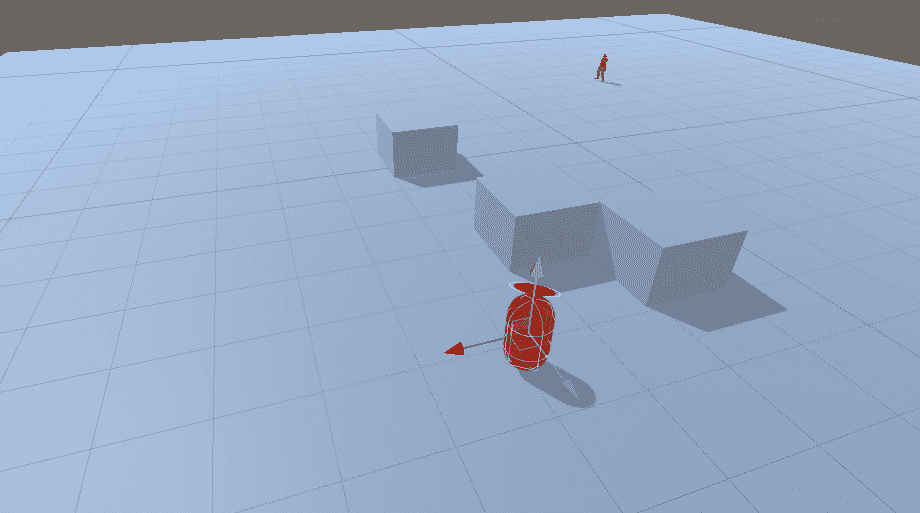
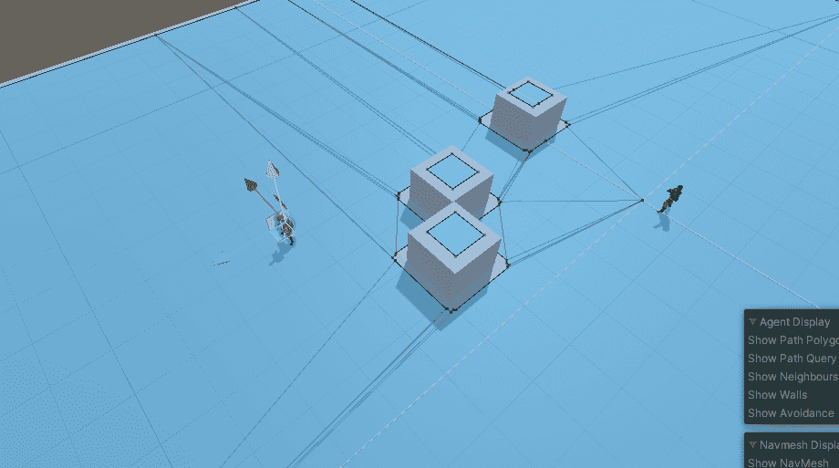
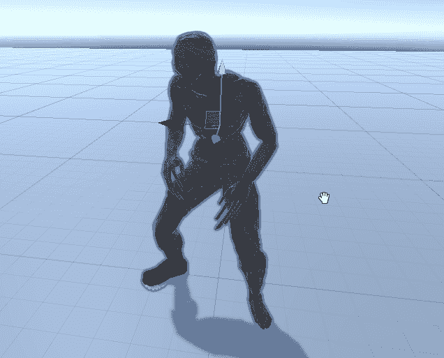
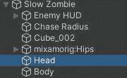
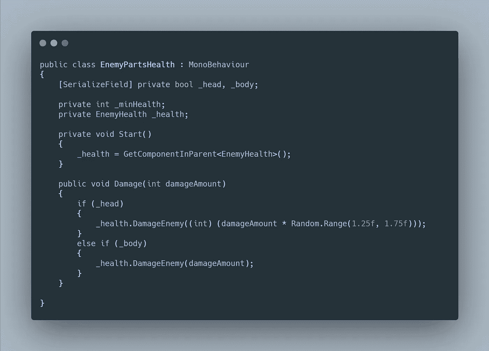

# 僵尸 FPS 进度报告:新僵尸 AI 单位 3D

> 原文：<https://medium.com/geekculture/zombie-fps-progression-report-new-zombie-ai-unity3d-1cf3fe9112c4?source=collection_archive---------40----------------------->

在使用一个角色控制器实现了新的僵尸 AI 之后(阅读这里=> [僵尸进展报告:敌人原型和新玩家角色](/geekculture/zombie-progression-report-enemy-prototype-and-new-player-character-unity-3d-9111fb32d9f2))，我看到这个 AI 有点哑。如果僵尸前面有障碍，僵尸不会试图寻找新的路径走向玩家。是的，僵尸有点傻，但这一点也不好玩。

Character Controller getting stuck

正如你所看到的，僵尸只是卡在立方体后面，无法计算出一条通向玩家的新路径。

在进入我如何解决上述问题之前，让我向你介绍第一个僵尸。这是一个移动缓慢的基本僵尸，当他们靠近时会嗅出玩家，并开始追逐和攻击他们。

Slow Zombie

> 修复僵尸人工智能

为了解决寻路问题，我把敌人的移动从角色控制器改为基于 NavMesh 的移动。

基本上，我把僵尸组件和角色控制器移除了。现在僵尸的目的地由导航网格代理设置。当然，我不得不添加烘焙导航到场景中(我将写一篇关于它的更详细的文章)。

必须对追逐半径、navmesh 停止距离和速度进行一些重构。停止距离现在是根据僵尸的攻击距离来分配的，navMeshAgent 速度是根据僵尸速度来分配的。

New Zombie AI

正如你现在所看到的，僵尸可以智能地找到一条通向玩家的新路径，而且几乎不会卡在障碍物后面。

Zombie Animations

> 头像乘数

僵尸，没有比爆头更好的了。我给玩家增加了爆头的能力，并且增加了爆头的伤害乘数。

我用触发碰撞器给僵尸添加了空的游戏对象，一个用于头部，一个用于身体。

我将上面的脚本添加到两个游戏对象中，我们可以检测我们是在射击头部还是身体，并相应地施加伤害。