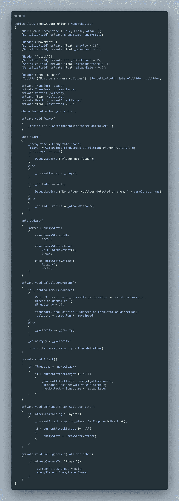
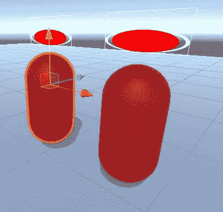
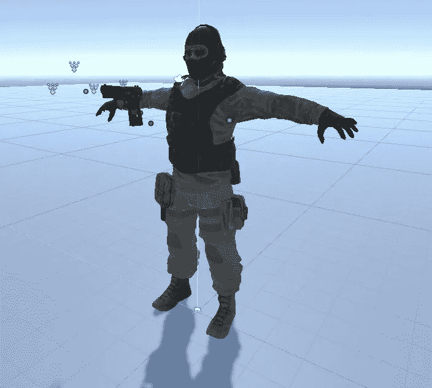
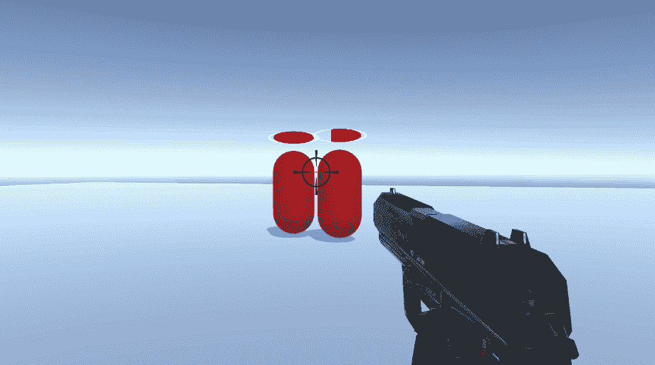

# 僵尸进展报告:敌人原型和新玩家角色 Unity 3D

> 原文：<https://medium.com/geekculture/zombie-progression-report-enemy-prototype-and-new-player-character-unity-3d-9111fb32d9f2?source=collection_archive---------15----------------------->

自从上次([僵尸进展报告:玩家动作&射击](/geekculture/zombie-progression-report-player-movement-shooting-unity-3d-3e4f2925a4a2)之后，我做了几个特写。我们开始吧

> 敌人原型

对于敌人的移动，这一次不是使用人工智能网格代理来告诉敌人去哪里，而是使用角色控制器组件从头开始创建移动系统。你可以在这里读到更多关于这个系统的细节(Unity 中的[角色控制器)。](/codex/tip-of-the-day-character-controller-in-unity-4516644f695)

敌人会使用国家机器。现在他们有两种状态，追逐状态，他们追逐玩家，攻击状态，他们开始攻击玩家。

在追逐状态下，敌人会找到玩家对象，将他设置为目标，并使用角色控制器 move()方法向他移动。

最后，我在敌人的上方添加了一个小的生命值条，使用了一个附加在敌人物体上的画布，它的渲染模式设置为世界空间。

Enemy Health Bar

> 新玩家角色

我使用 Filebase(一个大型的 unity 资产数据库)下载了 Sarge。中士是一名军队士兵，他的任务是防止城市落入僵尸手中。在他的部队全军覆没后，只剩下他一个人活着离开了这座城市。

The Sarge

中士的主要武器是 UPS 手枪，对僵尸有很好的伤害。

现在，枪有一个射击动画，一个空剪辑动画，和一个重新加载动画。

下面是它的实际应用:

Shoot shoot reload