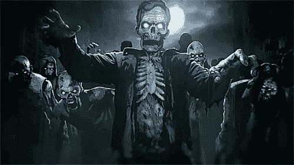
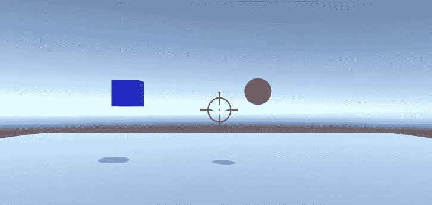
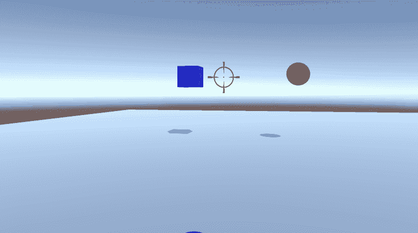
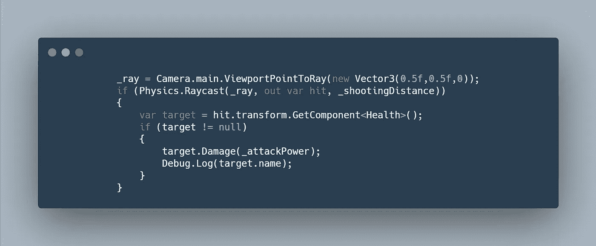
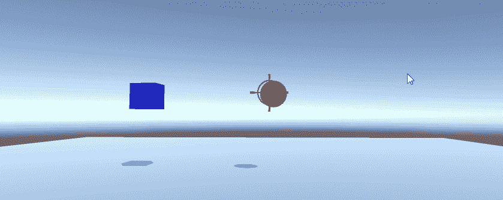

# 僵尸进展报告:玩家移动和射击 Unity 3D

> 原文：<https://medium.com/geekculture/zombie-progression-report-player-movement-shooting-unity-3d-3e4f2925a4a2?source=collection_archive---------59----------------------->

自从上次进度报告( [FPS 进度报告:僵尸射手(新输入系统)Unity](/geekculture/fps-progression-report-zombie-shooter-new-input-system-unity-aba8866023c2) )之后，我完成了玩家移动的工作，并在游戏中加入了射击。我们开始吧。

> 球员运动

首先，我想让玩家更容易知道他们在看哪里，瞄准哪里。所以我在相机中央加了一个十字线。

Reticle

在实现了相机系统之后，我发现了一个错误，玩家的运动没有被转换到全局空间，所以玩家没有正确地旋转，我通过实现一行代码解决了这个问题(查看这里的解决方案:[Unity](https://bootcamp.uxdesign.cc/quick-tip-local-space-vs-world-space-in-unity-1ee8ec68fe7f)中的本地空间 vs 世界空间)。我还发现有必要控制玩家的垂直视角，这样他们就不会看上去很低很高。

Movement

> 玩家射击

Unity 中的射击系统可以有很多种方式，对于 GameDevHQ 程序的原型，我们决定使用光线投射。基本上，光线投射是从一个位置向一个目的地发射一条光线(一种不可见的激光),并检测光线和它穿过的任何东西之间是否有碰撞。

Ray Casting

此外，我还添加了一个全球卫生系统。一个 C#脚本，玩家和敌人都可以使用它来创造生命值，并通过生命值检测目标。

为了测试它，我给两个游戏对象添加了健康脚本，给它们一些健康，然后开始射击。

Shooting