# 缩放汽车-克隆(Mongo 和 Ejs 的完整堆栈)

> 原文：<https://medium.com/geekculture/zoom-car-clone-full-stack-with-mongo-and-ejs-ceb717d4417e?source=collection_archive---------5----------------------->

读者你好，

# Zoomcar-“自我驱动的自我驱动”。

[**Zoomcar**](https://www.zoomcar.com/) **，**是非常受欢迎的一家印度自驾租车公司，总部位于印度班加罗尔。该公司由大卫·贝克(David Back)和格雷格·莫兰(Greg Moran)于 2013 年创立。它目前在 34 个以上的城市开展业务。坐在上面，你会感觉像是在自己的车里。

继续前进我是 **Ranjan Kumar Thakur** 一个**有抱负的开发者**在 [**马赛学校**](https://www.masaischool.com/) **。**最后一周被描述为构建周。我们与 6 名成员一起完成了这个项目，并为**【自驾为自驾】***[***变焦车***](https://www.zoomcar.com/)*构建了一个在印度非常受欢迎的电子商务网站的克隆体，以供学习之用。这个博客是关于我们的旅程和我们在建设这个项目时所面临的挑战。**

**我在这一单元学到了以下一些东西-**

1.  **结节**
2.  **快递。**
3.  **EJS。**
4.  **NPM 包(猫鼬，智威汤逊令牌，快速认证器等)**
5.  **页码**
6.  **Mongo DB。**
7.  **谷歌认证，授权**
8.  **模型视图控件(MVC)。**
9.  **NodeJS 中的事件循环。**
10.  **数据结构和算法(优化的问题解决技术)。**

# **团队概述。**

1.  **兰詹·库马尔·塔库尔**
2.  **潘卡伊·库马尔**
3.  **尼基塔·帕雷克**
4.  **Yashraj Maheshwari**
5.  **阿布舍克·索尼**
6.  **普里扬什·蒂瓦里**

**由于我们队友的努力和合作以及全体教员的支持，该项目已经完成。**

# **问题陈述-**

**因此，我有一个问题陈述，我必须创建一个名为[**zoom car**](https://www.zoomcar.com/)**的网站的成熟完整堆栈(后端和前端)的克隆，使用基于云的实时数据库-Mongo DB-Atlas，我们必须使用我到目前为止学到的技能，我们组有六名成员，并在截止时间内完成任务。****

# ****团队和工作分开****

****在团队中工作时，沟通起着重要的作用，在这种情况下远程工作时，就像有人坐在离我 1000 公里的地方，所以沟通对有效地实现他们的想法、在规定的时间内完成任务变得至关重要。****

****我们已经讨论了**克隆什么以及如何克隆**、**最重要产品(MVP)** 、**功能、要考虑的模块**在此过程中，我们使用了著名的**莫斯科**原则。我们相应地分解了我们的工作。****

## ****规划****

****▹·潘卡杰和阿布舍克负责处理主页，将所有数据整合到主页中。(合并整体)****

****▹·雅斯拉和尼基塔负责注册和登录页面。****

****▹·兰詹和普里扬什负责处理汽车数据库、预订汇总、结账、与 Paytm 测试支付网关集成的支付选项，用于实时支付，仅供学习之用。****

# ****收集项目数据-****

****在做这个项目之前，脑海中浮现的第一件事就是首先访问网站，了解产品的功能、视觉和类型等。我们惊讶地看到网站的设计，功能，特点，支持系统，展示产品的营销理念等。我们收集了来自**原始网站**的数据，使用了一些 Npm **库**，Google， [**Paytm**](https://developer.paytm.com/) 支付测试 API，以及 [**GitHub**](https://github.com/) 用于整个**项目协作**等。****

******使用的技术堆栈-******

****我们使用了 **EJS** 、 **HTML-5** ，样式由普通 **CSS** 完成，功能由**高级 JavaScript** 完成。我们使用了 **Google API** 用于动态定位，日历用于旅行日期，Mongo DB 用于准备数据库，mongose(DB 和 Express 之间的通信)，Paytm 支付 API 用于支付网关等。****

****我们使用了 **Express，NodeJS，mongose(Schema，Model)进行后端 Crud 操作**处理实时数据**，前端使用 eJS，html，ES6，CSS。******

# ****我们项目的一些快照:-****

******主页-** 用户登录后，会出现用户名而不是登录/注册。在这里，用户可以选择往返或单程等旅行类型，并使用谷歌地图选择接送地点，还可以分别选择日期和时间。****

****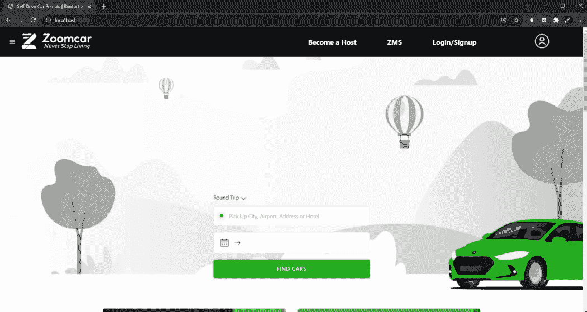****

****页脚-****

****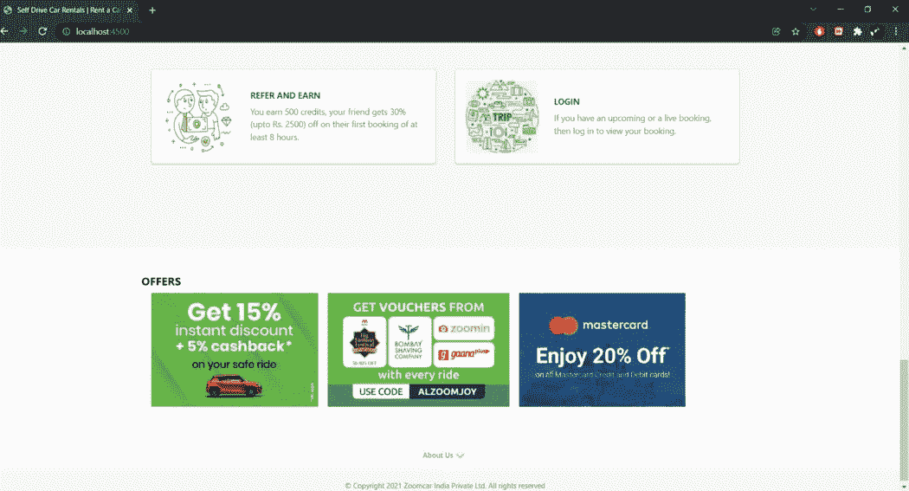****

******登录-注册-** 验证用户数据是否与我们数据库中的现有数据匹配。用户有多个登录选项，如使用电话号码或电子邮件 id。****

****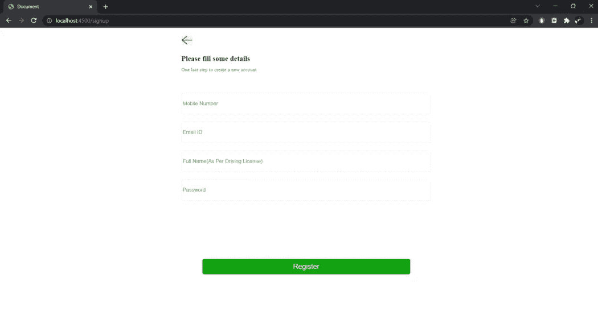****

****Registration for new user****

****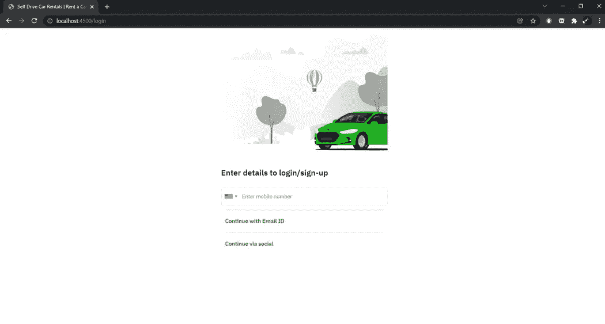****

****Email Registration****

****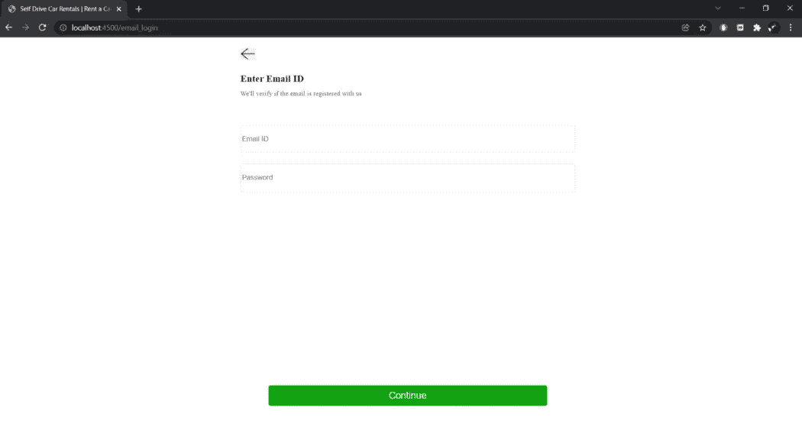****

****Login with Email id****

******选择旅行预订的城市******

****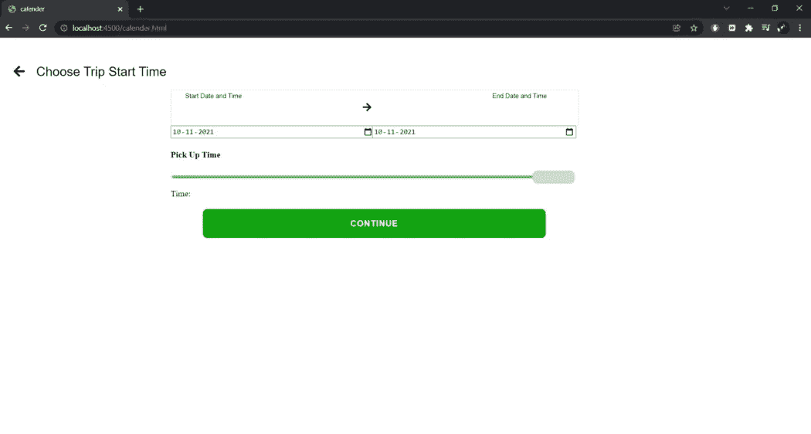****

****Select Data and Time for Booking.****

****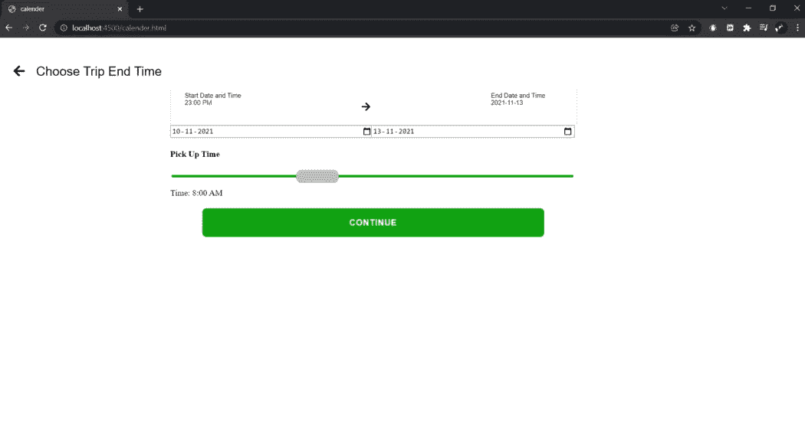****

****choose end time and date****

******选择接送地点-******

****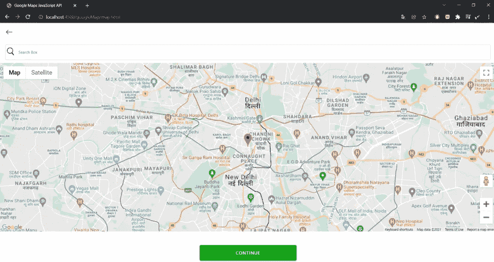****

****从谷歌地图中选择上下车地点****

******汽车展厅预订-******

****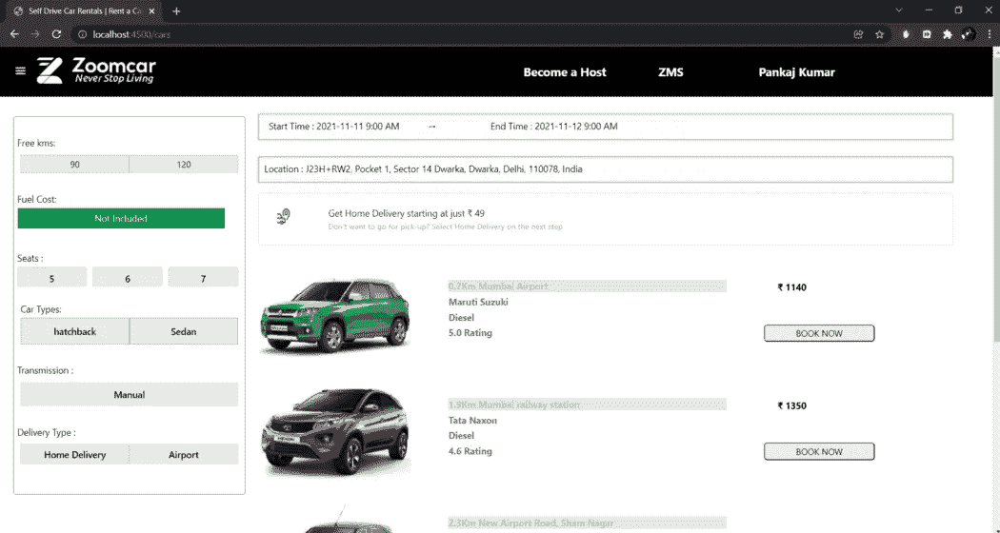****

****Car Showroom****

****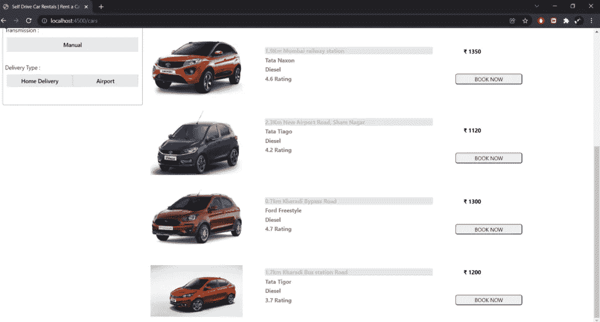****

****Car for booking trip****

******所选汽车描述-** 用户可以看到他/她所在城市的车辆，以及当时哪些车辆可用，并进行相应的过滤。****

****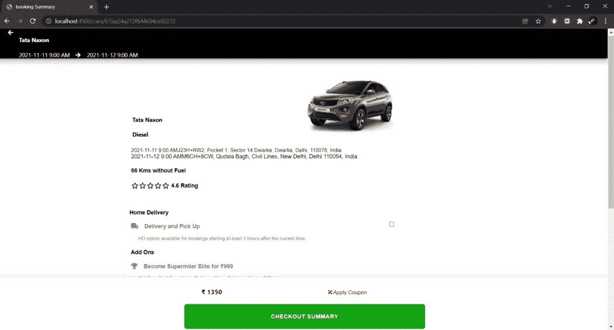****

****选定的汽车详细信息-一旦用户点击立即预订，他/她将被重定向到单个汽车页面，在那里他们可以选择多个选项，如送货上门，也可以享受附加福利，并继续结帐。****

******支付中断-******

****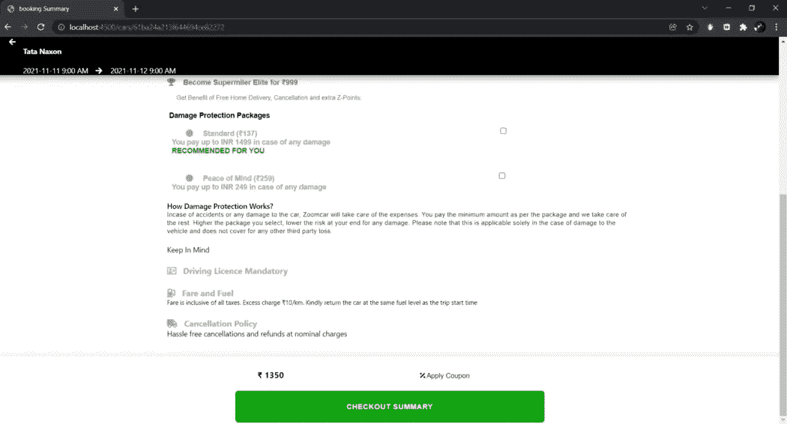****

****所选汽车的付款拆分-在这里用户可以看到旅行的价格拆分。****

******付款方式-******

****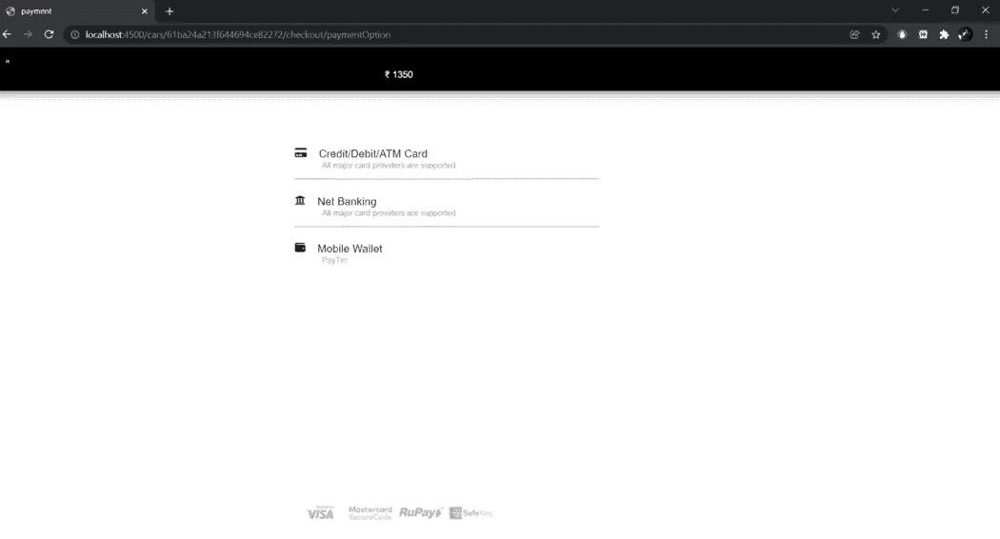****

****付款方式选择-我们有不同的付款方式选择****

******实时支付网关-** 我们在移动钱包部分集成了使用 paytm 的支付，他们可以使用 paytm 进行支付。****

****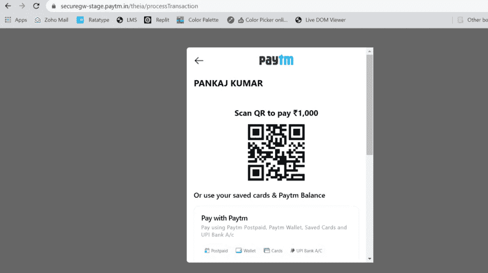****

****Paytm 钱包****

******填写支付卡的详细信息-******

****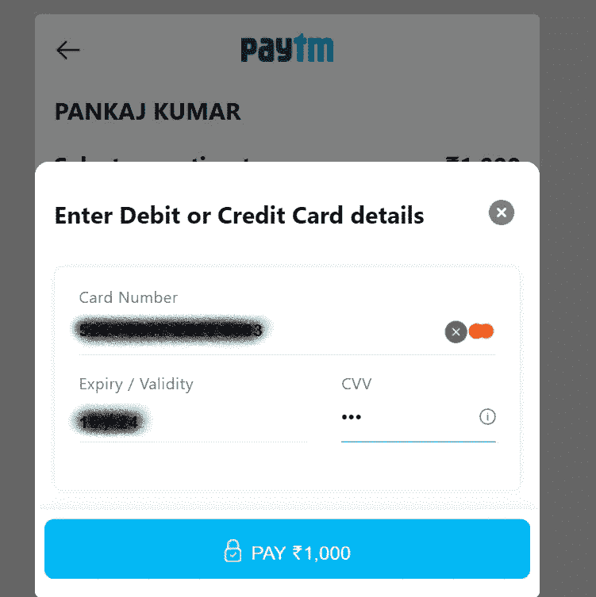****

****填写卡详细信息-****

******最终付款确认-******

****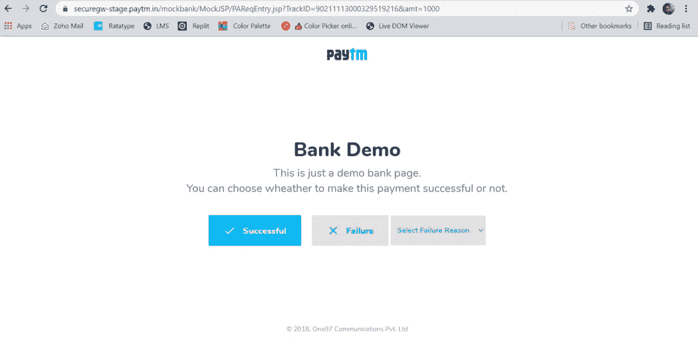****

****支付确认-一旦支付完成，用户登陆支付成功页面。****

# ****项目的成果和重要经验****

****制作这个项目的整个过程太棒了。通过申请 real 网站，我学到了很多东西，这给了我们很多信心。做了这个项目后，我对团队如何在数据库上工作的知识得到了提高，也知道了如何将前端和后端互连。****

****还可以做更多的功能。是的，时间不允许我们走得更远。但我们肯定会在今后的时间里改进它。****

****如果你想看看这个项目，那么你可以去这个 GitHub 回购。****

****[**GitHub**](https://github.com/)**-**[https://github.com/yashraj-m/ZoomCar-backend](https://github.com/yashraj-m/ZoomCar-backend)****

****我想对团队成员、马赛支持系统、IA、Zoom Car 等精彩的学习网站表示感谢。****

******免责声明:-******

****克隆本网站时拍摄的所有内容、图像和其他数据仅用于学习目的。****

******感谢您阅读**😊😊😊😊😊。****