# 缩放汽车-克隆(学习目的)

> 原文：<https://medium.com/geekculture/zoom-car-clone-learning-purpose-65675e5c064f?source=collection_archive---------14----------------------->

读者你好，

## *zoom car-【自我驱动】为自我驱动。*

[**zoom car**](https://www.zoomcar.com)**是一家非常受欢迎的印度自驾租车公司，总部位于印度班加罗尔。该公司由大卫·贝克(David Back)和格雷格·莫兰(Greg Moran)于 2013 年创立。它目前在 34 个以上的城市开展业务。坐在上面，你会感觉像是在自己的车里。**

**继续前进我是一名 **Ranjan Kumar Thakur** 一名**有抱负的开发者**在 [**马赛学校**](https://www.masaischool.com) 在 FT 网站 12 批次。我几乎就要完成**单元-3** 了。这是在最后一周，被描绘为建设周。我们与 6 名成员一起完成了这个项目，并为学习目的建立了一个在印度非常受欢迎的电子商务网站的克隆版**【自我驱动的自我驱动】***[***变焦车***](https://www.zoomcar.com)*。这个博客是关于我们的旅程和我们在建设这个项目时所面临的挑战。****

****我在这一单元学到了以下一些东西-****

1.  ****获取 Web API。****
2.  ****JSON 服务器。****
3.  ****进出口。****
4.  ****结束。****
5.  ****ES-6。****
6.  ****保证。****
7.  ****登录授权模拟器-服务器。****
8.  ****事件循环。****
9.  ****JavaScript 如何工作？****
10.  ****数据结构和算法(优化问题解决技术)。****

# ****团队概述。****

1.  ****兰詹·库马尔·塔库尔****
2.  ****潘卡伊·库马尔****
3.  ****尼基塔·帕雷克****
4.  ****米特莱什·库马尔****
5.  ****拉奥吉·帕蒂尔****
6.  ****普里扬什·蒂瓦里****

****由于我们队友的努力和合作以及全体教员的支持，该项目已经完成。****

# ****问题陈述-****

****因此，我有一个问题陈述，我必须创建一个名为[**zoom car**](https://www.zoomcar.com)**的网站的克隆。此外，我必须使用我到目前为止学到的技能，我们小组有六名成员，并在截止时间内完成任务。******

# ******团队和工作分开******

******在团队中工作时，沟通起着重要的作用，在这种情况下远程工作时，就像有人坐在离我 1000 公里的地方，所以沟通对有效地实现他们的想法、在规定的时间内完成任务变得至关重要。******

******我们已经讨论了**克隆什么以及如何克隆**、**最重要的产品(MVP)** 、**功能、要考虑的模块**在此过程中，我们使用了著名的**原理。我们相应地把我们的作品分开。********

# ******收集项目数据-******

******在做这个项目之前，脑海中浮现的第一件事就是首先访问网站，了解产品的功能、视觉和类型等。我们惊讶地看到网站的设计，功能，特点，支持系统，展示产品的营销理念等。我们收集了来自**原始网站**的数据，使用了一些**外部库**，Google， [**Paytm**](https://developer.paytm.com/) 支付测试 API，以及 [**GitHub**](https://github.com) 用于整个**项目协作**等。******

********使用的技术堆栈-********

******我们使用了 **HTML-5** ，样式由普通 **CSS** 完成，功能由**高级 JavaScript** 完成。我们使用了 **Google API** 用于动态定位，日历用于行程日期， **JSON 服务器**用于准备汽车数据库， **Fetch Web API** ， **Paytm 支付 API** 用于支付网关等。我们使用了使用 **DOM 操作**方法的 **HTML、CSS、JavaScript** 代码，我们使用了**本地存储来存储数据。********

# ******我们项目的一些快照:-******

********首页-********

******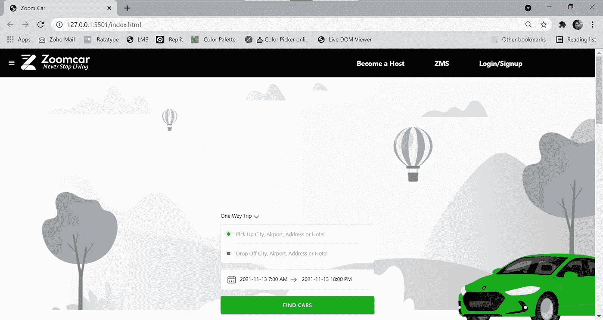******

******Home-1******

******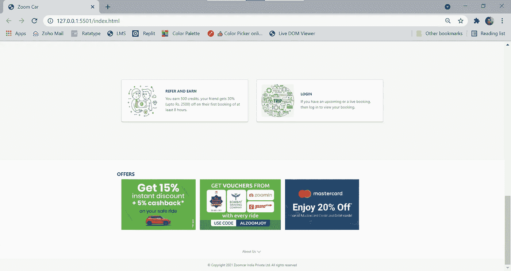******

******Footer Section******

********登录-注册-********

******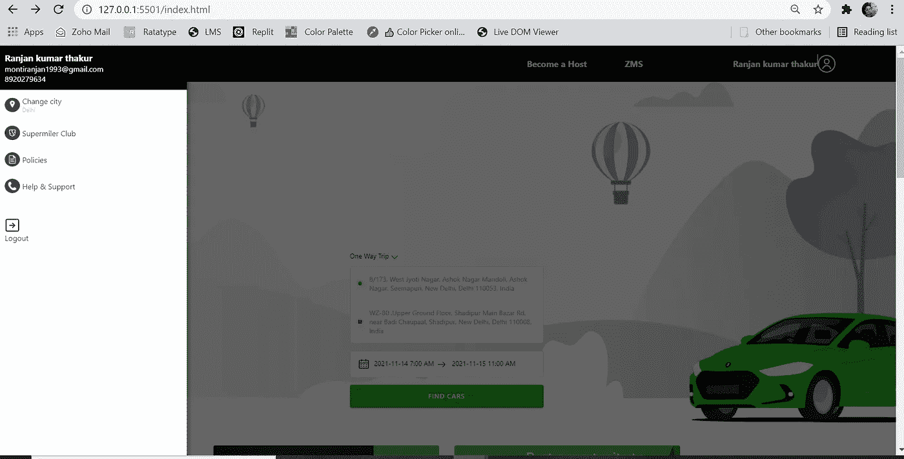******

******Login-Sign Up to Book you Trip******

********选择旅行预订的城市********

******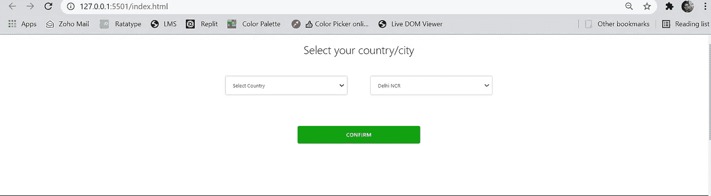******

******Select Your City******

********选择接送地点-********

******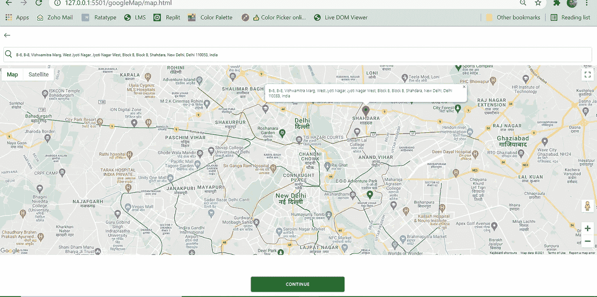******

******Select Pick up and Drop-off Location from the Map******

********汽车展厅预订-********

******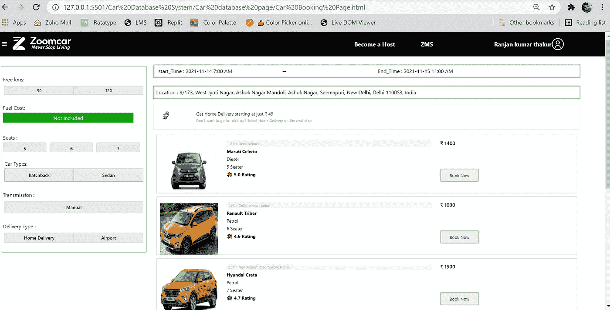******

******Car for Booking your Trip******

********选中汽车描述-********

******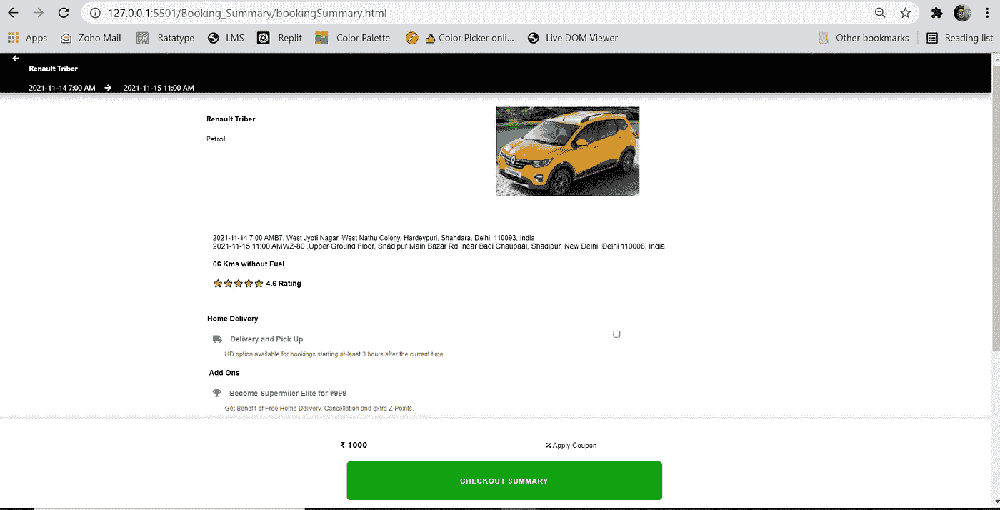******

******Selected Car Details******

********付款中断-********

******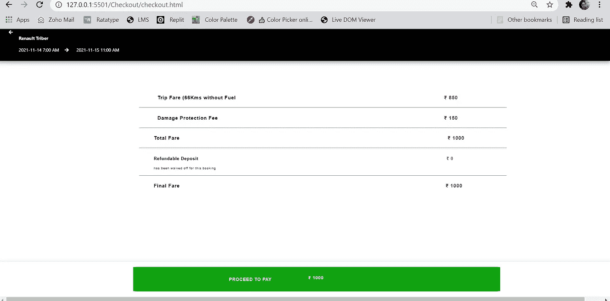******

******Payment Breakup for the Selected Car******

********付款方式-********

************

******Mode of Payment Option******

********实时支付网关-********

******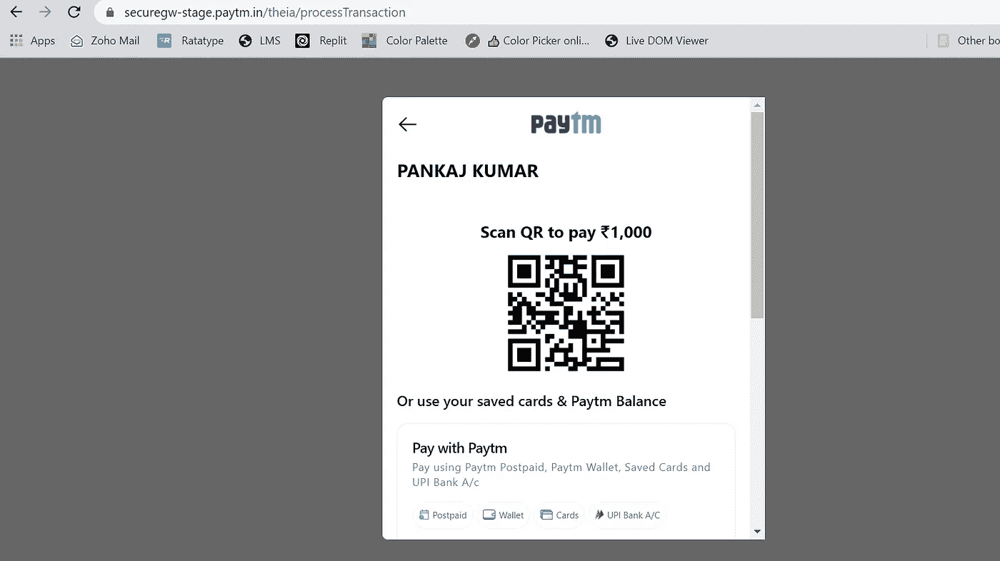******

******Paytm Wallet******

********向 Paytm 钱包中添加资金进行支付-********

******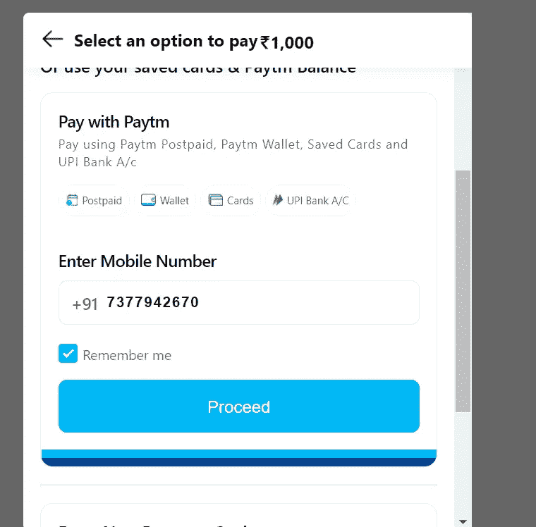******

******Paytm Wallet-2******

******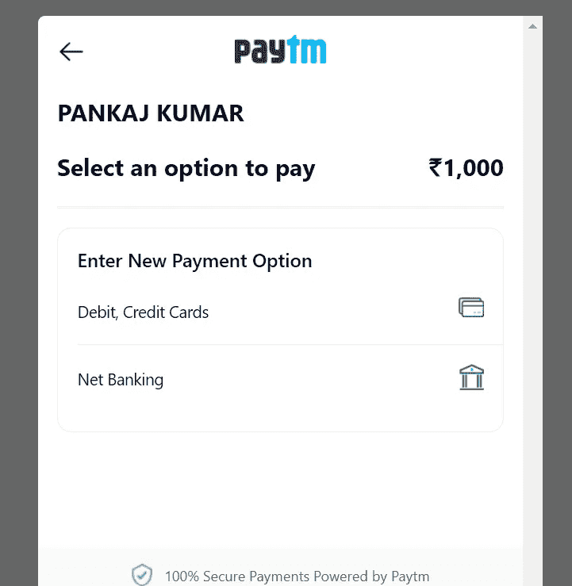******

******Paytm-3******

********填写支付卡的详细信息-********

************

******Fill Card Details-******

******最终付款确认-******

******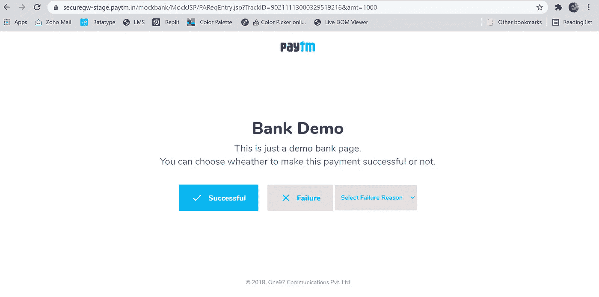******

******Payment Confirmation******

# ******项目的成果和重要经验******

******制作这个项目的整个过程太棒了。通过申请 real 网站，我学到了很多东西，这给了我们很多信心。还可以做更多的功能。是的，时间不允许我们走得更远。但我们肯定会在今后的时间里改进它。******

******如果你想看看这个项目，那么你可以去这个 GitHub 回购。******

******[**GitHub**](https://github.com)**-**[https://github.com/iampankajk/ZoomCar-Clone.git](https://github.com/iampankajk/ZoomCar-Clone.git)******

******我想对团队成员、马赛支持系统、IA、Zoom Car 等精彩的学习网站表示感谢。******

********免责声明:-********

******克隆本网站时拍摄的所有内容、图像和其他数据仅用于学习目的。******

********感谢您阅读**😊😊😊😊😊。******